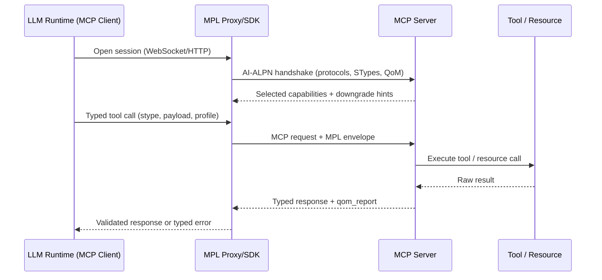
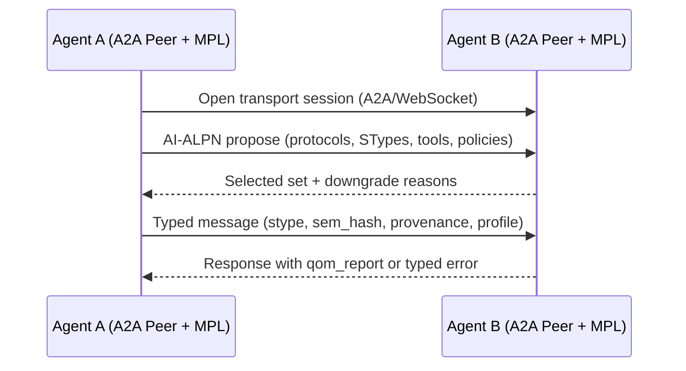
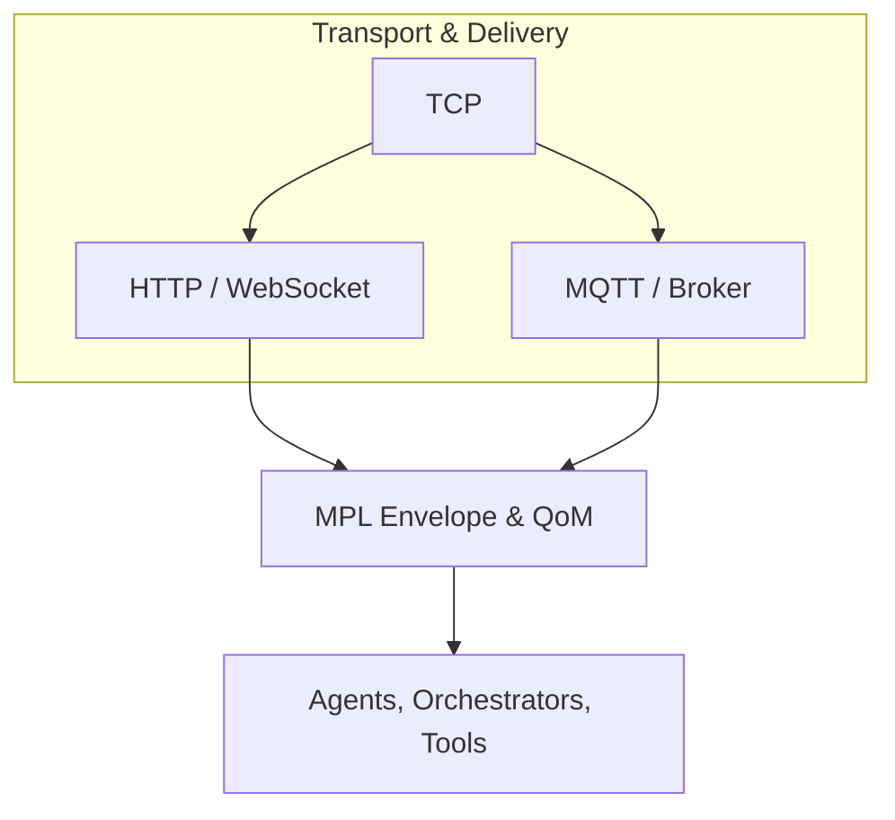

# MPL Conceptual Model

This document ties together the mental models so teams can explain *what* MPL is, *where* it sits, and *how* it coexists with MCP and A2A. Read `docs/protocol-architecture.md` for the core technical specification.

## 1. Why a Meaning Overlay

- Modern agent stacks suffer from semantic drift, hidden capability changes, and unverifiable outputs.
- Transports like HTTP/WebSocket already solve delivery; the missing layer is a **meaning contract** that both sides negotiate and enforce.
- MPL adds just enough structure (handshake + semantic envelope) to make independent runtimes agree on intent, schema, and quality without replacing existing protocols.

## 2. Integration Model Spectrum

| Pattern | Example | Topology | MPL’s role |
| ------- | ------- | -------- | ---------- |
| Client–Server | MCP | Model runtime connects to a server that hosts tools/resources. | MPL wraps MCP messages with semantic types, QoM, provenance. |
| Peer-to-Peer | A2A | Agents act as peers, advertising capabilities and exchanging structured frames. | MPL supplies a shared semantic envelope and negotiation even when every node is both client and server. |
| Semantic Overlay | MPL | Runs above either topology. | Provides the control plane for meaning, capability selection, and quality guarantees. |

MPL is orthogonal: it augments the client/server or peer models rather than replacing them.

## 3. Roles in MCP and A2A Terms

- **MCP:** client is typically the LLM runtime, server exposes tools/resources. MPL adds the AI-ALPN handshake and typed envelopes but otherwise reuses the MCP WebSocket/HTTP sessions. Older MCP clients ignore MPL fields, so adoption can start with a proxy.
- **A2A:** each agent is a peer. MPL becomes the framing around `AgentMessage`s, ensuring both sides agree on STypes, QoM profiles, and policies before exchanging work.

## 4. Connection Modes for LLMs and Orchestrators

| Mode | Description | Integration effort |
| ---- | ----------- | ------------------ |
| Sidecar proxy (#1, recommended) | Proxy wraps an existing MCP/A2A session, adding handshake, SType validation, and QoM checks transparently. | Minimal; no code changes. |
| Native integration (#2, vendors) | LLM runtime or MCP/A2A provider natively emits/consumes MPL envelopes. | Higher; requires provider collaboration but benefits all clients. |
| SDK (#3, power users) | Client library performs handshake, schema validation, QoM reporting, and provenance logging around model/tool calls. | Medium; for stateful assertions or custom telemetry. |

Teams should start with proxy. Native integration by vendors eliminates the need for SDK in most cases. See `docs/integration-modes.md` for detailed guidance.

## 5. Message Flow at a Glance

1. **Handshake:** client proposes protocols, STypes, tools, QoM level, and policy references; server returns the subset it can honor plus downgrade reasons.
2. **Typed call:** payload carries `Semantic-Type`, schema version, optional feature flags, and provenance hints.
3. **Validation:** receiver checks schema, QoM thresholds, ontology constraints, and semantic hash before acting.
4. **Response:** typed payload plus `qom_report` or a typed error such as `E-QOM-BREACH` or `E-TOOL-ARG-COERCION`.
5. **Telemetry:** both sides log downgrade causes, QoM metrics, and semantic hashes for auditability.

Compared to raw MCP traffic, MPL adds meaning-aware metadata while keeping transport and tool implementations intact.

## 6. Failure and Retry Semantics

- Typed errors distinguish semantic issues from transport failures and include hints (missing field, policy breach, downgrade, ontology violation).
- Clients can deterministically repair requests using the declared SType schema or trigger orchestrated retries with lower temperature or alternative tools.
- QoM breaches can gate workflows; if retries cannot meet the agreed profile, the session can degrade to a softer profile or be escalated.

## 7. Migration Checklist

1. Choose adoption mode (proxy vs SDK).
2. Introduce handshake negotiation for protocols, STypes, tools, QoM profiles, and policies.
3. Wrap tool calls with `stype`, `args_stype`, semantic hashes, and provenance metadata.
4. Enforce schema + QoM validation in responses; emit structured reports.
5. Map typed errors to retry, repair, or escalation paths.
6. Log provenance bundles and QoM metrics for audit.
7. Manage SType lifecycle via registry semver rules and deprecation notices.

## 8. Key Takeaways

- MPL makes meaning explicit without requiring new transports.
- The protocol is additive: developers keep their MCP/A2A stack but gain semantic contracts, negotiated capability sets, and quality telemetry.
- Incremental adoption is expected; the mental model emphasizes layering, not replacement, to minimize risk and accelerate validation.

## 9. Visual Integration Diagrams

### MPL Overlaying MCP (Client–Server)

*The MPL proxy/SDK mediates handshake, schema/QoM validation, and provenance while reusing the existing MCP transport and tool implementations.*

### MPL Overlaying A2A (Peer–Peer)

*Each peer runs the MPL handshake and envelope logic locally; the underlying A2A routing, discovery, and transport remain unchanged.*

### Layering at a Glance

*MPL rides on reliable transports (HTTP/WebSocket/gRPC/MQTT brokers) and supplies the meaning, negotiation, and quality guarantees above them.*
