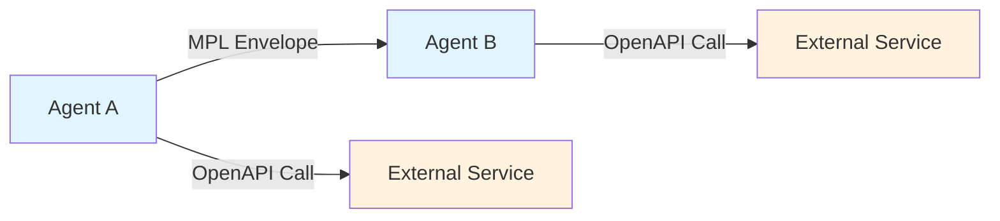
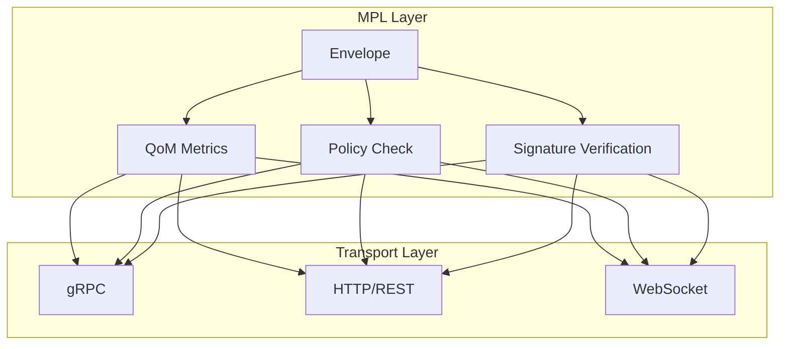
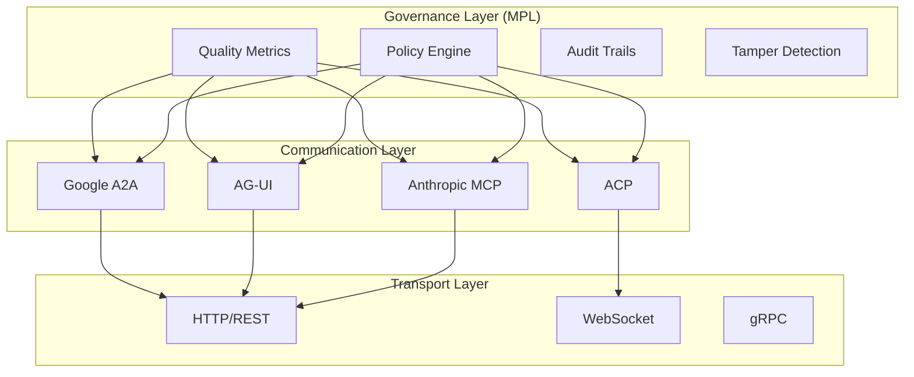

# Comparisons

MPL occupies a unique position in the ecosystem of developer tools and protocols. This page explains how MPL relates to and differs from existing solutions, and where it provides complementary value.

## Comparison Matrix

The following table provides a high-level feature comparison across tools and protocols:

| Feature | MPL | Schema Registries | OpenAPI | gRPC/Protobuf | AG-UI/ACP |
|---------|:---:|:-----------------:|:-------:|:-------------:|:---------:|
| **Typed schemas** | :material-check: | :material-check: | :material-check: | :material-check: | :material-close: |
| **Quality metrics (QoM)** | :material-check: | :material-close: | :material-close: | :material-close: | :material-close: |
| **Handshake negotiation** | :material-check: | :material-close: | :material-close: | :material-close: | :material-close: |
| **Tamper detection** | :material-check: | :material-close: | :material-close: | :material-close: | :material-close: |
| **Policy engine** | :material-check: | :material-close: | :material-close: | :material-close: | :material-close: |
| **Audit trails** | :material-check: | :material-close: | :material-close: | :material-close: | :material-check: |
| **Transport independence** | :material-check: | :material-check: | :material-close: | :material-close: | :material-check: |
| **Runtime enforcement** | :material-check: | :material-close: | :material-close: | :material-check: | :material-close: |
| **Agent-native design** | :material-check: | :material-close: | :material-close: | :material-close: | :material-check: |
| **Semantic governance** | :material-check: | :material-close: | :material-close: | :material-close: | :material-close: |

---

## MPL vs Schema Registries

**Examples**: Confluent Schema Registry, AWS Glue Schema Registry, Apicurio Registry

Schema registries are well-established tools for managing data schemas in event-driven architectures. MPL shares the concept of centralized schema management but extends it significantly for agent communication.

### Key Differences

| Aspect | Schema Registries | MPL |
|--------|-------------------|-----|
| **Primary focus** | Data pipeline schemas | Agent message governance |
| **Validation scope** | Structural correctness | Structure + quality + compliance |
| **Enforcement timing** | Typically build-time/deploy-time | Runtime enforcement via proxy |
| **Quality metrics** | Not provided | Schema Fidelity, Instruction Compliance, Groundedness, Determinism |
| **Negotiation** | Not provided | Handshake protocol for capability agreement |
| **Policy** | Basic compatibility rules | Full policy engine with declarative rules |
| **Provenance** | Schema versioning | Envelope signing + tamper detection + audit trails |
| **Target domain** | Data engineering | AI agent systems |

### When to Use What

!!! tip "Use a Schema Registry when..."

    - You need schema evolution for Kafka/event streams
    - Your primary concern is serialization compatibility (Avro, Protobuf, JSON Schema)
    - You are building traditional data pipelines
    - You need integration with existing data infrastructure

!!! tip "Use MPL when..."

    - You are building multi-agent systems that exchange semantic messages
    - You need runtime quality guarantees beyond structural validation
    - You require tamper detection and provenance tracking
    - You need policy-based governance of agent communications
    - You want handshake negotiation between agents

### Complementary Usage

MPL does not replace schema registries. In architectures where agents produce events consumed by data pipelines, you might use:

- **MPL** for governing agent-to-agent communication
- **Schema Registry** for governing agent-to-pipeline data formats

---

## MPL vs OpenAPI / AsyncAPI

**OpenAPI** defines HTTP API contracts. **AsyncAPI** extends this to event-driven APIs. Both provide excellent tooling for traditional service-to-service communication.

### Key Differences

| Aspect | OpenAPI/AsyncAPI | MPL |
|--------|-----------------|-----|
| **Contract model** | Request/response or pub/sub | Multi-hop agent workflows |
| **Validation** | Structural schema validation | Structural + semantic quality |
| **Negotiation** | Not provided (static contracts) | Dynamic handshake per interaction |
| **Quality of Message** | Not addressed | Core feature (multiple metrics) |
| **Tamper detection** | Not provided | Envelope signing and verification |
| **Transport** | HTTP (OpenAPI), multiple (AsyncAPI) | Transport-agnostic |
| **Design philosophy** | API-first design | Governance-first design |
| **Target interaction** | Client-server / publisher-subscriber | Agent-to-agent |

### How They Relate



MPL works **alongside** OpenAPI, not as a replacement:

- An agent might use **OpenAPI** to call external services (weather APIs, databases)
- The same agent uses **MPL** to communicate governed messages to other agents
- MPL envelopes can be transported **over** OpenAPI-defined endpoints

### What MPL Adds

Beyond what OpenAPI provides, MPL introduces:

1. **Quality of Message (QoM)**: Metrics like Schema Fidelity and Groundedness that measure not just structural correctness but semantic quality
2. **Handshake negotiation**: Agents dynamically agree on STypes, metrics thresholds, and policies before exchanging data
3. **Tamper detection**: Cryptographic signing ensures envelope integrity across multi-hop workflows
4. **Multi-hop governance**: Policies and metrics are maintained as messages flow through chains of agents

---

## MPL vs gRPC / Protocol Buffers

**gRPC** provides high-performance typed RPC with Protocol Buffer serialization. It is excellent for service-to-service communication with strong typing guarantees.

### Key Differences

| Aspect | gRPC/Protobuf | MPL |
|--------|--------------|-----|
| **Primary value** | Typed RPC with code generation | Semantic governance and compliance |
| **Schema language** | Protocol Buffers (.proto) | JSON Schema (STypes) |
| **Transport** | HTTP/2 (primarily) | Transport-agnostic (HTTP, gRPC, WebSocket, etc.) |
| **Quality metrics** | Not provided | Schema Fidelity, Instruction Compliance, etc. |
| **Policy enforcement** | Not provided | Declarative policy engine |
| **Negotiation** | Not provided (static contracts) | Dynamic handshake protocol |
| **Code generation** | Strong (multi-language) | SDK-based (Rust, Python, TypeScript) |
| **Performance focus** | Serialization speed, network efficiency | Governance with minimal overhead |

### Layered Architecture

MPL can operate **on top of** gRPC, adding governance capabilities that gRPC does not provide:



### When to Use Together

A common pattern is:

1. **gRPC** handles the transport: serialization, streaming, load balancing
2. **MPL** handles the governance: quality metrics, policy enforcement, audit trails
3. The MPL sidecar proxy can intercept gRPC traffic transparently

!!! example "Example: gRPC + MPL"

    ```
    Agent A --[gRPC]--> MPL Proxy --[validate envelope]--> Agent B
                            |
                            v
                       Policy Engine
                       QoM Metrics
                       Audit Log
    ```

---

## MPL vs Emerging Agent Protocols

**Examples**: AG-UI (Agent-User Interaction), ACP (Agent Communication Protocol), and similar emerging standards.

The agent protocol ecosystem is rapidly evolving. Several new protocols address different aspects of agent communication and coordination.

### Key Differences

| Aspect | AG-UI / ACP | MPL |
|--------|-------------|-----|
| **Primary focus** | Agent UX and coordination | Semantic governance and compliance |
| **Interaction model** | Agent lifecycle management | Message quality and policy |
| **Schema governance** | Minimal or not addressed | Core feature |
| **Quality metrics** | Not provided | Multiple QoM dimensions |
| **Policy enforcement** | Not provided | Declarative policy engine |
| **Tamper detection** | Not provided | Cryptographic envelope signing |
| **Transport** | Protocol-specific | Transport-agnostic overlay |

### Complementary, Not Competitive

MPL is designed to be **complementary** to these protocols, not a replacement:



### How MPL Overlays Agent Protocols

MPL can wrap messages from any agent protocol in governed envelopes:

1. **Agent A** sends an A2A TaskMessage
2. **MPL proxy** intercepts and wraps it in an MPL envelope
3. **Envelope** includes SType reference, QoM metrics, and signature
4. **Policy engine** evaluates the envelope against declared policies
5. **Agent B** receives the governed message, can verify integrity and quality

This means organizations can adopt MPL incrementally without replacing their existing agent communication infrastructure.

### Integration Status

| Protocol | MPL Integration | Status |
|----------|----------------|--------|
| Google A2A | Native bridge in mpl-core | :material-check-circle:{ .green } Complete |
| Anthropic MCP | Planned native integration | :material-clock-outline: Future |
| AG-UI | Overlay via proxy | :material-clock-outline: Future |
| ACP | Overlay via proxy | :material-clock-outline: Future |

---

## Summary

| Use Case | Recommended Approach |
|----------|---------------------|
| Schema validation for data pipelines | Schema Registry |
| HTTP API contracts | OpenAPI |
| High-performance typed RPC | gRPC |
| Agent UX and lifecycle | AG-UI / ACP |
| **Agent message governance** | **MPL** |
| **Semantic quality assurance** | **MPL** |
| **Multi-agent compliance** | **MPL** |
| Agent communication + governance | Agent protocol + MPL overlay |
| Typed transport + governance | gRPC + MPL sidecar |

!!! info "MPL's Unique Value"

    MPL is the only solution that combines **typed schemas**, **quality metrics**, **handshake negotiation**, **tamper detection**, **policy enforcement**, and **audit trails** in a single, transport-agnostic protocol designed specifically for AI agent communication.
