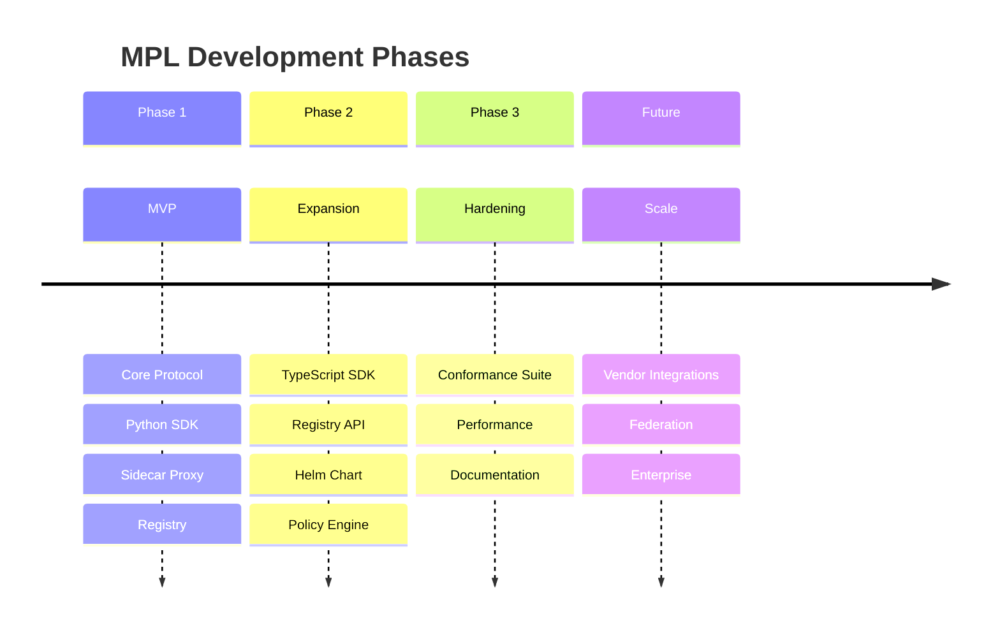

# Roadmap

This roadmap outlines the development phases of MPL, from the initial MVP through to the long-term vision. It reflects the current state of the project as of version 0.1.0.

## Overview

---

## Phase 1: MVP :material-check-circle:{ .green } COMPLETE

The foundational phase established the core protocol and primary SDK.

| Milestone | Status | Description |
|-----------|--------|-------------|
| Core protocol implementation | :material-check-circle:{ .green } Complete | Rust implementation of envelope format, SType resolution, and QoM metrics |
| Python SDK | :material-check-circle:{ .green } Complete | PyO3-based bindings providing full protocol access from Python |
| Sidecar proxy | :material-check-circle:{ .green } Complete | Transparent proxy for intercepting and governing agent traffic |
| Registry with pre-seeded STypes | :material-check-circle:{ .green } Complete | Central registry service with initial set of semantic type definitions |
| Schema Fidelity metric | :material-check-circle:{ .green } Complete | Runtime measurement of payload conformance to declared schemas |
| Instruction Compliance metric | :material-check-circle:{ .green } Complete | Runtime measurement of adherence to negotiated instructions |

### Key Deliverables

- **mpl-core crate**: Envelope creation, signing, validation, and SType resolution
- **mpl-proxy crate**: HTTP/gRPC sidecar with transparent interception
- **Python SDK**: `pip install mpl` with full envelope and registry APIs
- **Registry**: Pre-seeded with common agent communication STypes

---

## Phase 2: Expansion :material-check-circle:{ .green } COMPLETE

Phase 2 broadened SDK support, added Kubernetes-native deployment, and introduced the policy engine.

| Milestone | Status | Description |
|-----------|--------|-------------|
| TypeScript SDK | :material-check-circle:{ .green } Complete | Native TypeScript SDK for Node.js and browser environments |
| Registry REST API | :material-check-circle:{ .green } Complete | Full CRUD API for managing STypes programmatically |
| Helm chart for Kubernetes | :material-check-circle:{ .green } Complete | Production-ready Helm chart for deploying MPL components |
| Policy engine | :material-check-circle:{ .green } Complete | Rule-based policy evaluation for envelope governance |
| A2A integration | :material-check-circle:{ .green } Complete | Integration with Google's Agent-to-Agent protocol |

### Key Deliverables

- **TypeScript SDK**: `npm install @mpl/sdk` with full protocol support
- **Registry API**: RESTful endpoints for SType management, search, and versioning
- **Helm chart**: Single-command deployment to Kubernetes clusters
- **mpl-policy crate**: Declarative policy definitions with enforcement hooks
- **A2A bridge**: Envelope wrapping and unwrapping for A2A TaskMessages

---

## Phase 3: Hardening :material-progress-clock:{ .yellow } IN PROGRESS

The current phase focuses on production readiness, conformance testing, and performance optimization.

| Milestone | Status | Description |
|-----------|--------|-------------|
| Conformance suite | :material-progress-clock:{ .yellow } In Progress | 100+ test vectors for protocol compliance verification |
| A2A production hardening | :material-progress-clock:{ .yellow } In Progress | Edge-case handling, retry logic, and failure-mode testing |
| Groundedness metric | :material-progress-clock:{ .yellow } In Progress | Production-ready measurement of factual grounding in payloads |
| Determinism metric | :material-progress-clock:{ .yellow } In Progress | Production-ready measurement of response consistency |
| Performance benchmarking | :material-progress-clock:{ .yellow } In Progress | Systematic latency and throughput measurement across components |
| Documentation site | :material-progress-clock:{ .yellow } In Progress | Comprehensive documentation with guides, reference, and examples |

### Current Focus Areas

!!! info "Active Development"

    The team is currently focused on:

    1. **Conformance suite**: Building a comprehensive set of test vectors that third-party implementations can use to verify protocol compliance
    2. **A2A hardening**: Stress-testing the A2A integration under production load patterns
    3. **Advanced metrics**: Moving Groundedness and Determinism metrics from experimental to production-ready
    4. **Benchmarking**: Establishing baseline performance numbers and identifying optimization opportunities
    5. **This documentation site**: Building out comprehensive guides and reference material

---

## Future

Long-term vision items that are planned but not yet scheduled for a specific phase.

### Native Vendor Integrations

| Item | Description |
|------|-------------|
| MCP integration | Native integration with Anthropic's Model Context Protocol |
| A2A vendor integrations | Pre-built connectors for major A2A-compatible platforms |
| LangChain/LangGraph | First-class MPL middleware for LangChain workflows |
| CrewAI/AutoGen | Plugin support for popular multi-agent frameworks |

### Protocol Extensions

| Item | Description |
|------|-------------|
| Protobuf payload support | First-class support for Protocol Buffer encoded payloads |
| Streaming envelopes | Support for long-running streaming agent interactions |
| Binary envelope format | Compact binary serialization for high-throughput scenarios |

### Registry Federation

| Item | Description |
|------|-------------|
| Multi-registry federation | Federate STypes across organizational boundaries |
| Registry mirroring | Replicate registry content for availability and locality |
| Conflict resolution | Automated handling of SType version conflicts across registries |

### Tooling

| Item | Description |
|------|-------------|
| Visual schema designer | GUI tool for designing and testing SType schemas |
| Envelope inspector | Developer tool for debugging envelope contents and flow |
| VS Code extension | IDE support for SType authoring and validation |

### Enterprise Features

| Item | Description |
|------|-------------|
| SSO/RBAC for registry | Enterprise identity and access management |
| Audit logging | Comprehensive audit trails for compliance requirements |
| Multi-tenancy | Isolated namespaces and resource quotas |
| Conformance certification | Formal certification program for MPL-compliant implementations |

---

## Contributing to the Roadmap

Have ideas for the roadmap? We welcome community input:

- **Feature requests**: [Open an issue](https://github.com/Skelf-Research/mpl/issues/new) with the `enhancement` label
- **Discuss priorities**: Join the conversation in [GitHub Discussions](https://github.com/Skelf-Research/mpl/discussions)
- **Contribute directly**: See the [Contributing Guide](contributing.md) to help implement roadmap items

!!! note "Roadmap Updates"

    This roadmap is updated as development progresses. Items may be reprioritized based on community feedback and adoption patterns. Check back regularly for the latest status.
