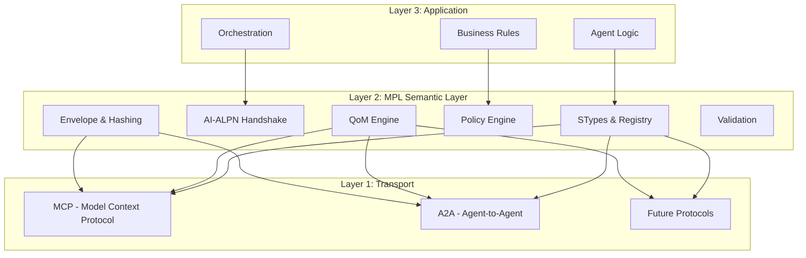
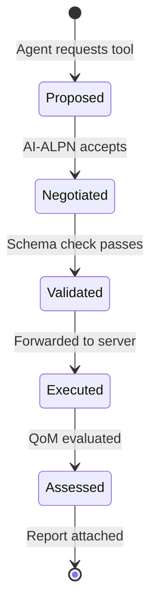
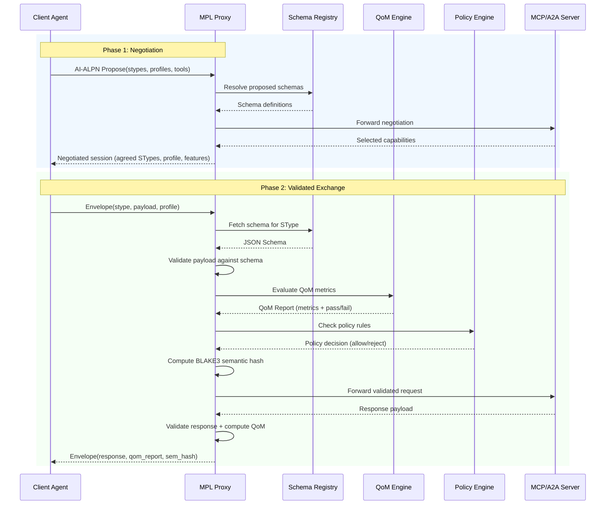

# Architecture

MPL is a semantic governance layer that overlays existing AI agent communication protocols. This page covers the protocol stack, the eight architectural pillars, and the core components that implement them.

---

## Protocol Stack

MPL introduces a semantic layer between your application logic and the underlying transport protocols (MCP, A2A):



| Layer | Responsibility | Examples |
|-------|---------------|----------|
| **Application** | Business logic, agent orchestration, user-facing behavior | LLM agents, workflow engines, task runners |
| **MPL Semantic** | Typed contracts, quality measurement, policy enforcement, audit | STypes, QoM, Policy, AI-ALPN, Envelope |
| **Transport** | Wire protocol, message framing, connection management | MCP (client/server), A2A (peer-to-peer) |

!!! note "Transport Independence"
    MPL never modifies transport-layer messages. It wraps them with semantic metadata, validates their content, and measures their quality -- all without changing how MCP or A2A work at the wire level.

---

## Architectural Pillars

MPL's design rests on eight pillars. Each addresses a specific gap in current AI agent governance:

### 1. Semantic Grounding

Every message is associated with a **Semantic Type (SType)** -- a globally unique, versioned identifier backed by JSON Schema. This grounds free-form AI outputs in a machine-verifiable contract.

```
org.calendar.Event.v1  -->  registry/stypes/org/calendar/Event/v1/schema.json
```

[:octicons-arrow-right-24: Learn more about STypes](stypes.md)

### 2. Capability Negotiation (AI-ALPN)

Before exchanging work, peers negotiate capabilities using an Application-Layer Protocol Negotiation inspired handshake. This prevents mismatches from producing invalid outputs.

- Client proposes: protocols, STypes, tools, QoM profiles
- Server selects: compatible subset, declares downgrades
- Result: both sides agree on the semantic contract

### 3. Quality Measurement (QoM)

Quality of Meaning provides six numeric metrics that quantify how well a message fulfills its semantic contract. Configurable profiles set thresholds for different risk levels.

[:octicons-arrow-right-24: Learn more about QoM](qom.md)

### 4. Semantic Integrity (Hashing)

Every envelope includes a **BLAKE3 semantic hash** computed over the canonicalized payload. This provides:

- Tamper detection across the message lifecycle
- Content-addressable referencing for audit logs
- Deduplication of semantically identical messages

### 5. Tool Lifecycle Management

MPL tracks the full lifecycle of tool invocations:



### 6. Transport Independence

The semantic layer is decoupled from transport. MPL works identically whether the underlying protocol is:

- **MCP** (client/server model for tool invocation)
- **A2A** (peer-to-peer agent collaboration)
- **Future protocols** (any JSON-based message exchange)

### 7. Policy Enforcement

The Policy Engine evaluates organizational rules against envelope metadata, QoM scores, and SType constraints. Policies are expressed as declarative rules:

```yaml
- name: require-high-quality-for-financial
  match:
    stype_prefix: "com.finance."
  require:
    profile: qom-comprehensive
    min_instruction_compliance: 0.99
  action: reject
```

### 8. Registry Governance

The Registry provides versioned, immutable storage for:

- SType schemas (JSON Schema draft 2020-12)
- QoM profiles and thresholds
- Assertion libraries (CEL expressions)
- Policy rule sets

!!! tip "Registry as Source of Truth"
    All validation decisions reference the registry. This means governance is centralized and auditable, even when enforcement is distributed across many proxies.

---

## Message Flow

The complete lifecycle of an MPL-governed interaction:



---

## Core Components

| Component | Source | Purpose |
|-----------|--------|---------|
| **STypes** | `crates/mpl-core/src/stype.rs` | Versioned semantic type identifiers with JSON Schema backing |
| **Envelope** | `crates/mpl-core/src/envelope.rs` | Message wrapper carrying payload, provenance, semantic hash, and QoM report |
| **AI-ALPN** | `crates/mpl-core/src/handshake.rs` | Capability negotiation protocol for aligning peers before work |
| **QoM Engine** | `crates/mpl-core/src/qom.rs` | Quality metrics evaluation against configurable profiles |
| **Policy Engine** | `crates/mpl-core/src/policy.rs` | Rule-based enforcement of organizational governance policies |
| **Validation** | `crates/mpl-core/src/validation.rs` | JSON Schema validation using draft 2020-12 |

### STypes

STypes are the foundational building block. They provide a globally unique name for what a message *means*, decoupled from how it is transmitted.

```rust
// From crates/mpl-core/src/stype.rs
pub struct SType {
    pub namespace: String,    // e.g., "org"
    pub domain: String,       // e.g., "calendar"
    pub name: String,         // e.g., "Event"
    pub major_version: u32,   // e.g., 1
}
```

[:octicons-arrow-right-24: Full STypes documentation](stypes.md)

### Envelope

The Envelope wraps every MPL message with governance metadata:

```rust
// From crates/mpl-core/src/envelope.rs
pub struct MplEnvelope {
    pub id: String,
    pub stype: SType,
    pub payload: Value,
    pub args_stype: Option<SType>,
    pub profile: String,
    pub sem_hash: String,
    pub provenance: Provenance,
    pub qom_report: Option<QomReport>,
    pub features: Vec<String>,
    pub timestamp: DateTime<Utc>,
}
```

### AI-ALPN Handshake

The handshake ensures both parties agree on capabilities before work begins:

```rust
// From crates/mpl-core/src/handshake.rs
pub struct AlpnProposal {
    pub protocols: Vec<String>,
    pub stypes: Vec<SType>,
    pub tools: Vec<String>,
    pub profiles: Vec<String>,
    pub policies: Vec<String>,
}

pub struct AlpnSelection {
    pub protocol: String,
    pub stypes: Vec<SType>,
    pub profile: String,
    pub downgrades: Vec<Downgrade>,
}
```

### QoM Engine

Evaluates messages against quality profiles:

[:octicons-arrow-right-24: Full QoM documentation](qom.md)

### Policy Engine

Enforces organizational rules expressed as declarative policies:

```rust
// From crates/mpl-core/src/policy.rs
pub struct PolicyRule {
    pub name: String,
    pub match_criteria: MatchCriteria,
    pub requirements: Requirements,
    pub action: PolicyAction,  // Allow, Reject, Warn
}
```

### Validation

Performs JSON Schema validation (draft 2020-12) against registered schemas:

```rust
// From crates/mpl-core/src/validation.rs
pub fn validate(payload: &Value, schema: &Value) -> ValidationResult {
    // Validates payload against JSON Schema draft 2020-12
    // Returns detailed error paths on failure
}
```

---

## Design Decisions

!!! abstract "Why a Separate Semantic Layer?"
    MCP and A2A handle *transport* excellently but provide no semantic guarantees about message *meaning*. MPL fills this gap without competing with or replacing either protocol.

!!! abstract "Why BLAKE3 for Hashing?"
    BLAKE3 is fast (parallel, SIMD-optimized), secure (based on BLAKE2), and produces fixed 256-bit hashes. It enables semantic hashing at wire speed without becoming a bottleneck.

!!! abstract "Why JSON Schema (draft 2020-12)?"
    JSON Schema is the most widely adopted schema language for JSON. Draft 2020-12 adds `prefixItems`, `$dynamicRef`, and improved vocabulary support -- all useful for complex semantic type definitions.

---

## Next Steps

- **[STypes](stypes.md)** -- Deep dive into semantic type design and versioning
- **[QoM](qom.md)** -- Understand quality metrics and profiles
- **[Integration Modes](integration-modes.md)** -- Choose your deployment model
