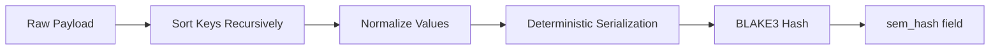
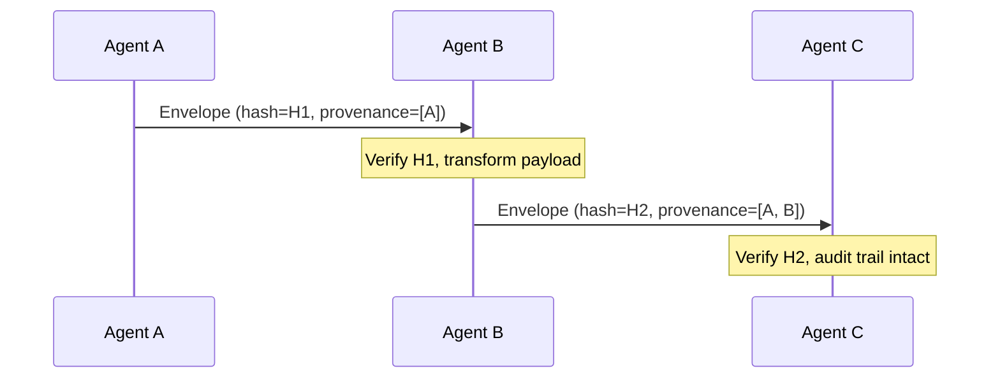
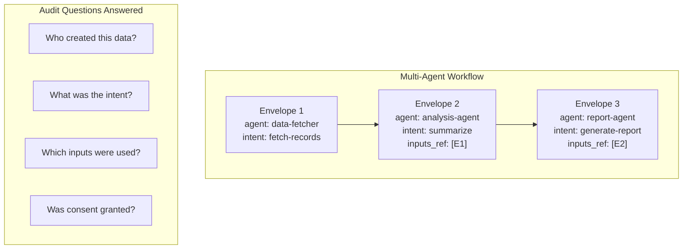

# Envelope & Provenance

Every MPL message is wrapped in an **MplEnvelope** -- the fundamental unit of semantic communication. The envelope carries not just the payload, but the full context needed for validation, auditing, and tamper detection across multi-agent workflows.

---

## MplEnvelope Structure

The envelope contains all metadata required for semantic governance:

| Field | Type | Purpose |
|-------|------|---------|
| `id` | `string` | Unique message identifier (UUID v7 recommended) |
| `stype` | `string` | Semantic type declaration (e.g., `org.calendar.Event.v1`) |
| `payload` | `string \| object` | The actual message content |
| `args_stype` | `string` | SType for tool input arguments (when wrapping tool calls) |
| `profile` | `string` | QoM profile to evaluate against |
| `sem_hash` | `string` | BLAKE3 hash over canonicalized payload |
| `provenance` | `object` | Origin, intent, and transformation chain |
| `qom_report` | `object` | Quality metrics and pass/fail status |
| `features` | `object` | Negotiated feature flags from handshake |
| `timestamp` | `string` | ISO 8601 creation time |

---

## Full Envelope Example

```json
{
  "id": "msg-01JQ7K3M5N8P2R4S6T8V0W",
  "stype": "org.calendar.Event.v1",
  "payload": {
    "title": "Quarterly Review",
    "start": "2025-01-15T10:00:00Z",
    "end": "2025-01-15T11:00:00Z",
    "attendees": ["alice@example.com", "bob@example.com"],
    "location": "Room 401"
  },
  "args_stype": null,
  "profile": "qom-strict-argcheck",
  "sem_hash": "blake3:7f2a1c4e8b9d3f6a0e5c2b8d4f1a7e3c9b5d2f8a4e6c0b3d7f9a1e5c8b2d4f6",
  "provenance": {
    "agent_id": "scheduler-agent-v2",
    "intent": "create-event",
    "inputs_ref": ["msg-01JQ7K2A3B4C5D6E7F8G9H"],
    "consent_ref": "consent-corporate-calendar-rw",
    "signatures": [
      {
        "agent_id": "scheduler-agent-v2",
        "algorithm": "ed25519",
        "value": "base64:xK9mN2pQ..."
      }
    ]
  },
  "qom_report": {
    "meets_profile": true,
    "metrics": {
      "schema_fidelity": 1.0,
      "instruction_compliance": 0.97,
      "groundedness": 1.0
    },
    "evaluated_at": "2025-01-15T09:59:58Z"
  },
  "features": {
    "mpl.streaming": true,
    "mpl.batch": false
  },
  "timestamp": "2025-01-15T09:59:55Z"
}
```

!!! info "Minimal Envelope"
    Only `stype` and `payload` are strictly required. All other fields are populated by the MPL proxy or SDK based on the negotiated session capabilities.

---

## Semantic Hashing

MPL uses **BLAKE3** cryptographic hashing over canonicalized payloads to provide tamper detection and integrity verification across multi-hop agent workflows.

### Canonicalization Algorithm

Before hashing, the payload undergoes deterministic canonicalization:

1. **Sort keys** recursively at every level of nesting (lexicographic order)
2. **Remove whitespace** between tokens (no pretty-printing)
3. **Normalize numbers** (no trailing zeros, no leading `+`)
4. **Normalize strings** (Unicode NFC normalization)
5. **Serialize deterministically** (consistent key ordering, no trailing commas)



!!! example "Canonicalization in Action"
    **Input:** `{"b": 2, "a": 1, "c": {"z": 26, "a": 1}}`

    **Canonicalized:** `{"a":1,"b":2,"c":{"a":1,"z":26}}`

    The output is always identical regardless of the original key ordering.

### Tamper Detection

When a downstream agent receives an envelope, it can verify integrity:

1. Extract the `payload` field
2. Canonicalize using the same algorithm
3. Compute BLAKE3 hash
4. Compare against `sem_hash` -- mismatch indicates tampering

### Multi-Hop Integrity

In workflows spanning multiple agents, each hop can:

- **Verify** the incoming envelope's hash before processing
- **Recompute** the hash after any legitimate transformation
- **Chain** provenance entries to record the transformation history



!!! warning "Hash Invalidation"
    Any modification to the payload -- even adding a single space -- invalidates the semantic hash. Agents that transform payloads **must** recompute the hash and append to the provenance chain.

---

## Provenance Metadata

The `provenance` object records the origin and transformation history of a message, enabling complete audit trails across multi-agent workflows.

### Provenance Fields

| Field | Required | Purpose |
|-------|----------|---------|
| `agent_id` | Yes | Identifier of the agent that created or last modified the envelope |
| `intent` | Yes | Declared purpose of the action (e.g., `create-event`, `summarize`) |
| `inputs_ref` | No | Array of envelope IDs that contributed to this message |
| `consent_ref` | No | Reference to the consent grant authorizing this action |
| `signatures` | No | Cryptographic signatures for non-repudiation |

### Provenance Example

```json
{
  "provenance": {
    "agent_id": "analysis-agent-v1",
    "intent": "summarize-financial-report",
    "inputs_ref": [
      "msg-01JQ7K2A3B4C5D6E7F8G9H",
      "msg-01JQ7K2B4C5D6E7F8G9HJK"
    ],
    "consent_ref": "consent-finance-readonly-2025",
    "signatures": [
      {
        "agent_id": "analysis-agent-v1",
        "algorithm": "ed25519",
        "value": "base64:pR7sT2uV..."
      }
    ]
  }
}
```

### Audit Trails Across Multi-Agent Workflows

Provenance enables organizations to answer critical governance questions:



!!! tip "Regulatory Compliance"
    In regulated industries (healthcare, finance), provenance provides the audit trail required by frameworks like HIPAA, SOX, and GDPR. Every data transformation is traceable back to its origin.

---

## Python SDK Examples

### Creating and Verifying Envelopes

```python
from mpl_sdk import MplEnvelope, canonicalize, semantic_hash, verify_hash

# Create envelope
envelope = MplEnvelope(
    stype="org.calendar.Event.v1",
    payload='{"title":"Meeting","start":"2025-01-15T10:00:00Z","end":"2025-01-15T11:00:00Z"}',
    profile="qom-basic"
)
envelope.compute_hash()
assert envelope.verify_hash()

# Hashing functions
canonical = canonicalize('{"b": 2, "a": 1}')  # '{"a":1,"b":2}'
hash_val = semantic_hash(canonical)
assert verify_hash(canonical, hash_val)
```

### Working with Provenance

```python
from mpl_sdk import MplEnvelope, Provenance

# Create envelope with full provenance
envelope = MplEnvelope(
    stype="org.agent.TaskPlan.v1",
    payload='{"steps": ["fetch data", "analyze", "report"]}',
    profile="qom-strict-argcheck",
    provenance=Provenance(
        agent_id="planner-agent-v1",
        intent="generate-task-plan",
        inputs_ref=["msg-001", "msg-002"],
        consent_ref="consent-org-planning"
    )
)

# Compute hash and verify
envelope.compute_hash()
print(f"Hash: {envelope.sem_hash}")
# blake3:9c4f2e7a...

# Verify integrity downstream
assert envelope.verify_hash(), "Envelope has been tampered with!"
```

### Multi-Hop Verification

```python
from mpl_sdk import MplEnvelope, verify_chain

# Agent B receives envelope from Agent A
incoming = receive_envelope()
assert incoming.verify_hash(), "Integrity check failed"

# Agent B transforms the payload
new_payload = transform(incoming.payload)
outgoing = MplEnvelope(
    stype="eval.rag.SearchResult.v1",
    payload=new_payload,
    profile=incoming.profile,
    provenance=Provenance(
        agent_id="search-agent-v1",
        intent="semantic-search",
        inputs_ref=[incoming.id]
    )
)
outgoing.compute_hash()

# Verify the full provenance chain
chain_valid = verify_chain([incoming, outgoing])
assert chain_valid, "Provenance chain is broken"
```

---

## Next Steps

- [AI-ALPN Handshake](handshake.md) -- How envelopes are negotiated before exchange
- [Policy Engine](policy-engine.md) -- How policies enforce rules on envelopes
- [Registry](registry.md) -- Where SType schemas for envelope validation are stored
