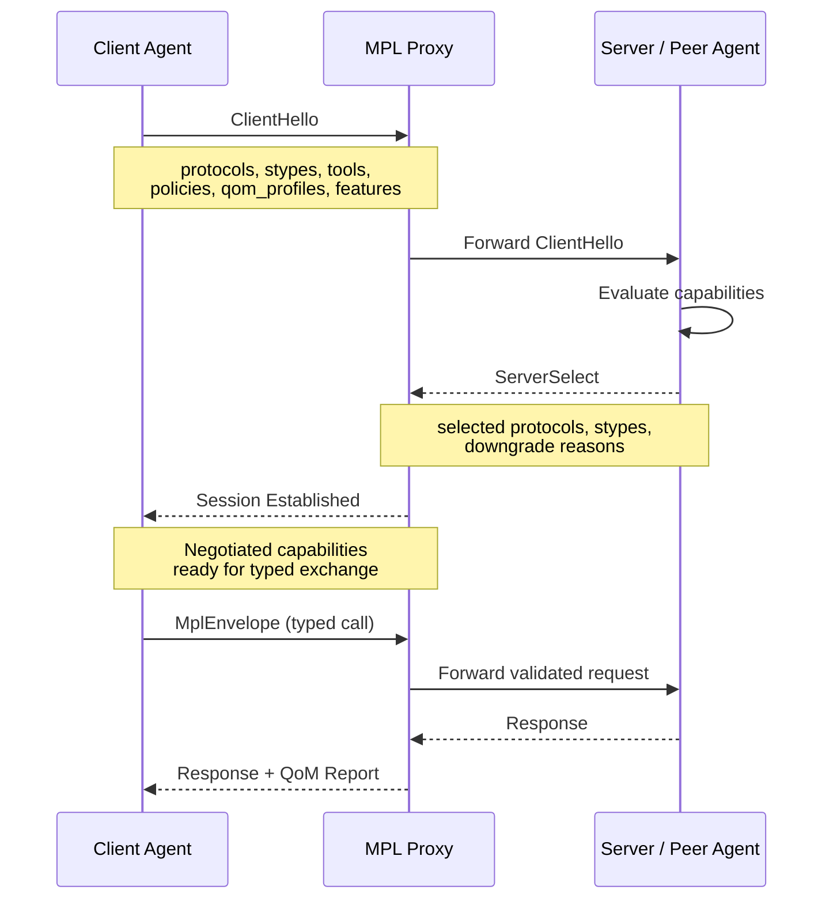
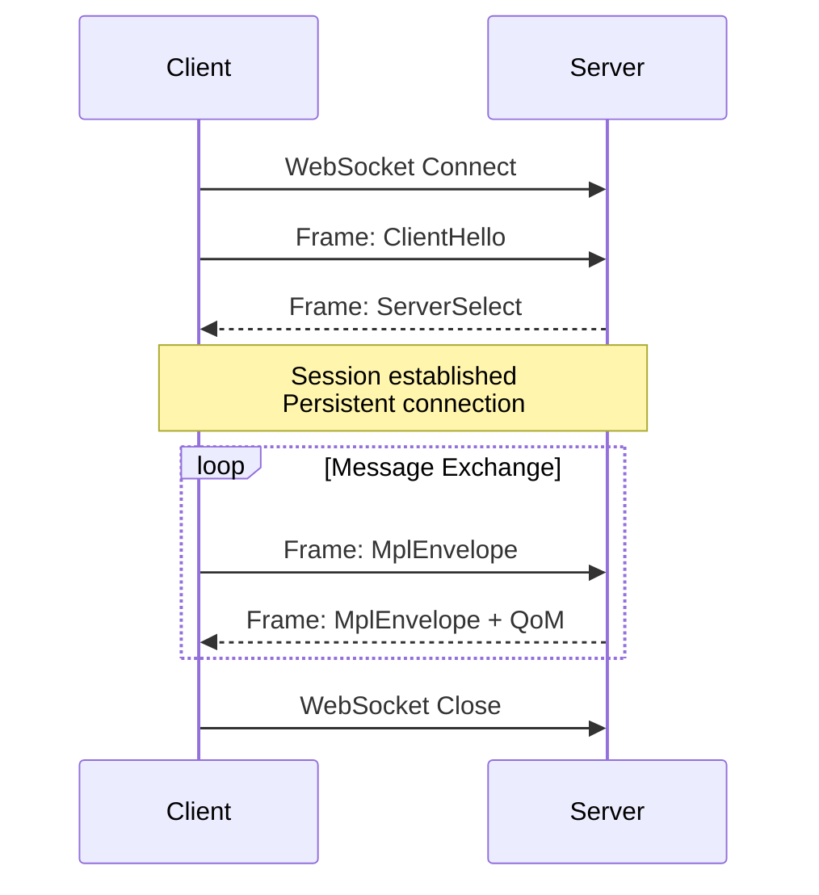
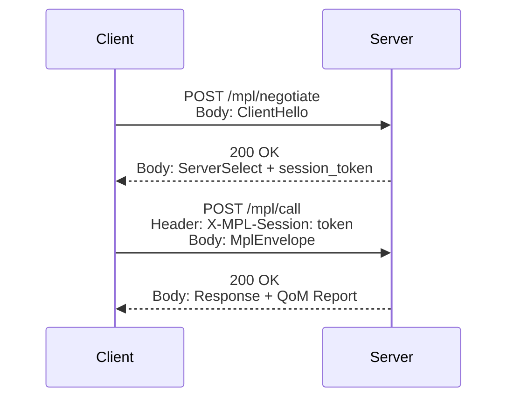

# AI-ALPN Handshake

The AI-ALPN (Application-Layer Protocol Negotiation) handshake is MPL's capability negotiation mechanism. Modeled after TLS ALPN, it ensures that both peers agree on semantic contracts **before** any work begins.

---

## Purpose

Without negotiation, agents risk:

- Sending payloads the receiver cannot validate
- Using QoM profiles the server does not support
- Invoking tools that have been deprecated or restricted by policy
- Wasting compute on work that will be rejected

AI-ALPN solves this by establishing a shared understanding of capabilities upfront.

!!! note "Why Not Just Fail-Fast?"
    Fail-fast approaches detect problems *after* work has been done. In multi-agent workflows with LLM inference costs, this waste compounds quickly. AI-ALPN prevents wasted work at the protocol level.

---

## Handshake Flow



---

## ClientHello Message

The client initiates the handshake by declaring everything it supports:

```json
{
  "type": "client_hello",
  "protocols": ["mcp-v1", "a2a-v1"],
  "models": ["gpt-4o", "claude-sonnet-4"],
  "stypes": [
    "org.calendar.Event.v1",
    "org.agent.TaskPlan.v1",
    "org.agent.ToolInvocation.v1",
    "data.table.Table.v1"
  ],
  "tools": [
    "calendar.create",
    "calendar.list",
    "search.semantic"
  ],
  "policies": ["restrict-phi", "financial-audit"],
  "qom_profiles": ["qom-basic", "qom-strict-argcheck", "qom-comprehensive"],
  "features": {
    "mpl.streaming": true,
    "mpl.batch": true,
    "mpl.provenance-signing": true
  }
}
```

| Field | Purpose |
|-------|---------|
| `protocols` | Transport protocols the client supports |
| `models` | LLM models the client may use (for compatibility checks) |
| `stypes` | Semantic types the client can produce or consume |
| `tools` | Tools the client expects to invoke |
| `policies` | Policy sets the client is aware of |
| `qom_profiles` | QoM profiles the client can satisfy |
| `features` | Optional extension flags |

---

## ServerSelect Response

The server responds with the intersection of capabilities, plus reasons for any downgrades:

```json
{
  "type": "server_select",
  "protocol": "mcp-v1",
  "stypes": [
    "org.calendar.Event.v1",
    "org.agent.TaskPlan.v1"
  ],
  "tools": ["calendar.create", "calendar.list"],
  "qom_profile": "qom-strict-argcheck",
  "features": {
    "mpl.streaming": true,
    "mpl.batch": false
  },
  "downgrades": [
    {
      "field": "stypes",
      "requested": "org.agent.ToolInvocation.v1",
      "reason": "SType not registered on server"
    },
    {
      "field": "stypes",
      "requested": "data.table.Table.v1",
      "reason": "SType deprecated; use data.record.Record.v1"
    },
    {
      "field": "features",
      "requested": "mpl.batch",
      "reason": "Batch mode not supported by this endpoint"
    }
  ]
}
```

!!! warning "Downgrade Awareness"
    Clients **must** respect the negotiated capabilities. Sending an SType that was not selected will result in an `E-STYPE-NOT-NEGOTIATED` error.

---

## Downgrade Handling

Downgrades occur when the server cannot satisfy all client capabilities. MPL provides structured telemetry for monitoring downgrade rates.

### Downgrade Metrics

| Metric | Target | Alert Threshold |
|--------|--------|----------------|
| Overall downgrade rate | < 5% | > 10% |
| SType downgrade rate | < 3% | > 7% |
| Profile downgrade rate | < 2% | > 5% |
| Feature downgrade rate | < 10% | > 20% |

!!! tip "Monitoring Best Practice"
    Track downgrade rates in your Prometheus/Grafana dashboards. A rising downgrade rate indicates schema drift between agents -- time to update registry definitions or align agent capabilities.

### Downgrade Telemetry

The proxy emits structured telemetry for every downgrade:

```json
{
  "event": "mpl.handshake.downgrade",
  "session_id": "sess-01JQ7K3M5N",
  "field": "stypes",
  "requested": "org.agent.ToolInvocation.v1",
  "reason": "SType not registered on server",
  "client_agent": "planner-agent-v1",
  "server_endpoint": "ws://mcp-server:8080",
  "timestamp": "2025-01-15T10:00:01Z"
}
```

---

## WebSocket Flow vs HTTP Flow

MPL supports both persistent WebSocket connections and stateless HTTP for the handshake.

### WebSocket Flow (Recommended)



**Advantages:**

- Single handshake for the session lifetime
- Lower latency for subsequent messages
- Supports streaming responses
- Real-time capability updates via re-negotiation

### HTTP Flow



**Advantages:**

- Works with existing HTTP infrastructure
- Stateless (session token carries capabilities)
- Easier to load-balance
- Compatible with serverless deployments

| Aspect | WebSocket | HTTP |
|--------|-----------|------|
| Handshake cost | Once per session | Once, then token-based |
| Latency | Lower (persistent) | Higher (per-request overhead) |
| Streaming | Native support | Requires SSE or chunked |
| Scalability | Sticky sessions needed | Stateless, easy to scale |
| Firewall compatibility | May require config | Works everywhere |

---

## Feature Flags

Feature flags enable optional extensions without requiring new SType definitions. They are namespaced to prevent collisions.

### Namespace Convention

```
{org}.{capability}

Examples:
  mpl.streaming         # Core MPL streaming support
  mpl.batch             # Core MPL batch processing
  mpl.provenance-signing  # Cryptographic provenance signatures
  acme.custom-metrics   # Organization-specific extension
  acme.priority-routing # Organization-specific extension
```

### Standard Feature Flags

| Flag | Purpose | Default |
|------|---------|---------|
| `mpl.streaming` | Enable streaming responses | `false` |
| `mpl.batch` | Enable batch envelope submission | `false` |
| `mpl.provenance-signing` | Require cryptographic signatures in provenance | `false` |
| `mpl.compression` | Enable payload compression | `false` |
| `mpl.retry` | Enable automatic retry with backoff | `true` |

!!! info "Why Feature Flags Instead of New STypes?"
    Feature flags handle cross-cutting concerns that apply to *any* SType (like streaming or compression). Creating new STypes for these would cause combinatorial explosion: `org.calendar.Event.v1.streaming`, `org.calendar.Event.v1.batch`, etc.

### Feature Negotiation Rules

1. Client proposes features in `ClientHello`
2. Server enables only features it supports
3. Unsupported features are silently set to `false` (no error)
4. Feature flags are immutable for the session duration
5. Re-negotiation requires a new handshake

---

## Python SDK Example

```python
from mpl_sdk import Session, SessionConfig

config = SessionConfig(
    endpoint="ws://localhost:8080/mcp",
    stypes=["org.calendar.Event.v1", "org.agent.TaskPlan.v1"],
    qom_profile="qom-strict-argcheck",
    registry_path="./registry",
)

async with Session(config) as session:
    caps = session.capabilities
    print(caps.common_stypes)     # Negotiated STypes
    print(caps.selected_profile)  # Selected QoM profile
```

### Advanced Configuration

```python
from mpl_sdk import Session, SessionConfig, Features

config = SessionConfig(
    endpoint="ws://localhost:8080/mcp",
    stypes=[
        "org.calendar.Event.v1",
        "org.agent.TaskPlan.v1",
        "data.record.Record.v1"
    ],
    tools=["calendar.create", "calendar.list"],
    qom_profile="qom-comprehensive",
    registry_path="./registry",
    features=Features(
        streaming=True,
        batch=True,
        provenance_signing=True
    ),
    policies=["restrict-phi", "financial-audit"]
)

async with Session(config) as session:
    # Inspect negotiation results
    caps = session.capabilities

    print(f"Protocol: {caps.protocol}")
    print(f"STypes: {caps.common_stypes}")
    print(f"Profile: {caps.selected_profile}")
    print(f"Features: {caps.features}")

    # Check for downgrades
    if caps.downgrades:
        for dg in caps.downgrades:
            print(f"Downgrade: {dg.field} - {dg.requested} -> {dg.reason}")

    # Send typed messages using negotiated capabilities
    result = await session.send(
        stype="org.calendar.Event.v1",
        payload={"title": "Standup", "start": "2025-01-15T09:00:00Z"}
    )
    print(result.qom_report)
```

### Handling Downgrades Programmatically

```python
from mpl_sdk import Session, SessionConfig, DowngradeError

config = SessionConfig(
    endpoint="ws://localhost:8080/mcp",
    stypes=["org.calendar.Event.v1"],
    qom_profile="qom-comprehensive",
    registry_path="./registry",
    require_profile=True  # Fail if profile is downgraded
)

try:
    async with Session(config) as session:
        pass
except DowngradeError as e:
    print(f"Critical downgrade: {e.field} - {e.reason}")
    # Fallback to a compatible profile
    config.qom_profile = "qom-basic"
    config.require_profile = False
    async with Session(config) as session:
        # Continue with reduced guarantees
        pass
```

---

## Next Steps

- [Envelope & Provenance](envelope.md) -- Structure of messages exchanged after handshake
- [Policy Engine](policy-engine.md) -- How policies interact with negotiated capabilities
- [Registry](registry.md) -- Where negotiated STypes are defined
