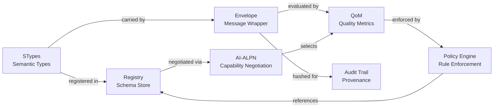
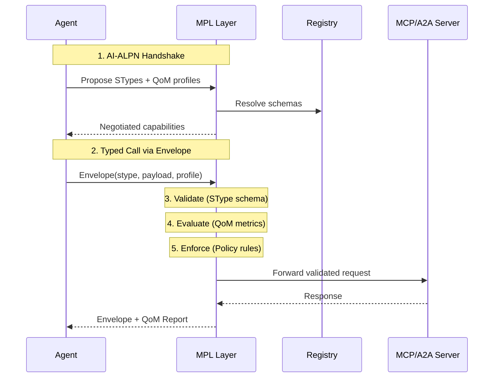

# Core Concepts

MPL is built on a small set of interlocking concepts. Each concept addresses a specific challenge in governing AI agent communication within regulated environments. Together, they form a complete semantic governance layer.

---

## Concept Map

The following diagram shows how MPL's core concepts relate to each other:

!!! info "Reading the Concept Map"
    Start from **STypes** on the left. They define what a message *means*. The **Registry** stores their schemas. The **Envelope** wraps messages with SType metadata. **AI-ALPN** negotiates which STypes and profiles both parties support. **QoM** measures semantic quality. The **Policy Engine** enforces organizational rules based on all of the above.

---

## Concepts at a Glance

| Concept | Description | Learn More |
|---------|-------------|------------|
| **Architecture** | The three-layer protocol stack and eight architectural pillars that define MPL's design | [Architecture](architecture.md) |
| **Semantic Types (STypes)** | Globally unique, versioned identifiers backed by JSON Schema that define message semantics | [STypes](stypes.md) |
| **Quality of Meaning (QoM)** | Six measurable metrics with configurable profiles that quantify semantic quality | [QoM](qom.md) |
| **Integration Modes** | Three deployment models (Sidecar, SDK, Native) for adopting MPL in any environment | [Integration Modes](integration-modes.md) |
| **Envelope** | The message wrapper carrying payload, SType, semantic hash, provenance, and QoM report | [Architecture: Envelope](architecture.md#core-components) |
| **AI-ALPN** | Capability negotiation handshake that aligns peers before work begins | [Architecture: AI-ALPN](architecture.md#core-components) |
| **Policy Engine** | Rule-based enforcement layer that gates actions on QoM thresholds, SType constraints, and org policies | [Architecture: Policy](architecture.md#core-components) |
| **Registry** | Versioned store of SType schemas, QoM profiles, and assertion libraries | [Architecture: Registry](architecture.md#core-components) |

---

## How the Concepts Fit Together

A typical MPL interaction exercises all concepts in sequence:

---

## Where to Start

!!! tip "Recommended Reading Order"
    1. **[Architecture](architecture.md)** -- Understand the protocol stack and design pillars
    2. **[Semantic Types](stypes.md)** -- Learn how messages get their meaning
    3. **[Quality of Meaning](qom.md)** -- See how quality is measured and enforced
    4. **[Integration Modes](integration-modes.md)** -- Choose how to deploy MPL in your environment

---

## Design Principles

MPL's concepts are guided by these principles:

| Principle | Meaning |
|-----------|---------|
| **Transport Independence** | Works with MCP, A2A, or any future protocol |
| **Progressive Adoption** | Start observing, then learn, then enforce |
| **Zero Trust Semantics** | Every message is validated regardless of source |
| **Measurable Quality** | Quality is numeric, not binary pass/fail |
| **Auditability** | Every decision leaves a cryptographic trace |
