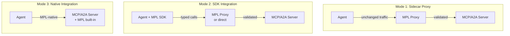
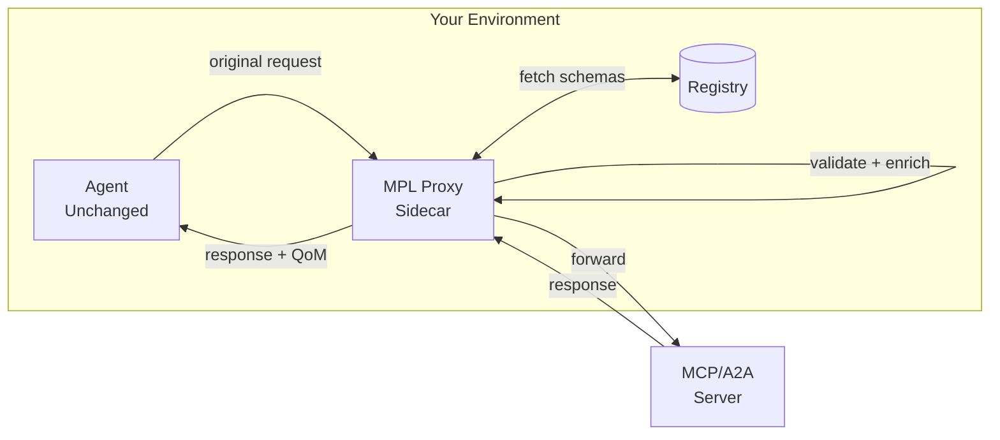
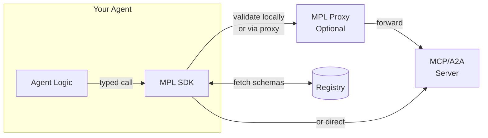
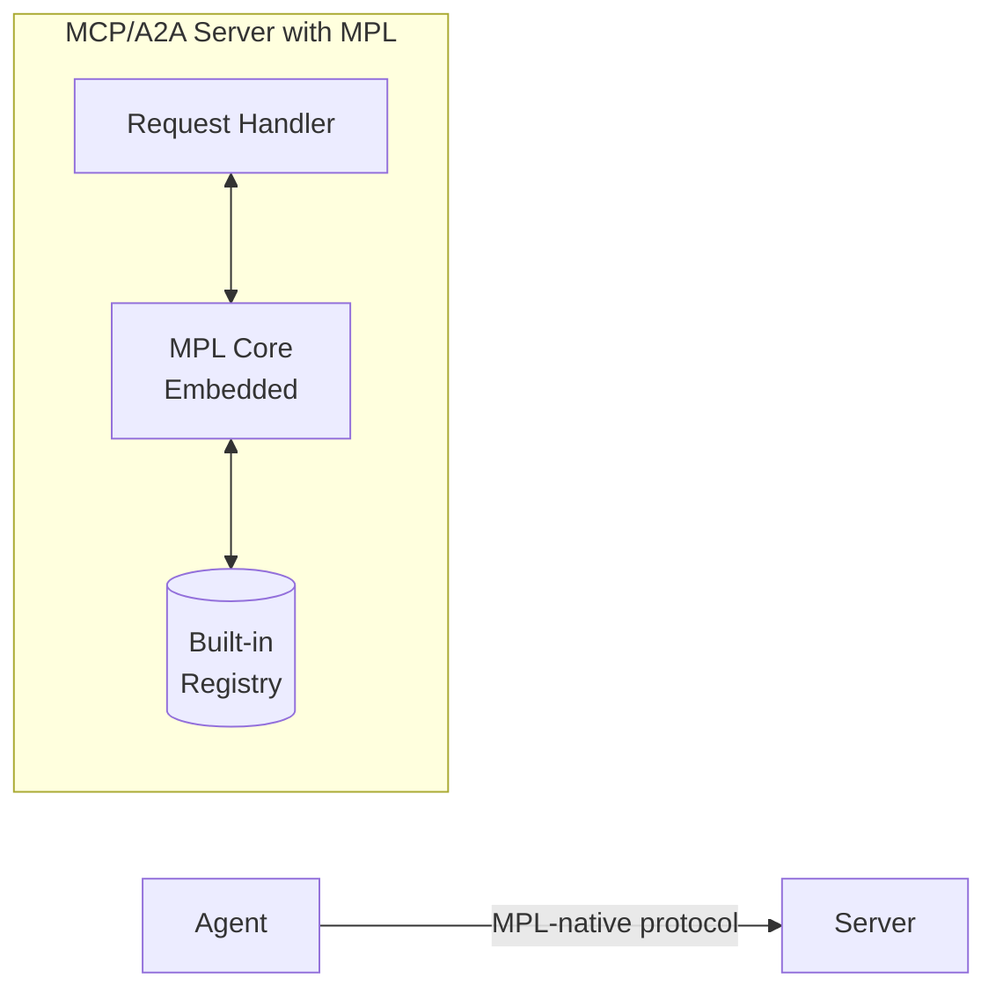
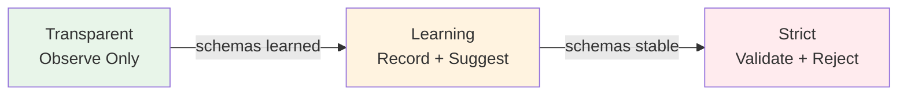
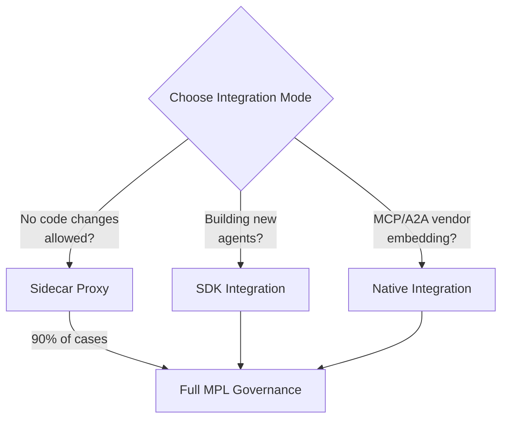

# Integration Modes

MPL offers three integration modes, each balancing deployment effort against control and customization. Choose the mode that fits your environment, then progressively adopt stricter enforcement over time.

---

## Overview



---

## Decision Matrix

| Mode | Effort | Code Changes | Best For | Trade-offs |
|------|--------|-------------|----------|------------|
| **Sidecar Proxy** | Zero code | None | 90% of deployments; existing agents and servers | Slight latency (< 5ms); limited to interceptable traffic |
| **SDK Integration** | Low code | Add SDK calls | Custom validation logic; client-side QoM awareness | Requires code changes; SDK dependency |
| **Native Integration** | Medium | Vendor implements | MCP/A2A platform vendors; deep protocol integration | Vendor adoption required; tighter coupling |

---

## Mode 1: Sidecar Proxy

!!! success "Recommended for 90% of Deployments"
    The sidecar proxy provides full MPL governance with zero code changes to your agents or servers. Deploy it alongside your existing infrastructure and get immediate visibility and control.

### How It Works

The proxy intercepts traffic between your agent and MCP/A2A server, transparently adding semantic governance:



### Deployment

```bash
# Start the proxy pointing at your existing MCP server
mpl proxy http://your-mcp-server:8080

# Or with Docker Compose
docker compose up mpl-proxy
```

### What You Get

- **Traffic visibility**: All MCP/A2A requests logged and observable
- **Schema validation**: Payloads checked against registered STypes
- **QoM evaluation**: Quality metrics computed for every interaction
- **Policy enforcement**: Organizational rules applied transparently
- **Audit trail**: BLAKE3 hashes and provenance for every message
- **Dashboard**: Real-time view at `http://localhost:9080`
- **Metrics**: Prometheus endpoint at `http://localhost:9100/metrics`

### Configuration

```yaml
# mpl-proxy.yaml
listen: "0.0.0.0:9443"
upstream: "http://your-mcp-server:8080"
registry: "file://./registry"
mode: learning          # transparent | learning | strict
profile: qom-basic     # default QoM profile
dashboard: true
metrics: true
```

### When to Choose

- You have existing agents and MCP/A2A servers you cannot modify
- You want immediate governance without development effort
- You need to evaluate MPL before committing to deeper integration
- Your compliance team requires governance but your dev team is capacity-constrained

---

## Mode 2: SDK Integration

!!! info "For Custom Validation and Client-Side Awareness"
    The SDK gives your agent code direct access to MPL's validation, QoM evaluation, and envelope construction. Use it when you need client-side quality awareness or custom assertion logic.

### How It Works

Your agent imports the MPL SDK and makes typed calls. The SDK handles envelope construction, validation, and QoM evaluation either locally or via a remote proxy:



### Python SDK

```python
from mpl_sdk import Client, Mode, QomProfile

async with Client("http://localhost:9443", mode=Mode.PRODUCTION) as client:
    # Negotiate capabilities
    session = await client.negotiate(
        stypes=["org.calendar.Event.v1"],
        profile=QomProfile.STRICT_ARGCHECK
    )

    # Make a typed call with automatic validation
    result = await client.call(
        stype="org.calendar.Event.v1",
        payload={
            "title": "Team Standup",
            "start": "2025-01-15T09:00:00Z",
            "end": "2025-01-15T09:30:00Z"
        }
    )

    # Access QoM report
    print(result.qom_report.meets_profile)  # True
    print(result.qom_report.schema_fidelity)  # 1.0
    print(result.sem_hash)  # "blake3:a1b2c3..."
```

### TypeScript SDK

```typescript
import { MplClient, QomProfile } from '@mpl/sdk';

const client = new MplClient('http://localhost:9443');

// Negotiate capabilities
const session = await client.negotiate({
  stypes: ['org.calendar.Event.v1'],
  profile: QomProfile.StrictArgcheck,
});

// Make a typed call
const result = await client.validate({
  stype: 'org.calendar.Event.v1',
  payload: {
    title: 'Team Standup',
    start: '2025-01-15T09:00:00Z',
    end: '2025-01-15T09:30:00Z',
  },
});

console.log(result.qomReport.meetsProfile); // true
```

### When to Choose

- You want client-side QoM awareness (e.g., retry on low quality)
- You need custom assertion logic beyond declarative CEL rules
- You are building new agents and can add MPL from the start
- You want local validation without a proxy roundtrip

---

## Mode 3: Native Integration

!!! warning "For Platform Vendors"
    Native integration is intended for MCP/A2A server implementations that want to embed MPL support directly. This gives the tightest integration but requires vendor adoption.

### How It Works

The MCP or A2A server implementation includes MPL support natively. Semantic governance happens inside the server process with no external proxy:



### Integration Points

Native integration adds MPL at these extension points:

| Extension Point | What It Does |
|----------------|--------------|
| **Connection handshake** | AI-ALPN negotiation during protocol setup |
| **Tool registration** | Associates STypes with tool definitions |
| **Request validation** | Schema check before tool execution |
| **Response enrichment** | Attaches QoM report and semantic hash |
| **Error mapping** | MPL error codes (E-SCHEMA-FIDELITY, E-QOM-BREACH) |

### Rust Crate Integration

```rust
use mpl_core::{MplEngine, Config, SType, Envelope};

let engine = MplEngine::new(Config {
    registry_path: "./registry",
    default_profile: "qom-strict-argcheck",
    mode: Mode::Strict,
});

// During tool invocation
let envelope = Envelope::new(
    SType::parse("org.calendar.Event.v1")?,
    payload,
);

let result = engine.validate_and_evaluate(&envelope)?;
if !result.meets_profile() {
    return Err(MplError::QomBreach(result.report()));
}
```

### When to Choose

- You are an MCP or A2A server vendor
- You want zero-latency governance (no proxy hop)
- You need the tightest possible integration with tool lifecycle
- You control the server implementation and can modify it

---

## Progressive Adoption Path

All three modes support progressive adoption through enforcement levels:



| Phase | Behavior | Duration | Outcome |
|-------|----------|----------|---------|
| **Transparent** | Observe and log all traffic; never reject | 1-2 weeks | Understand traffic patterns; identify SType candidates |
| **Learning** | Record schemas from observed payloads; warn on mismatches | 2-4 weeks | Auto-generated schemas; validated against real traffic |
| **Strict** | Validate every message; reject on schema or QoM failure | Ongoing | Full governance enforcement |

!!! tip "Start Transparent, Go Strict"
    The safest adoption path is:

    1. Deploy the sidecar proxy in **transparent** mode
    2. Let it observe traffic and learn schemas for **2-4 weeks**
    3. Review learned schemas and promote them to the registry
    4. Switch to **strict** mode for production enforcement

    This approach requires zero code changes and zero risk during the learning phase.

---

## Comparison Summary



| Capability | Sidecar | SDK | Native |
|-----------|---------|-----|--------|
| Schema validation | Yes | Yes | Yes |
| QoM evaluation | Yes | Yes | Yes |
| Policy enforcement | Yes | Yes | Yes |
| AI-ALPN negotiation | Yes | Yes | Yes |
| Zero code changes | Yes | No | No |
| Client-side QoM access | No | Yes | Yes |
| Custom assertions | Limited | Yes | Yes |
| Latency overhead | ~2-5ms | ~1ms | ~0ms |
| Deployment complexity | Low | Medium | High |

---

## Next Steps

- **[Quick Start](../getting-started/quick-start.md)** -- Deploy your first sidecar proxy in 5 minutes
- **[Architecture](architecture.md)** -- Understand the protocol stack these modes implement
- **[STypes](stypes.md)** -- Learn about the semantic types validated by all modes
