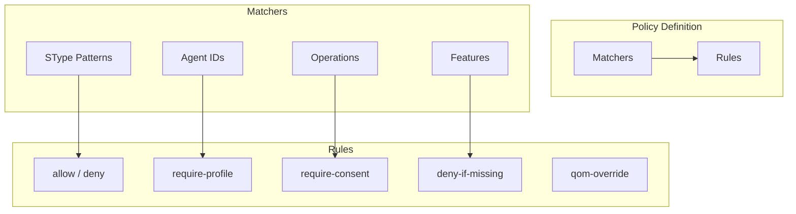
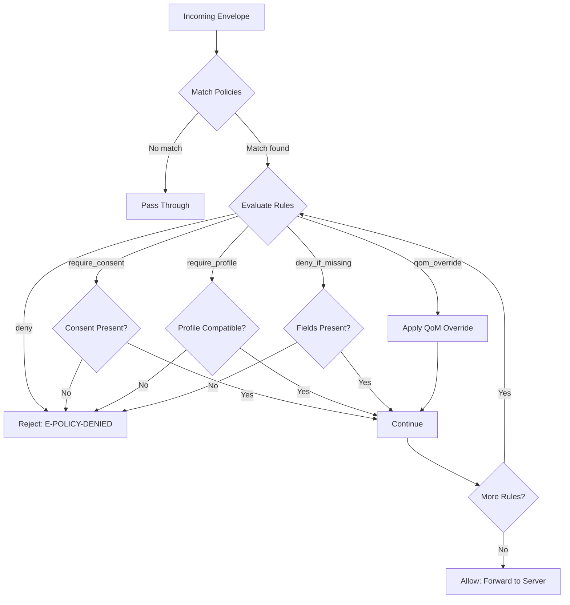
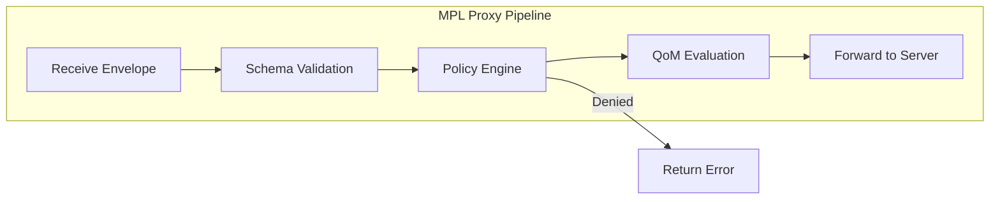

# Policy Engine

The Policy Engine enforces organizational constraints at the protocol level. It acts as a rule-based gatekeeper that evaluates every envelope against configurable policies before allowing it to proceed.

---

## Purpose

In regulated environments, agents must operate within organizational boundaries:

- **Healthcare:** PHI access requires patient consent and strict QoM profiles
- **Finance:** Audit trails must be complete; provenance cannot be missing
- **Legal:** Data residency rules restrict where payloads can be routed
- **Compliance:** Consent scopes must be verified before processing

The Policy Engine encodes these constraints as declarative rules, evaluated automatically by the MPL proxy.

!!! info "Protocol-Level Enforcement"
    Unlike application-level authorization, MPL policies operate at the *protocol layer*. This means enforcement is consistent regardless of which agent, framework, or language is used.

---

## Policy Structure

Policies are defined in YAML and consist of **matchers** and **rules**:



### Matchers

Matchers determine which messages a policy applies to:

| Matcher | Description | Example |
|---------|-------------|---------|
| `stypes` | Glob patterns matching SType names | `org.health.*`, `data.*.Record.v1` |
| `agents` | Agent IDs or patterns | `scheduler-*`, `external-agent-v2` |
| `operations` | Operations being performed | `create`, `read`, `delete` |
| `features` | Required feature flags | `mpl.provenance-signing` |

### Rules

Rules define the enforcement actions:

| Rule | Effect | Description |
|------|--------|-------------|
| `allow` | Pass | Explicitly allow matching messages |
| `deny` | Block | Reject matching messages |
| `require_profile` | Conditional | Require a specific QoM profile |
| `require_consent` | Conditional | Require a consent reference |
| `deny_if_missing` | Conditional | Deny if specified fields are absent |
| `qom_override` | Modify | Override the QoM profile for evaluation |

---

## Policy Definition Examples

### Healthcare: PHI Access Control

```yaml
policies:
  - name: "restrict-phi"
    match:
      stypes: ["org.health.*"]
    rules:
      - require_consent: "hipaa-patient-consent"
      - require_profile: "qom-strict-argcheck"
```

### Financial Audit Requirements

```yaml
policies:
  - name: "financial-audit"
    match:
      stypes: ["org.finance.*"]
    rules:
      - require_profile: "qom-comprehensive"
      - deny_if_missing: ["provenance.agent_id"]
```

### Complete Policy File

```yaml
# policies.yaml
version: "1.0"

policies:
  - name: "restrict-phi"
    description: "Enforce HIPAA compliance for health data"
    match:
      stypes: ["org.health.*"]
    rules:
      - require_consent: "hipaa-patient-consent"
      - require_profile: "qom-strict-argcheck"
      - deny_if_missing:
          - "provenance.agent_id"
          - "provenance.intent"
          - "provenance.consent_ref"

  - name: "financial-audit"
    description: "Ensure complete audit trails for financial data"
    match:
      stypes: ["org.finance.*"]
    rules:
      - require_profile: "qom-comprehensive"
      - deny_if_missing: ["provenance.agent_id"]
      - qom_override:
          groundedness: 1.0
          determinism: 0.95

  - name: "restrict-external-agents"
    description: "Limit external agent access to read-only STypes"
    match:
      agents: ["external-*"]
      operations: ["create", "update", "delete"]
    rules:
      - deny: "External agents are read-only"

  - name: "require-provenance-signing"
    description: "All production traffic must have signed provenance"
    match:
      stypes: ["*"]
      features: ["mpl.provenance-signing"]
    rules:
      - deny_if_missing: ["provenance.signatures"]

  - name: "data-residency-eu"
    description: "EU data must not leave EU endpoints"
    match:
      stypes: ["data.*.Record.v1"]
      agents: ["eu-*"]
    rules:
      - require_consent: "gdpr-data-processing"
      - require_profile: "qom-strict-argcheck"
```

---

## Evaluation Flow

When an envelope arrives at the MPL proxy, the policy engine evaluates it through a deterministic pipeline:



### Evaluation Order

1. **Collect matching policies** -- all policies whose matchers match the envelope
2. **Evaluate rules in order** -- within each policy, rules are evaluated sequentially
3. **First deny wins** -- if any rule denies, evaluation stops immediately
4. **All requirements must pass** -- every `require_*` rule must be satisfied
5. **QoM overrides accumulate** -- multiple overrides merge (strictest wins)

!!! warning "Policy Ordering"
    Policies are evaluated in the order they appear in the YAML file. Place more specific policies before general ones to ensure correct behavior.

---

## Policy Violation Error

When a policy denies a request, the proxy returns a structured error with remediation hints:

```json
{
  "error": {
    "code": "E-POLICY-DENIED",
    "policy": "restrict-phi",
    "rule": "require_consent",
    "message": "Policy 'restrict-phi' requires consent 'hipaa-patient-consent' for SType 'org.health.PatientRecord.v1'",
    "envelope_id": "msg-01JQ7K3M5N8P2R4S6T8V0W",
    "remediation": {
      "action": "provide_consent",
      "required_consent": "hipaa-patient-consent",
      "documentation": "https://docs.example.com/consent/hipaa"
    },
    "timestamp": "2025-01-15T10:00:05Z"
  }
}
```

### Error Fields

| Field | Purpose |
|-------|---------|
| `code` | Error code (`E-POLICY-DENIED`) |
| `policy` | Name of the policy that triggered the denial |
| `rule` | Specific rule within the policy |
| `message` | Human-readable explanation |
| `envelope_id` | ID of the rejected envelope |
| `remediation` | Hints on how to fix the issue |
| `timestamp` | When the denial occurred |

!!! tip "Actionable Errors"
    The `remediation` object tells agents exactly what they need to do to satisfy the policy. Well-designed agents can automatically retry with the required consent or profile.

---

## Integration with the Proxy Middleware

The Policy Engine runs as middleware in the MPL proxy pipeline:



### Proxy Configuration

```yaml
# mpl-proxy.yaml
proxy:
  listen: "0.0.0.0:9443"
  upstream: "http://mcp-server:8080"

  middleware:
    - schema_validation:
        registry: "./registry"
    - policy_engine:
        policies: "./policies.yaml"
        mode: "enforce"  # or "audit" for logging-only
    - qom_evaluation:
        default_profile: "qom-basic"

  telemetry:
    prometheus: ":9100"
    dashboard: ":9080"
```

### Audit Mode

In audit mode, policies log violations without blocking requests:

```yaml
middleware:
  - policy_engine:
      policies: "./policies.yaml"
      mode: "audit"  # Log violations, never block
```

!!! note "Progressive Rollout"
    Start with `mode: audit` to understand your traffic patterns, then switch to `mode: enforce` once policies are validated.

---

## Use Cases

### PHI Access Control (HIPAA)

Enforce that health data is only accessed with proper patient consent and strict validation:

```yaml
- name: "hipaa-enforcement"
  match:
    stypes: ["org.health.*"]
  rules:
    - require_consent: "hipaa-patient-consent"
    - require_profile: "qom-strict-argcheck"
    - deny_if_missing:
        - "provenance.agent_id"
        - "provenance.intent"
        - "provenance.consent_ref"
```

### Financial Audit Requirements (SOX)

Ensure complete provenance for all financial operations:

```yaml
- name: "sox-compliance"
  match:
    stypes: ["org.finance.*"]
  rules:
    - require_profile: "qom-comprehensive"
    - deny_if_missing:
        - "provenance.agent_id"
        - "provenance.signatures"
    - qom_override:
        groundedness: 1.0
        determinism: 0.99
```

### Data Residency (GDPR)

Restrict EU data to EU-based agents and require GDPR consent:

```yaml
- name: "gdpr-residency"
  match:
    stypes: ["data.*"]
    agents: ["eu-*"]
  rules:
    - require_consent: "gdpr-data-processing"
    - deny_if_missing: ["provenance.consent_ref"]
```

### Consent Enforcement

Block processing if the required consent scope is not present in provenance:

```yaml
- name: "consent-gate"
  match:
    stypes: ["*"]
  rules:
    - deny_if_missing: ["provenance.consent_ref"]
```

---

## Policy Metrics

The Policy Engine exposes Prometheus metrics for monitoring:

| Metric | Type | Description |
|--------|------|-------------|
| `mpl_policy_evaluations_total` | Counter | Total policy evaluations |
| `mpl_policy_denials_total` | Counter | Total denials by policy name |
| `mpl_policy_evaluation_duration_seconds` | Histogram | Time spent evaluating policies |
| `mpl_policy_audit_violations_total` | Counter | Violations logged in audit mode |

```promql
# Alert on high denial rate
rate(mpl_policy_denials_total[5m]) / rate(mpl_policy_evaluations_total[5m]) > 0.1
```

---

## Next Steps

- [Envelope & Provenance](envelope.md) -- How provenance fields satisfy policy requirements
- [AI-ALPN Handshake](handshake.md) -- How policies are declared during negotiation
- [Registry](registry.md) -- Where SType schemas referenced by policies are stored
