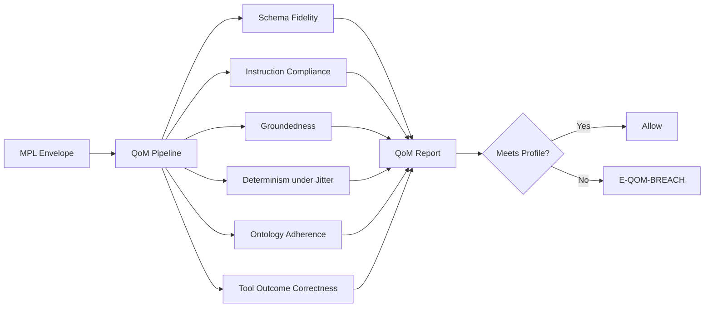
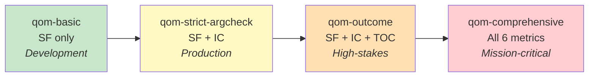
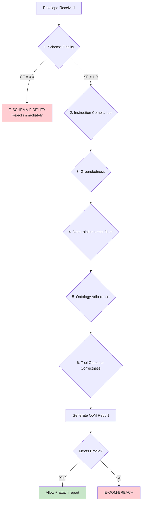

# Quality of Meaning (QoM)

Quality of Meaning (QoM) is MPL's system for measuring, quantifying, and enforcing semantic quality. Rather than treating quality as a binary pass/fail, QoM provides six numeric metrics that capture different dimensions of meaning fidelity. Configurable profiles set thresholds appropriate to each use case's risk level.

---

## Overview



!!! abstract "Design Philosophy"
    QoM treats semantic quality as a **measurable, continuous signal** rather than a gate. Each metric produces a value between 0.0 and 1.0. Profiles define thresholds -- the minimum acceptable scores for a given deployment context.

---

## The Six Metrics

### 1. Schema Fidelity (SF)

**What it measures**: Whether the payload structurally conforms to its declared SType's JSON Schema.

| Property | Value |
|----------|-------|
| **Score range** | 0.0 or 1.0 (binary) |
| **Evaluation** | JSON Schema validation (draft 2020-12) |
| **Mandatory** | Yes -- all profiles require SF = 1.0 |
| **Cost** | Negligible (local validation) |

Schema Fidelity is the foundational gate. If the payload does not conform to its declared schema, no further QoM evaluation occurs. The error `E-SCHEMA-FIDELITY` is returned immediately.

```json
{
  "metric": "schema_fidelity",
  "score": 1.0,
  "details": {
    "schema": "org.calendar.Event.v1",
    "validation_errors": []
  }
}
```

---

### 2. Instruction Compliance (IC)

**What it measures**: Whether the payload satisfies additional business assertions beyond schema structure.

| Property | Value |
|----------|-------|
| **Score range** | 0.0 to 1.0 (pass rate across assertions) |
| **Evaluation** | CEL expressions or JSONLogic rules |
| **Mandatory** | Required in `qom-strict-argcheck` and above |
| **Cost** | Low (rule evaluation) |

Assertions are defined in `.cel` files alongside the schema:

```cel
// assertions.cel for org.calendar.Event.v1

// End time must be after start time
timestamp(payload.end) > timestamp(payload.start)

// Title must not be all whitespace
payload.title.trim().size() > 0

// Event duration must be at most 24 hours
timestamp(payload.end) - timestamp(payload.start) <= duration("24h")
```

The IC score is the fraction of assertions that pass:

```
IC = passing_assertions / total_assertions
```

---

### 3. Groundedness (G)

**What it measures**: Whether claims in the payload are supported by cited sources.

| Property | Value |
|----------|-------|
| **Score range** | 0.0 to 1.0 (claim support ratio) |
| **Evaluation** | Citation verification against source material |
| **Mandatory** | Required in `qom-comprehensive` |
| **Cost** | Medium (requires source retrieval) |

Groundedness evaluates whether factual claims can be traced to source material. This is critical for RAG (Retrieval-Augmented Generation) scenarios:

```
G = supported_claims / total_claims
```

!!! info "When Groundedness Applies"
    Groundedness is most relevant for STypes that carry factual assertions (e.g., research summaries, medical information, financial reports). For purely structural types (e.g., calendar events), Groundedness is typically not required and scores 1.0 by default.

---

### 4. Determinism under Jitter (DJ)

**What it measures**: Whether repeated execution with slight input perturbation produces semantically consistent results.

| Property | Value |
|----------|-------|
| **Score range** | 0.0 to 1.0 (similarity across re-executions) |
| **Evaluation** | BLEU, ROUGE, or cosine similarity |
| **Mandatory** | Required in `qom-comprehensive` |
| **Cost** | High (requires multiple re-executions) |

Determinism under Jitter catches non-deterministic AI behaviors that could produce inconsistent outputs for the same logical input:

```
DJ = average_similarity(outputs_under_perturbation)
```

The evaluation process:

1. Introduce minor perturbations to the input (rephrasing, whitespace, ordering)
2. Re-execute the tool/agent call N times (configurable, default 3)
3. Compare outputs using configured similarity metric
4. Score is the average pairwise similarity

!!! warning "Performance Impact"
    DJ evaluation requires multiple re-executions of the tool call. Enable it only for high-stakes scenarios where consistency is critical. The `qom-comprehensive` profile includes DJ but with a relaxed threshold.

---

### 5. Ontology Adherence (OA)

**What it measures**: Whether the payload conforms to domain-specific ontological rules beyond JSON Schema.

| Property | Value |
|----------|-------|
| **Score range** | 0.0 to 1.0 (rule pass rate) |
| **Evaluation** | SHACL shapes, OWL constraints, or custom rules |
| **Mandatory** | Required in `qom-comprehensive` |
| **Cost** | Medium (rule engine evaluation) |

Ontology Adherence captures domain knowledge that cannot be expressed in JSON Schema alone:

- Medical: ICD-10 code validity, drug interaction checks
- Financial: SWIFT code format, currency pair validity
- Legal: Jurisdiction-specific clause requirements

```json
{
  "metric": "ontology_adherence",
  "score": 0.95,
  "details": {
    "rules_evaluated": 20,
    "rules_passed": 19,
    "violations": [
      {
        "rule": "icd10_code_valid",
        "message": "Code Z99.99 is not a valid ICD-10 code"
      }
    ]
  }
}
```

---

### 6. Tool Outcome Correctness (TOC)

**What it measures**: Whether the side effects of a tool invocation match expectations.

| Property | Value |
|----------|-------|
| **Score range** | 0.0 to 1.0 (post-check pass rate) |
| **Evaluation** | Post-execution hooks that verify outcomes |
| **Mandatory** | Required in `qom-outcome` and above |
| **Cost** | Variable (depends on post-check implementation) |

TOC verifies that tools actually did what they claimed. Post-check hooks run after tool execution:

```python
# Post-check hook for calendar event creation
async def check_event_created(tool_result, payload):
    """Verify the event actually exists in the calendar system."""
    event_id = tool_result["eventId"]
    event = await calendar_api.get_event(event_id)

    checks = {
        "event_exists": event is not None,
        "title_matches": event.title == payload["title"],
        "time_matches": event.start == payload["start"],
    }

    return sum(checks.values()) / len(checks)
```

---

## Metrics Summary

| # | Metric | Abbreviation | Measures | Score Type | Cost |
|---|--------|-------------|----------|-----------|------|
| 1 | Schema Fidelity | SF | Structural conformance | Binary (0/1) | Negligible |
| 2 | Instruction Compliance | IC | Business rule adherence | Continuous | Low |
| 3 | Groundedness | G | Citation support | Continuous | Medium |
| 4 | Determinism under Jitter | DJ | Output consistency | Continuous | High |
| 5 | Ontology Adherence | OA | Domain rule conformance | Continuous | Medium |
| 6 | Tool Outcome Correctness | TOC | Side-effect verification | Continuous | Variable |

---

## QoM Profiles

Profiles define which metrics are evaluated and their minimum thresholds. Choose a profile based on your deployment's risk level:

| Profile | Metrics Required | Thresholds | Use Case |
|---------|-----------------|-----------|----------|
| `qom-basic` | SF | SF = 1.0 | Development, testing, low-risk |
| `qom-strict-argcheck` | SF, IC | SF = 1.0, IC >= 0.97 | Production, business-critical |
| `qom-outcome` | SF, IC, TOC | SF + IC + TOC >= 0.95 (each) | High-stakes, side-effect verification |
| `qom-comprehensive` | All 6 | All metrics evaluated | Mission-critical, regulated environments |



!!! tip "Choosing a Profile"
    - **Development**: Start with `qom-basic` to validate schemas without overhead
    - **Production**: Use `qom-strict-argcheck` for most business applications
    - **Financial/Medical**: Use `qom-outcome` when side effects must be verified
    - **Regulated/Audited**: Use `qom-comprehensive` for full governance coverage

---

## Evaluation Pipeline

QoM metrics are evaluated in a defined order. Each stage can short-circuit on failure:



!!! note "Short-Circuit Behavior"
    Schema Fidelity failure immediately rejects the message. Other metrics are evaluated based on the active profile -- if the profile does not require a metric, it is skipped (scored as 1.0 by default).

---

## QoM Report Structure

Every evaluated message receives a QoM report attached to its response envelope:

```json
{
  "qom_report": {
    "profile": "qom-strict-argcheck",
    "meets_profile": true,
    "evaluated_at": "2025-01-15T10:00:05.123Z",
    "metrics": {
      "schema_fidelity": {
        "score": 1.0,
        "details": {
          "schema": "org.calendar.Event.v1",
          "validation_errors": []
        }
      },
      "instruction_compliance": {
        "score": 0.98,
        "details": {
          "assertions_total": 50,
          "assertions_passed": 49,
          "failures": [
            {
              "assertion": "event_duration_reasonable",
              "message": "Event duration exceeds 8 hours"
            }
          ]
        }
      }
    },
    "skipped_metrics": ["groundedness", "determinism", "ontology_adherence", "tool_outcome_correctness"],
    "evaluation_duration_ms": 12
  }
}
```

---

## Breach Handling

When a message fails to meet its negotiated QoM profile, the system raises an `E-QOM-BREACH` error:

### Error Response

```json
{
  "error": {
    "code": "E-QOM-BREACH",
    "message": "Message does not meet qom-strict-argcheck profile",
    "profile": "qom-strict-argcheck",
    "violations": [
      {
        "metric": "instruction_compliance",
        "required": 0.97,
        "actual": 0.89,
        "gap": 0.08
      }
    ],
    "retry_allowed": true,
    "retry_budget": 2
  }
}
```

### Breach Response Strategies

| Strategy | Behavior | Configuration |
|----------|----------|---------------|
| **Reject** | Return error to caller; no forwarding | `action: reject` (default) |
| **Retry** | Re-evaluate up to N times with regeneration | `retry_budget: 3` |
| **Degrade** | Fall back to a less strict profile | `fallback_profile: qom-basic` |
| **Warn** | Allow but flag in audit log | `action: warn` |

### Retry Policy

```yaml
qom:
  breach_handling:
    action: reject
    retry:
      enabled: true
      budget: 3
      backoff: exponential
      base_delay_ms: 100
    fallback:
      enabled: true
      profile: qom-basic
      log_level: warn
```

!!! warning "Profile Degradation"
    Falling back to a weaker profile should be a last resort. Every degradation is logged with full context in the audit trail. Use this only for availability-critical systems where partial governance is better than no response.

---

## Working with QoM in Code

### Python SDK

```python
from mpl_sdk import QomMetrics, QomProfile

# Create metrics from evaluation results
metrics = QomMetrics(
    schema_fidelity=1.0,
    instruction_compliance=0.95
)

# Load a profile
profile = QomProfile.strict_argcheck()

# Evaluate against profile
evaluation = profile.evaluate(metrics)
print(evaluation.meets_profile)  # False (IC 0.95 < required 0.97)
print(evaluation.violations)     # [Violation(metric="instruction_compliance", required=0.97, actual=0.95)]

# Check with a passing score
metrics_passing = QomMetrics(
    schema_fidelity=1.0,
    instruction_compliance=0.99
)
evaluation_pass = profile.evaluate(metrics_passing)
print(evaluation_pass.meets_profile)  # True
```

### TypeScript SDK

```typescript
import { QomMetrics, QomProfile } from '@mpl/sdk';

const metrics = new QomMetrics({
  schemaFidelity: 1.0,
  instructionCompliance: 0.95,
});

const profile = QomProfile.strictArgcheck();
const evaluation = profile.evaluate(metrics);

console.log(evaluation.meetsProfile);  // false
console.log(evaluation.violations);    // [{metric: "instructionCompliance", required: 0.97, actual: 0.95}]
```

### Custom Profile Definition

```python
from mpl_sdk import QomProfile, MetricThreshold

# Define a custom profile
custom_profile = QomProfile(
    name="my-org-production",
    thresholds={
        "schema_fidelity": MetricThreshold(min=1.0, required=True),
        "instruction_compliance": MetricThreshold(min=0.95, required=True),
        "groundedness": MetricThreshold(min=0.90, required=True),
        "tool_outcome_correctness": MetricThreshold(min=0.98, required=True),
    }
)

# Register in the local registry
registry.register_profile(custom_profile)
```

---

## Configuring QoM Evaluation

### Profile Selection Priority

QoM profiles are selected in this priority order:

1. **Envelope-level**: Profile specified in the message envelope
2. **Handshake-level**: Profile negotiated during AI-ALPN
3. **SType-level**: Default profile declared in SType metadata
4. **Proxy-level**: Default profile in proxy configuration

### Per-SType Configuration

```yaml
# registry/stypes/org/calendar/Event/v1/metadata.json
{
  "stype": "org.calendar.Event.v1",
  "default_profile": "qom-strict-argcheck",
  "assertions_path": "assertions.cel",
  "ontology_rules_path": null,
  "post_check_hooks": []
}
```

---

## Observability

QoM metrics are exposed for monitoring:

### Prometheus Metrics

```
# Histogram of QoM scores by metric
mpl_qom_score{metric="schema_fidelity", stype="org.calendar.Event.v1"} 1.0
mpl_qom_score{metric="instruction_compliance", stype="org.calendar.Event.v1"} 0.98

# Counter of QoM breaches by profile
mpl_qom_breaches_total{profile="qom-strict-argcheck", metric="instruction_compliance"} 42

# Histogram of evaluation duration
mpl_qom_evaluation_duration_seconds{profile="qom-strict-argcheck"} 0.012
```

### Dashboard

The MPL dashboard (`http://localhost:9080`) provides real-time QoM visibility:

- Score distributions per SType
- Breach rates over time
- Profile compliance trends
- Assertion failure heat maps

---

## Next Steps

- **[STypes](stypes.md)** -- Understand the schemas that Schema Fidelity validates
- **[Architecture](architecture.md)** -- See how QoM fits into the protocol stack
- **[Integration Modes](integration-modes.md)** -- Deploy QoM evaluation in your environment
