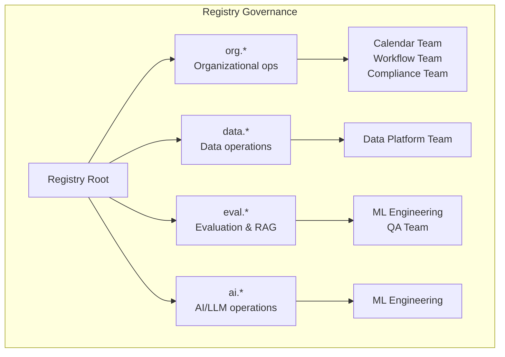
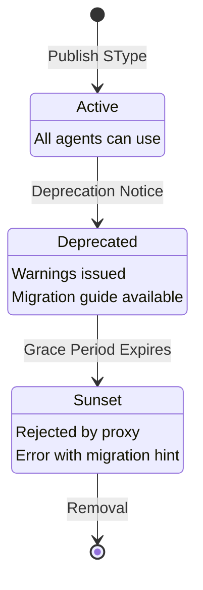

# Registry

The Registry is a centralized, version-controlled store of SType definitions. It provides the source of truth for all semantic types, schemas, assertions, and QoM profiles used across your MPL deployment.

---

## Purpose

The Registry answers fundamental questions for every MPL component:

- **Proxy:** "What schema should I validate this `org.calendar.Event.v1` payload against?"
- **Policy Engine:** "Does this SType exist and is it still active?"
- **QoM Engine:** "What assertions must hold for this profile?"
- **Agents:** "What STypes are available and what do they expect?"

!!! info "Single Source of Truth"
    All MPL components reference the same registry. This ensures consistent validation regardless of where an envelope is evaluated -- at the proxy, in the SDK, or during CI testing.

---

## Directory Structure

The registry follows a deterministic path convention:

```
registry/
├── stypes/
│   ├── org/
│   │   ├── calendar/Event/v1/
│   │   │   ├── schema.json
│   │   │   ├── assertions.json
│   │   │   ├── examples/
│   │   │   │   ├── basic-event.json
│   │   │   │   └── recurring-event.json
│   │   │   └── negative/
│   │   │       ├── missing-title.json
│   │   │       └── invalid-time-range.json
│   │   ├── agent/TaskPlan/v1/
│   │   │   ├── schema.json
│   │   │   ├── assertions.json
│   │   │   ├── examples/
│   │   │   └── negative/
│   │   └── agent/ToolInvocation/v1/...
│   ├── data/
│   │   ├── table/Table/v1/...
│   │   ├── record/Record/v1/...
│   │   └── query/Query/v1/...
│   ├── eval/
│   │   ├── rag/RAGQuery/v1/...
│   │   └── feedback/Feedback/v1/...
│   └── ai/
│       ├── prompt/Template/v1/...
│       └── completion/Response/v1/...
└── profiles/
    ├── qom-basic.json
    ├── qom-strict-argcheck.json
    └── qom-comprehensive.json
```

### Path Resolution

SType paths follow a deterministic pattern:

```
stypes/{namespace}/{domain}/{name}/v{major}/schema.json
```

| Segment | Example | Description |
|---------|---------|-------------|
| `namespace` | `org`, `data`, `eval`, `ai` | Top-level domain category |
| `domain` | `calendar`, `agent`, `table` | Functional domain |
| `name` | `Event`, `TaskPlan`, `Record` | Type name (PascalCase) |
| `v{major}` | `v1`, `v2` | Major version number |

!!! example "Path Examples"
    - `stypes/org/calendar/Event/v1/schema.json`
    - `stypes/data/record/Record/v1/assertions.json`
    - `stypes/ai/prompt/Template/v1/examples/basic.json`

---

## Pre-Seeded STypes

MPL ships with a comprehensive set of pre-defined STypes covering common agent workflows:

### org.* -- Organizational Operations

| SType | Purpose | Key Fields |
|-------|---------|------------|
| `org.calendar.Event.v1` | Calendar event creation/management | `title`, `start`, `end`, `attendees` |
| `org.agent.TaskPlan.v1` | Multi-step task planning | `steps`, `dependencies`, `priority` |
| `org.agent.ToolInvocation.v1` | Tool call wrapping | `tool_name`, `arguments`, `context` |
| `org.agent.ToolResult.v1` | Tool call result wrapping | `tool_name`, `result`, `status` |
| `org.workflow.Step.v1` | Individual workflow step | `action`, `inputs`, `outputs`, `status` |
| `org.workflow.Pipeline.v1` | Multi-step pipeline definition | `steps`, `trigger`, `schedule` |
| `org.communication.Message.v1` | Inter-agent messaging | `from`, `to`, `subject`, `body` |
| `org.profile.Profile.v1` | Agent profile/capabilities | `agent_id`, `capabilities`, `version` |

### data.* -- Data Operations

| SType | Purpose | Key Fields |
|-------|---------|------------|
| `data.table.Table.v1` | Tabular data representation | `columns`, `rows`, `schema` |
| `data.record.Record.v1` | Single record/document | `id`, `fields`, `metadata` |
| `data.query.Query.v1` | Structured query | `source`, `filters`, `projections` |
| `data.query.Result.v1` | Query result set | `records`, `total`, `cursor` |
| `data.file.FileMetadata.v1` | File metadata | `name`, `size`, `mime_type`, `hash` |
| `data.transform.Mapping.v1` | Data transformation rules | `source_schema`, `target_schema`, `rules` |

### eval.* -- Evaluation & Retrieval

| SType | Purpose | Key Fields |
|-------|---------|------------|
| `eval.rag.RAGQuery.v1` | RAG retrieval query | `query`, `top_k`, `filters`, `reranker` |
| `eval.rag.SearchResult.v1` | RAG search results | `results`, `scores`, `sources` |
| `eval.rag.Context.v1` | Retrieved context for generation | `documents`, `relevance_scores` |
| `eval.feedback.Feedback.v1` | Human/automated feedback | `rating`, `comments`, `categories` |
| `eval.benchmark.TestCase.v1` | Evaluation test case | `input`, `expected`, `metrics` |

### ai.* -- AI/LLM Operations

| SType | Purpose | Key Fields |
|-------|---------|------------|
| `ai.prompt.Template.v1` | Prompt template definition | `template`, `variables`, `model_hints` |
| `ai.prompt.Rendered.v1` | Rendered prompt ready for LLM | `messages`, `parameters` |
| `ai.completion.Response.v1` | LLM completion response | `content`, `model`, `usage`, `finish_reason` |
| `ai.completion.Streaming.v1` | Streaming completion chunk | `delta`, `index`, `finish_reason` |
| `ai.agent.Reasoning.v1` | Agent reasoning trace | `steps`, `conclusions`, `confidence` |
| `ai.agent.Decision.v1` | Agent decision record | `options`, `selected`, `rationale` |

---

## Schema Components

Each SType directory contains four components:

### schema.json -- JSON Schema Definition

The primary validation schema using JSON Schema draft 2020-12:

```json
{
  "$schema": "https://json-schema.org/draft/2020-12/schema",
  "$id": "https://mpl.dev/stypes/org/calendar/Event/v1",
  "title": "Calendar Event",
  "description": "Represents a calendar event with time range and attendees",
  "type": "object",
  "required": ["title", "start", "end"],
  "properties": {
    "title": {
      "type": "string",
      "minLength": 1,
      "maxLength": 500
    },
    "start": {
      "type": "string",
      "format": "date-time"
    },
    "end": {
      "type": "string",
      "format": "date-time"
    },
    "attendees": {
      "type": "array",
      "items": {
        "type": "string",
        "format": "email"
      }
    },
    "location": {
      "type": "string"
    },
    "recurrence": {
      "type": "string",
      "enum": ["daily", "weekly", "monthly", "yearly"]
    }
  },
  "additionalProperties": false
}
```

### assertions.json -- Integrity Constraint Rules

Semantic constraints beyond what JSON Schema can express:

```json
{
  "$schema": "https://mpl.dev/schemas/assertions/v1",
  "stype": "org.calendar.Event.v1",
  "assertions": [
    {
      "id": "end-after-start",
      "description": "Event end time must be after start time",
      "expression": "parse_datetime($.end) > parse_datetime($.start)",
      "severity": "error"
    },
    {
      "id": "reasonable-duration",
      "description": "Event duration should not exceed 24 hours",
      "expression": "duration_hours($.start, $.end) <= 24",
      "severity": "warning"
    },
    {
      "id": "attendee-limit",
      "description": "Events should have fewer than 100 attendees",
      "expression": "length($.attendees) < 100",
      "severity": "warning"
    }
  ]
}
```

!!! note "Assertion Severity"
    - **error**: Fails QoM instruction compliance check; blocks in strict mode
    - **warning**: Logged and reported in QoM report; does not block

### examples/ -- Positive Test Cases

Valid payloads that must pass both schema validation and assertions:

```json
// examples/basic-event.json
{
  "title": "Team Standup",
  "start": "2025-01-15T09:00:00Z",
  "end": "2025-01-15T09:30:00Z",
  "attendees": ["alice@example.com", "bob@example.com"],
  "location": "Room 401"
}
```

### negative/ -- Negative Test Cases

Invalid payloads that must fail validation, with expected error annotations:

```json
// negative/missing-title.json
{
  "_meta": {
    "expected_error": "required property 'title' is missing",
    "violated_rule": "schema.required"
  },
  "start": "2025-01-15T09:00:00Z",
  "end": "2025-01-15T09:30:00Z"
}
```

---

## Namespace Governance

### CODEOWNERS Rules

Registry namespaces are governed through standard CODEOWNERS patterns:

```
# registry/CODEOWNERS

# Core MPL types - maintained by platform team
stypes/org/agent/         @mpl-platform-team
stypes/org/workflow/      @mpl-platform-team

# Domain-specific types
stypes/org/calendar/      @calendar-team
stypes/org/health/        @compliance-team @health-team
stypes/org/finance/       @compliance-team @finance-team

# Data types
stypes/data/              @data-platform-team

# AI/ML types
stypes/ai/                @ml-engineering
stypes/eval/              @ml-engineering @qa-team

# Profiles
profiles/                 @mpl-platform-team @compliance-team
```

### Organization Scopes

Namespaces map to organizational boundaries:



!!! warning "Namespace Reservation"
    Custom organization namespaces (e.g., `acme.*`) require registration. Contact the platform team to reserve your namespace prefix.

---

## Registry API (REST)

The registry exposes a REST API for programmatic access:

### List STypes

```http
GET /api/v1/stypes?namespace=org&domain=calendar
```

```json
{
  "stypes": [
    {
      "stype": "org.calendar.Event.v1",
      "title": "Calendar Event",
      "status": "active",
      "created_at": "2025-01-01T00:00:00Z",
      "updated_at": "2025-01-10T14:30:00Z"
    }
  ],
  "total": 1
}
```

### Get Schema

```http
GET /api/v1/stypes/org.calendar.Event.v1/schema
```

Returns the `schema.json` content for the specified SType.

### Validate Payload

```http
POST /api/v1/stypes/org.calendar.Event.v1/validate
Content-Type: application/json

{
  "title": "Meeting",
  "start": "2025-01-15T10:00:00Z",
  "end": "2025-01-15T11:00:00Z"
}
```

```json
{
  "valid": true,
  "schema_errors": [],
  "assertion_results": [
    {"id": "end-after-start", "passed": true},
    {"id": "reasonable-duration", "passed": true}
  ]
}
```

### Search STypes

```http
GET /api/v1/stypes/search?q=calendar&status=active
```

```json
{
  "results": [
    {
      "stype": "org.calendar.Event.v1",
      "title": "Calendar Event",
      "score": 0.95
    }
  ]
}
```

### API Summary

| Endpoint | Method | Purpose |
|----------|--------|---------|
| `/api/v1/stypes` | GET | List STypes with optional filters |
| `/api/v1/stypes/{stype}/schema` | GET | Get JSON Schema for an SType |
| `/api/v1/stypes/{stype}/assertions` | GET | Get assertions for an SType |
| `/api/v1/stypes/{stype}/validate` | POST | Validate a payload against an SType |
| `/api/v1/stypes/search` | GET | Full-text search across STypes |
| `/api/v1/profiles` | GET | List available QoM profiles |
| `/api/v1/profiles/{name}` | GET | Get a specific profile definition |

---

## Versioning and Deprecation

### Versioning Rules

MPL follows a strict versioning protocol for SType evolution:

| Change Type | Version Impact | Example |
|-------------|---------------|---------|
| Adding optional field | No version bump | Adding `location` to Event |
| Adding required field | Major version bump | `v1` -> `v2` |
| Removing a field | Major version bump | `v1` -> `v2` |
| Changing field type | Major version bump | `v1` -> `v2` |
| Tightening constraints | Major version bump | Making `maxLength` shorter |
| Loosening constraints | No version bump | Making `maxLength` longer |

### Deprecation Workflow



### Deprecation Metadata

```json
{
  "stype": "org.calendar.Event.v1",
  "status": "deprecated",
  "deprecated_at": "2025-06-01T00:00:00Z",
  "sunset_at": "2025-09-01T00:00:00Z",
  "successor": "org.calendar.Event.v2",
  "migration_guide": "https://docs.mpl.dev/migration/calendar-event-v2",
  "reason": "Added required 'timezone' field for global support"
}
```

!!! tip "Deprecation Warnings"
    When a deprecated SType is used, the proxy includes a warning header:
    ```
    X-MPL-Deprecated: org.calendar.Event.v1; successor=org.calendar.Event.v2; sunset=2025-09-01
    ```

---

## QoM Profiles

Profiles are stored in the `profiles/` directory and define which quality metrics to evaluate:

### qom-basic.json

```json
{
  "name": "qom-basic",
  "description": "Basic schema validation only",
  "metrics": {
    "schema_fidelity": {
      "enabled": true,
      "threshold": 1.0
    },
    "instruction_compliance": {
      "enabled": false
    },
    "groundedness": {
      "enabled": false
    },
    "determinism": {
      "enabled": false
    }
  }
}
```

### qom-strict-argcheck.json

```json
{
  "name": "qom-strict-argcheck",
  "description": "Schema validation plus assertion checking",
  "metrics": {
    "schema_fidelity": {
      "enabled": true,
      "threshold": 1.0
    },
    "instruction_compliance": {
      "enabled": true,
      "threshold": 0.95
    },
    "groundedness": {
      "enabled": true,
      "threshold": 0.9
    },
    "determinism": {
      "enabled": false
    }
  }
}
```

---

## CLI Usage

```bash
# List all registered STypes
mpl registry list

# Show schema for a specific SType
mpl registry show org.calendar.Event.v1

# Validate a payload against a schema
mpl registry validate org.calendar.Event.v1 payload.json

# Search for STypes
mpl registry search "calendar"

# Check SType status
mpl registry status org.calendar.Event.v1

# Run positive and negative test cases
mpl registry test org.calendar.Event.v1
```

---

## Next Steps

- [Envelope & Provenance](envelope.md) -- How envelopes reference STypes from the registry
- [AI-ALPN Handshake](handshake.md) -- How STypes are negotiated between peers
- [Policy Engine](policy-engine.md) -- How policies reference SType patterns for enforcement
