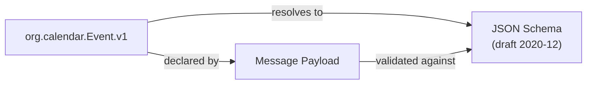
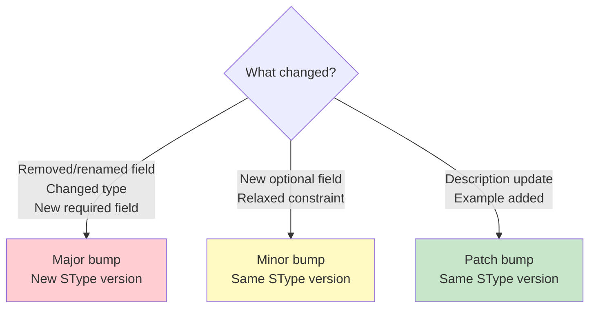
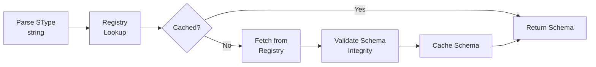

# Semantic Types (STypes)

STypes are the foundational building block of MPL. They provide globally unique, versioned identifiers that define what a message *means*, backed by JSON Schema for machine-verifiable validation.

---

## What Are STypes?

An SType is a structured identifier that associates a message with a specific semantic contract. Every MPL-governed message declares its SType, enabling the system to:

- **Validate** the payload against a registered schema
- **Negotiate** compatible types between agents
- **Version** semantic contracts with explicit compatibility rules
- **Audit** which contract governed each interaction



!!! example "Example SType"
    `org.calendar.Event.v1` identifies a calendar event message, version 1, in the `org` (standard) namespace, under the `calendar` domain.

---

## Naming Format

STypes follow a strict four-part naming convention:

```
namespace.domain.Intent.vMajor
```

| Part | Rules | Example |
|------|-------|---------|
| **namespace** | Lowercase, dot-separated organization identifier | `org`, `com.acme`, `data` |
| **domain** | Lowercase, single word describing the functional area | `calendar`, `finance`, `medical` |
| **Intent** | PascalCase, describes the semantic meaning | `Event`, `Transaction`, `Diagnosis` |
| **vMajor** | `v` prefix + major version number | `v1`, `v2`, `v12` |

### Parsing an SType

```python
from mpl_sdk import SType

stype = SType("org.calendar.Event.v1")
print(stype.namespace)       # "org"
print(stype.domain)          # "calendar"
print(stype.name)            # "Event"
print(stype.major_version)   # 1
```

### Valid SType Examples

| SType | Namespace | Domain | Intent | Version |
|-------|-----------|--------|--------|---------|
| `org.calendar.Event.v1` | org | calendar | Event | 1 |
| `com.acme.finance.Transaction.v3` | com.acme | finance | Transaction | 3 |
| `data.medical.Diagnosis.v1` | data | medical | Diagnosis | 1 |
| `eval.benchmark.Result.v2` | eval | benchmark | Result | 2 |
| `ai.completion.ChatResponse.v1` | ai | completion | ChatResponse | 1 |

---

## Namespace Governance

Namespaces prevent naming collisions and establish ownership:

| Namespace | Governance | Purpose | Example |
|-----------|-----------|---------|---------|
| `org` | MPL Consortium | Standard types shared across the ecosystem | `org.calendar.Event.v1` |
| `com.{company}` | Organization | Company-specific types with private governance | `com.acme.finance.Invoice.v2` |
| `data` | MPL Consortium | Data exchange formats (datasets, records) | `data.csv.Row.v1` |
| `eval` | MPL Consortium | Evaluation and benchmark types | `eval.benchmark.Result.v1` |
| `ai` | MPL Consortium | AI-specific types (completions, embeddings) | `ai.completion.ChatResponse.v1` |

!!! info "Registering a Namespace"
    The `org`, `data`, `eval`, and `ai` namespaces are governed by the MPL Consortium. To register a company namespace (`com.yourcompany`), submit a namespace claim to the registry governance process. Private registries can define any namespace without external approval.

---

## Schema Backing

Every SType resolves to a JSON Schema (draft 2020-12) stored in the registry. The schema defines the exact structure a payload must conform to.

### Schema Requirements

| Requirement | Rationale |
|-------------|-----------|
| JSON Schema draft 2020-12 | Latest stable draft with vocabulary support |
| `additionalProperties: false` | Prevents undeclared fields from bypassing validation |
| All fields in `required` array | Ensures complete, unambiguous payloads |
| `$id` matches SType identifier | Links schema to its SType unambiguously |
| `title` and `description` present | Human-readable documentation |

### Example Schema

The following schema backs `org.calendar.Event.v1`:

```json
{
  "$schema": "https://json-schema.org/draft/2020-12/schema",
  "$id": "https://mpl.dev/stypes/org/calendar/Event/v1/schema.json",
  "title": "Calendar Event",
  "description": "A calendar event with required time bounds and title.",
  "type": "object",
  "required": ["title", "start", "end"],
  "additionalProperties": false,
  "properties": {
    "title": {
      "type": "string",
      "minLength": 1,
      "maxLength": 500,
      "description": "Human-readable event title"
    },
    "start": {
      "type": "string",
      "format": "date-time",
      "description": "Event start time in ISO 8601 format"
    },
    "end": {
      "type": "string",
      "format": "date-time",
      "description": "Event end time in ISO 8601 format"
    },
    "location": {
      "type": "string",
      "maxLength": 1000,
      "description": "Optional event location"
    },
    "attendees": {
      "type": "array",
      "items": {
        "type": "string",
        "format": "email"
      },
      "description": "Optional list of attendee email addresses"
    }
  }
}
```

!!! warning "`additionalProperties: false` Is Mandatory"
    All SType schemas must set `additionalProperties: false`. This ensures that every field in a payload is explicitly declared and validated. Without this, agents could pass arbitrary undeclared data through the governance layer.

---

## Registry Path

SType schemas are stored in the registry at a deterministic path derived from the SType identifier:

```
registry/stypes/{namespace}/{domain}/{name}/v{major}/schema.json
```

### Path Examples

| SType | Registry Path |
|-------|--------------|
| `org.calendar.Event.v1` | `registry/stypes/org/calendar/Event/v1/schema.json` |
| `com.acme.finance.Transaction.v3` | `registry/stypes/com.acme/finance/Transaction/v3/schema.json` |
| `data.medical.Diagnosis.v1` | `registry/stypes/data/medical/Diagnosis/v1/schema.json` |

### Registry Structure

```
registry/
  stypes/
    org/
      calendar/
        Event/
          v1/
            schema.json
            assertions.cel
            metadata.json
          v2/
            schema.json
            assertions.cel
            metadata.json
      email/
        Message/
          v1/
            schema.json
    com.acme/
      finance/
        Transaction/
          v3/
            schema.json
            assertions.cel
```

---

## Versioning

STypes use semantic versioning with the major version encoded directly in the identifier. Minor and patch versions live in schema metadata.

### Version Components

| Component | Location | Meaning |
|-----------|----------|---------|
| **Major** | In SType identifier (`v1`, `v2`) | Breaking changes; new schema contract |
| **Minor** | In `metadata.json` | Backward-compatible additions (new optional fields) |
| **Patch** | In `metadata.json` | Documentation, description, or example changes only |

### Backward Compatibility Rules



| Change Type | Version Impact | Example |
|-------------|---------------|---------|
| Remove a required field | **Major** (breaking) | Removing `end` from Event |
| Add a new required field | **Major** (breaking) | Adding required `timezone` |
| Change a field's type | **Major** (breaking) | `start: string` to `start: integer` |
| Add a new optional field | Minor | Adding optional `description` |
| Relax a constraint | Minor | `minLength: 5` to `minLength: 1` |
| Tighten a constraint | **Major** (breaking) | `maxLength: 500` to `maxLength: 100` |
| Update description text | Patch | Clarifying field documentation |

### Metadata File

```json
{
  "stype": "org.calendar.Event.v1",
  "version": {
    "major": 1,
    "minor": 3,
    "patch": 0
  },
  "created": "2025-01-01T00:00:00Z",
  "updated": "2025-06-15T14:30:00Z",
  "deprecated": false,
  "successor": null,
  "authors": ["calendar-team@example.com"],
  "tags": ["calendar", "scheduling", "events"]
}
```

!!! tip "Deprecation and Migration"
    When a major version is superseded, set `deprecated: true` and `successor: "org.calendar.Event.v2"` in the metadata. The proxy will log deprecation warnings, and the AI-ALPN handshake will prefer the successor version when both are available.

---

## SType Resolution

When the MPL layer encounters an SType, it resolves it through this pipeline:



1. **Parse**: Validate the SType string format
2. **Lookup**: Check the local schema cache
3. **Fetch**: If not cached, retrieve from the registry
4. **Validate**: Verify schema integrity (hash check)
5. **Cache**: Store for future lookups
6. **Return**: Provide the schema for payload validation

---

## Working with STypes in Code

### Python SDK

```python
from mpl_sdk import SType, Registry

# Parse and inspect
stype = SType("org.calendar.Event.v1")
print(stype.namespace)       # "org"
print(stype.domain)          # "calendar"
print(stype.name)            # "Event"
print(stype.major_version)   # 1
print(stype.registry_path)   # "registry/stypes/org/calendar/Event/v1/schema.json"

# Resolve schema from registry
registry = Registry("./registry")
schema = registry.resolve(stype)

# Validate a payload
from mpl_sdk import validate
result = validate(
    payload={"title": "Meeting", "start": "2025-01-15T10:00:00Z", "end": "2025-01-15T11:00:00Z"},
    stype=stype,
    registry=registry
)
print(result.valid)          # True
print(result.errors)         # []
```

### TypeScript SDK

```typescript
import { SType, Registry } from '@mpl/sdk';

const stype = SType.parse('org.calendar.Event.v1');
console.log(stype.namespace);     // "org"
console.log(stype.domain);        // "calendar"
console.log(stype.name);          // "Event"
console.log(stype.majorVersion);  // 1

const registry = new Registry('./registry');
const schema = await registry.resolve(stype);
const result = await registry.validate(stype, {
  title: 'Meeting',
  start: '2025-01-15T10:00:00Z',
  end: '2025-01-15T11:00:00Z',
});
```

---

## SType Design Guidelines

!!! tip "Best Practices"
    - **Be specific**: `org.calendar.RecurringEvent.v1` is better than `org.calendar.Event.v1` with a `recurring` boolean
    - **One intent per SType**: Do not overload a single SType with multiple semantic meanings
    - **Start at v1**: Never start at v0; the first published schema is always v1
    - **Document thoroughly**: Every field should have a `description` in the schema
    - **Use format keywords**: `date-time`, `email`, `uri`, `uuid` provide free validation
    - **Prefer flat structures**: Deeply nested schemas are harder to version safely

---

## Next Steps

- **[QoM](qom.md)** -- Learn how SType-validated messages are quality-scored
- **[Architecture](architecture.md)** -- See how STypes fit into the protocol stack
- **[Integration Modes](integration-modes.md)** -- Deploy SType validation in your environment
