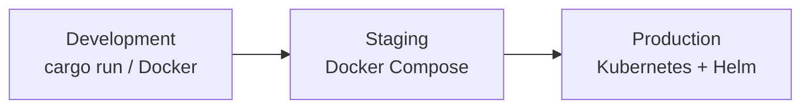
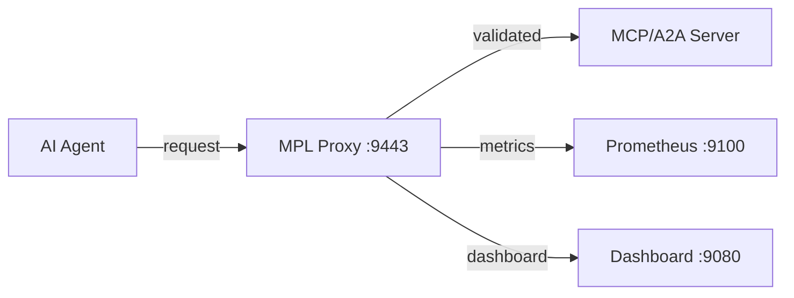

# Deployment

The MPL proxy is a single Rust binary that sits between your AI agents and MCP/A2A servers. It can be deployed as a native binary, a Docker container, or a Kubernetes sidecar -- choose the method that matches your environment and operational maturity.

---

## Deployment Options

MPL supports three primary deployment patterns, each suited to a different stage of your workflow:



### Development

Run the proxy locally for rapid iteration:

=== "Cargo (Native)"

    ```bash
    cargo run --release --package mpl-proxy -- --config mpl-config.yaml
    ```

=== "Docker"

    ```bash
    docker run -p 9443:9443 -p 9100:9100 \
      -v ./registry:/app/registry:ro \
      -v ./mpl-config.yaml:/app/mpl-config.yaml:ro \
      mpl-proxy:latest
    ```

### Staging

Use Docker Compose to run the full stack locally -- proxy, demo server, and optional monitoring:

```bash
docker compose up -d
```

### Production

Deploy with the Helm chart for autoscaling, health probes, network policies, and observability:

```bash
helm install mpl-proxy ./helm/mpl-proxy \
  --set mpl.mode=strict \
  --set mpl.requiredProfile=qom-strict-argcheck \
  --set transport.upstream=http://mcp-server:8080
```

---

## Decision Matrix

| Environment | Method | Complexity | Features | Guide |
|-------------|--------|:----------:|----------|-------|
| **Development** | `cargo run` or Docker | Low | Hot reload, debug logging | [Docker](docker.md) |
| **Staging** | Docker Compose | Medium | Full stack, metrics, dashboards | [Docker](docker.md) |
| **Production** | Kubernetes + Helm | High | HPA, TLS, network policies, PDB, ServiceMonitor | [Kubernetes & Helm](kubernetes.md) |

---

## Ports

All deployment methods expose the same set of ports:

| Port | Purpose | Protocol |
|------|---------|----------|
| **9443** | Proxy (MCP/A2A traffic) | HTTP |
| **9100** | Prometheus metrics | HTTP |
| **9080** | Dashboard UI | HTTP |

---

## Configuration

Regardless of deployment method, the proxy reads its configuration from `mpl-config.yaml`. Key sections:

| Section | Controls |
|---------|----------|
| `transport` | Listen address, upstream target, protocol |
| `mpl` | Mode, registry path, QoM profile, schema enforcement |
| `observability` | Metrics port, log level, log format |
| `routing` | (Optional) SType-based traffic routing |

See the [Configuration Reference](../reference/configuration.md) for full details.

---

## Deployment Guides

<div class="grid cards" markdown>

-   :material-docker:{ .lg .middle } **Docker Deployment**

    ---

    Build, run, and compose the MPL proxy as a container.

    [:octicons-arrow-right-24: Docker Guide](docker.md)

-   :material-kubernetes:{ .lg .middle } **Kubernetes & Helm**

    ---

    Deploy with the Helm chart for production-grade infrastructure.

    [:octicons-arrow-right-24: Kubernetes Guide](kubernetes.md)

-   :material-clipboard-check:{ .lg .middle } **Production Checklist**

    ---

    Security, reliability, and observability requirements before going live.

    [:octicons-arrow-right-24: Production Checklist](production-checklist.md)

</div>

---

## Architecture Recap

In all deployment modes, MPL operates as a transparent reverse proxy:



The proxy intercepts traffic, validates it against the SType registry, evaluates QoM metrics, enforces policies, and forwards valid requests upstream. Invalid requests are either logged (transparent mode) or rejected (strict mode).
