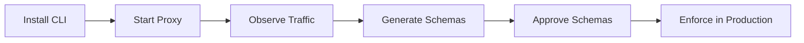

# Getting Started

Welcome to MPL. This section will get you from zero to a running MPL deployment.

---

## Prerequisites

You'll need one of the following to run the MPL proxy:

- **Rust toolchain** (1.75+) for building from source
- **Docker** for containerized deployment

For SDK development:

- **Python 3.10+** for the Python SDK
- **Node.js 18+** for the TypeScript SDK

---

## Choose Your Path

| Path | Best For | Time |
|------|----------|------|
| [Quick Start](quick-start.md) | First-time users who want immediate value | 5 min |
| [Installation](installation.md) | Setting up all components from scratch | 10 min |
| [Docker Compose](docker-compose.md) | Full local stack with monitoring | 10 min |
| [First Validation](first-validation.md) | Understanding schema validation hands-on | 15 min |

---

## Recommended Flow

1. **Install** the CLI or pull the Docker image
2. **Start** the proxy pointing at your MCP/A2A server
3. **Observe** traffic in transparent mode
4. **Generate** schemas from observed traffic patterns
5. **Approve** generated schemas after review
6. **Enforce** validation in production mode
