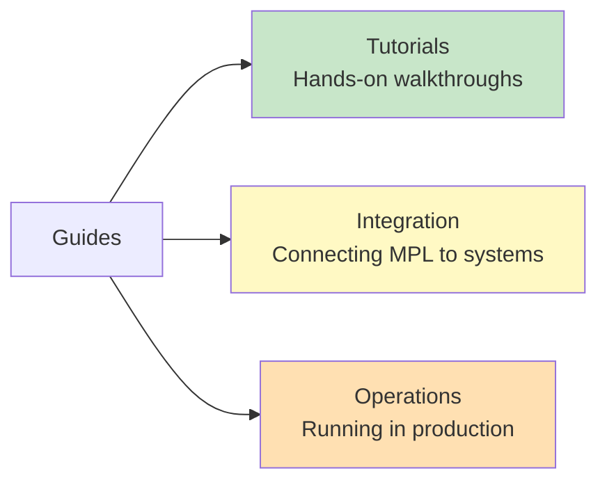

# Guides

Practical, step-by-step guides for working with MPL. Whether you are validating your first payload, connecting MPL to an existing pipeline, or running it in production, these guides walk you through real-world scenarios.

---

## Guide Categories

---

## Tutorials

Hands-on walkthroughs that teach MPL concepts through building. Each tutorial is self-contained and takes 15-30 minutes to complete.

| Tutorial | Description | STypes Used | Difficulty |
|----------|-------------|-------------|------------|
| [Calendar Workflow](tutorials/calendar-workflow.md) | Create and validate calendar events through the proxy | `org.calendar.Event.v1` | Beginner |
| [RAG with QoM](tutorials/rag-workflow.md) | Validate RAG queries and evaluate groundedness | `eval.rag.RAGQuery.v1`, `eval.rag.SearchResult.v1` | Intermediate |
| [Multi-Agent Workflow](tutorials/multi-agent.md) | Typed communication between planner and executor agents | `org.agent.TaskPlan.v1`, `org.agent.ToolInvocation.v1` | Advanced |
| [Creating a Custom SType](tutorials/custom-stype.md) | Design, register, and validate your own semantic type | Custom (`org.support.Ticket.v1`) | Intermediate |

---

## Integration

Guides for connecting MPL to existing systems, frameworks, and protocols.

| Guide | Description | Prerequisites |
|-------|-------------|---------------|
| MCP Integration | Connect MPL as a governance layer for MCP servers | Running MCP server |
| A2A Integration | Add semantic governance to Agent-to-Agent protocols | A2A-compatible agents |
| LangChain Integration | Use MPL validation in LangChain tool chains | LangChain installed |
| CI/CD Pipeline | Validate schemas and assertions in your build pipeline | GitHub Actions or similar |

!!! note "Coming Soon"
    Integration guides are under active development. Check back for updates or [contribute on GitHub](https://github.com/mpl-dev/mpl).

---

## Operations

Guides for deploying, monitoring, and maintaining MPL in production environments.

| Guide | Description | Audience |
|-------|-------------|----------|
| Production Deployment | Configure the proxy for high-availability production use | Platform Engineers |
| Monitoring and Alerting | Set up Prometheus, Grafana, and alerting for QoM metrics | SRE / DevOps |
| Schema Governance | Manage SType lifecycle across teams | Architects |
| Troubleshooting | Diagnose common issues with validation, QoM, and the proxy | All |

!!! note "Coming Soon"
    Operations guides are under active development. Check back for updates or [contribute on GitHub](https://github.com/mpl-dev/mpl).

---

## Prerequisites

Before starting any guide, ensure you have:

- **MPL CLI** installed ([Installation Guide](../getting-started/installation.md))
- **MPL Proxy** running on port `9443` ([Quick Start](../getting-started/quick-start.md))
- **Python 3.10+** or **Node.js 18+** for SDK examples
- **Docker** (optional, for containerized setups)

---

## Recommended Path

!!! tip "Suggested Order"
    1. Start with the **[Calendar Workflow](tutorials/calendar-workflow.md)** tutorial to learn the basics
    2. Move to **[RAG with QoM](tutorials/rag-workflow.md)** to understand quality metrics
    3. Try **[Multi-Agent Workflow](tutorials/multi-agent.md)** for complex orchestration
    4. Create your own type with **[Custom SType](tutorials/custom-stype.md)**
    5. Then explore Integration and Operations guides for production deployment

---

## Conventions Used in Guides

Throughout these guides, you will see:

- **Tabbed code blocks** with Python, TypeScript, and curl examples
- **Admonitions** highlighting tips, warnings, and important notes
- **Mermaid diagrams** showing data flow and architecture
- **Full request/response examples** you can copy and run directly

All examples assume the MPL proxy is running at `http://localhost:9443` and metrics are available at `http://localhost:9100/metrics`.
