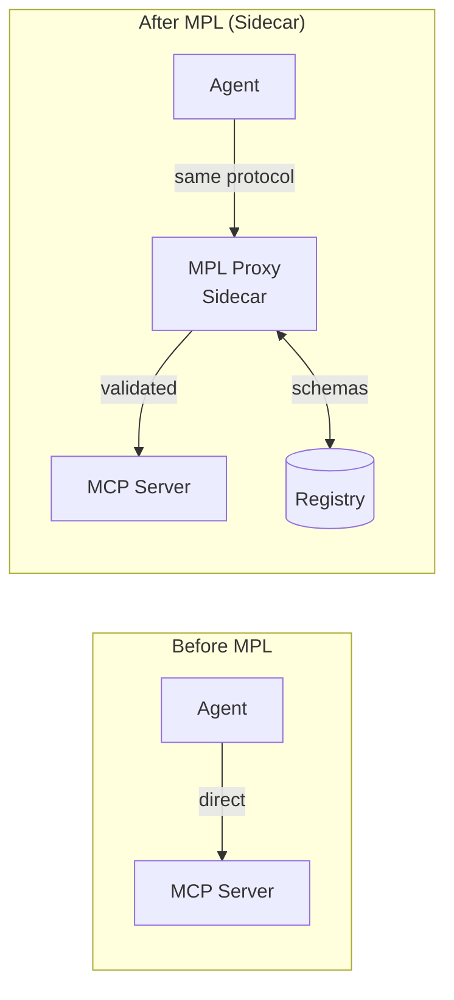
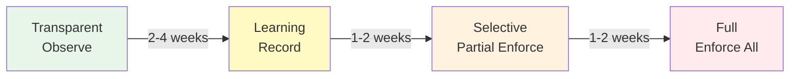

# Integrating with Existing Infrastructure

MPL can be added to your existing infrastructure **without any code changes** using the sidecar proxy pattern. This guide walks through the complete migration path from zero governance to full enforcement.

---

## The Sidecar Pattern

Deploy the MPL proxy alongside your existing MCP/A2A services as a sidecar. Traffic flows through the proxy transparently, gaining semantic governance without modifying your agents or servers:



!!! success "Zero Code Changes Required"
    The only change is the endpoint URL your agent connects to. Instead of `http://mcp-server:8080`, point to `http://mpl-proxy:9443`. The proxy handles everything else transparently.

---

## Migration Strategy

The recommended migration follows four phases, each adding enforcement incrementally:



| Phase | Duration | Risk | What Happens |
|-------|----------|------|--------------|
| **Transparent** | 2-4 weeks | None | Observe and log all traffic; never reject |
| **Learning** | 1-2 weeks | None | Record schemas from observed traffic; suggest types |
| **Selective** | 1-2 weeks | Low | Enforce for high-confidence STypes; pass others through |
| **Full** | Ongoing | Medium | Validate all mapped STypes; reject violations |

---

## Step-by-Step Migration

### Step 1: Deploy Proxy in Transparent Mode

Start the proxy in transparent mode where it observes all traffic but never modifies or rejects anything:

```bash
# Deploy the proxy pointing at your existing MCP server
mpl proxy http://mcp-server:8080 --mode transparent

# Verify it is running
curl http://localhost:9443/health
# {"status": "healthy", "mode": "transparent", "upstream": "http://mcp-server:8080"}
```

Redirect your agents to connect through the proxy:

```bash
# Before: agent connects directly
export MCP_SERVER_URL=http://mcp-server:8080

# After: agent connects through proxy
export MCP_SERVER_URL=http://localhost:9443
```

!!! info "What Transparent Mode Does"
    - Logs every request/response with timing and metadata
    - Detects potential SType candidates from tool names
    - Exposes metrics on `:9100` (request counts, latencies)
    - Shows traffic on the dashboard at `:9080`
    - **Never modifies or rejects any request**

---

### Step 2: Enable Schema Learning

Switch to learning mode to let the proxy infer schemas from live traffic patterns:

```bash
# Restart with learning enabled
mpl proxy http://mcp-server:8080 --learn

# Or update the config file
```

```yaml
# mpl-config.yaml
upstream: "http://mcp-server:8080"
listen: "0.0.0.0:9443"
mode: learning

learning:
  min_samples: 50          # Minimum observations before generating a schema
  confidence_threshold: 0.9 # Minimum confidence to mark schema as ready
  output_dir: "./schemas"   # Where to write generated schemas
```

Let the proxy observe traffic for sufficient time to capture representative payloads. The dashboard at `:9080` shows learning progress.

---

### Step 3: Generate and Review Schemas

Once the proxy has observed enough traffic, generate schema candidates:

```bash
# Generate schemas from observed traffic
mpl schemas generate

# List what was generated
mpl schemas list
```

Example output:

```
┌─────────────────────────────────────┬────────────┬───────────┬────────────┐
│ SType                               │ Confidence │ Samples   │ Status     │
├─────────────────────────────────────┼────────────┼───────────┼────────────┤
│ org.calendar.Event.v1               │ 0.98       │ 247       │ ready      │
│ org.calendar.EventList.v1           │ 0.95       │ 182       │ ready      │
│ ai.search.SemanticQuery.v1          │ 0.92       │ 89        │ ready      │
│ com.acme.finance.Transaction.v3     │ 0.87       │ 56        │ review     │
│ org.email.Message.v1                │ 0.71       │ 23        │ low-conf   │
└─────────────────────────────────────┴────────────┴───────────┴────────────┘
```

Review individual schemas:

```bash
# Inspect a specific schema
mpl schemas show org.calendar.Event.v1

# View the raw JSON Schema
mpl schemas show org.calendar.Event.v1 --format json
```

!!! tip "Review Checklist"
    Before approving a schema, verify:

    - All required fields are truly required (not just frequently present)
    - Field types are correct (especially `string` vs `number`)
    - `additionalProperties: false` is set
    - Format constraints (`date-time`, `email`, `uri`) are appropriate
    - The SType name follows the naming convention (`namespace.domain.Intent.vMajor`)

---

### Step 4: Approve Schemas Incrementally

Start by approving high-confidence schemas and leave uncertain ones for further observation:

```bash
# Approve individual schemas
mpl schemas approve org.calendar.Event.v1
mpl schemas approve org.calendar.EventList.v1
mpl schemas approve ai.search.SemanticQuery.v1

# Or approve all schemas above a confidence threshold
mpl schemas approve --min-confidence 0.90

# Do NOT approve everything blindly
# mpl schemas approve --all  # Avoid this initially
```

Approved schemas are written to the registry:

```
registry/
  stypes/
    org/
      calendar/
        Event/
          v1/
            schema.json
            metadata.json
        EventList/
          v1/
            schema.json
            metadata.json
    ai/
      search/
        SemanticQuery/
          v1/
            schema.json
            metadata.json
```

---

### Step 5: Enable Selective Enforcement

Switch to selective enforcement mode where only approved STypes are validated, and unknown tools pass through:

```yaml
# mpl-config.yaml
upstream: "http://mcp-server:8080"
listen: "0.0.0.0:9443"
mode: production
registry: "file://./registry"

# Selective enforcement: per-SType mode
enforcement:
  default: transparent         # Unknown STypes pass through unvalidated
  overrides:
    - stype: "org.calendar.Event.v1"
      mode: strict             # Validate and reject on failure
    - stype: "org.calendar.EventList.v1"
      mode: strict
    - stype: "ai.search.SemanticQuery.v1"
      mode: warn               # Validate but log warning instead of rejecting
    - stype: "com.acme.finance.Transaction.v3"
      mode: transparent        # Still learning, observe only
```

```bash
# Restart with selective enforcement
mpl proxy --config mpl-config.yaml
```

| Mode | Behavior | Use When |
|------|----------|----------|
| `transparent` | Log only, never reject | Still learning or low confidence |
| `warn` | Validate and log warnings, but forward anyway | Testing enforcement before committing |
| `strict` | Validate and reject failures | High confidence, production-ready |

---

### Step 6: Expand Enforcement Coverage

As confidence grows, progressively move more STypes from `transparent` to `warn` to `strict`:

```bash
# Monitor validation results for STypes in "warn" mode
curl -s http://localhost:9100/metrics | grep mpl_validation_errors_total

# Once error rate is acceptable, promote to strict
# Update mpl-config.yaml: change mode from "warn" to "strict"

# Continue approving newly learned schemas
mpl schemas generate
mpl schemas approve --min-confidence 0.95
```

!!! abstract "Promotion Criteria"
    Before promoting an SType from `warn` to `strict`:

    - Validation error rate < 1% for at least one week
    - No false-positive rejections observed
    - Schema has been reviewed by a team member
    - Rollback plan is in place (switch back to `warn`)

---

## Rollback Strategy

At any point, you can instantly revert to transparent mode without affecting your services:

```bash
# Immediate rollback: switch to transparent mode
mpl proxy http://mcp-server:8080 --mode transparent

# Or update config and restart
# mode: transparent
```

!!! success "Instant Recovery"
    Switching to transparent mode takes effect immediately. No requests are rejected, no traffic is modified. Your services continue operating exactly as they did before MPL was deployed.

### Partial Rollback

Roll back individual STypes without affecting others:

```yaml
enforcement:
  default: transparent
  overrides:
    - stype: "org.calendar.Event.v1"
      mode: strict              # Keep this enforced
    - stype: "ai.search.SemanticQuery.v1"
      mode: transparent         # Roll back this one
```

---

## Metrics to Track During Migration

Monitor these metrics throughout the migration to assess readiness for the next phase:

| Metric | What to Watch | Action Threshold |
|--------|--------------|------------------|
| `mpl_requests_total` | Total traffic volume | Baseline understanding |
| `mpl_validation_errors_total` | Schema validation failures | < 1% before promoting to strict |
| `mpl_unknown_stype_total` | Requests without SType mapping | Should decrease over time |
| `mpl_proxy_latency_seconds` | Latency overhead added by proxy | p99 < 10ms |
| `mpl_qom_score` | Quality distribution | Identify low-quality patterns |
| `mpl_qom_breaches_total` | QoM profile violations | Tune thresholds if too many |

```bash
# Check key metrics
curl -s http://localhost:9100/metrics | grep -E "mpl_(requests|validation_errors|unknown_stype)_total"
```

---

## CI/CD Integration

Run the MPL proxy in your test pipeline to catch schema violations before deployment:

```yaml
# GitHub Actions example
name: Test with MPL Validation
on: [push, pull_request]

jobs:
  test:
    runs-on: ubuntu-latest
    steps:
      - uses: actions/checkout@v4

      - name: Install MPL
        run: cargo install mpl-cli

      - name: Start MCP server
        run: node mcp-server.js &

      - name: Start MPL proxy in production mode
        run: |
          mpl proxy http://localhost:8080 \
            --mode production \
            --schemas ./schemas &
          sleep 2

      - name: Verify proxy health
        run: curl -f http://localhost:9443/health

      - name: Run tests through MPL proxy
        run: npm test
        env:
          MCP_SERVER_URL: http://localhost:9443

      - name: Check for validation errors
        run: |
          errors=$(curl -s http://localhost:9100/metrics | grep 'mpl_validation_errors_total' | awk '{sum += $2} END {print sum}')
          if [ "$errors" -gt "0" ]; then
            echo "Schema validation errors detected!"
            exit 1
          fi
```

### GitLab CI Example

```yaml
# .gitlab-ci.yml
test_with_mpl:
  stage: test
  script:
    - cargo install mpl-cli
    - node mcp-server.js &
    - mpl proxy http://localhost:8080 --mode production --schemas ./schemas &
    - sleep 2
    - npm test
  variables:
    MCP_SERVER_URL: http://localhost:9443
```

### Pre-Commit Hook

Validate schemas locally before committing:

```bash
#!/bin/bash
# .git/hooks/pre-commit

# Validate all schema files
for schema in registry/stypes/**/**/schema.json; do
  mpl schemas validate "$schema"
  if [ $? -ne 0 ]; then
    echo "Invalid schema: $schema"
    exit 1
  fi
done
```

---

## Docker Compose Deployment

A complete Docker Compose setup for sidecar deployment:

```yaml
# docker-compose.yml
version: "3.9"

services:
  mcp-server:
    image: your-mcp-server:latest
    ports:
      - "8080:8080"

  mpl-proxy:
    image: ghcr.io/mpl/proxy:latest
    ports:
      - "9443:9443"    # Proxy endpoint
      - "9100:9100"    # Metrics
      - "9080:9080"    # Dashboard
    volumes:
      - ./mpl-config.yaml:/etc/mpl/config.yaml
      - ./registry:/etc/mpl/registry
    environment:
      - RUST_LOG=info
    depends_on:
      - mcp-server
    command: ["proxy", "--config", "/etc/mpl/config.yaml"]

  prometheus:
    image: prom/prometheus:latest
    ports:
      - "9090:9090"
    volumes:
      - ./prometheus.yml:/etc/prometheus/prometheus.yml

  grafana:
    image: grafana/grafana:latest
    ports:
      - "3000:3000"
    depends_on:
      - prometheus
```

---

## Troubleshooting Migration Issues

!!! warning "Common Problems"

    **High validation error rate after enabling enforcement:**

    - Check if the learned schema is too strict (missing optional fields)
    - Lower the confidence threshold: `mpl schemas generate --min-confidence 0.85`
    - Switch the problematic SType back to `warn` mode

    **Latency spike after proxy deployment:**

    - Ensure the registry is local (file-based, not remote)
    - Check schema cache hit rate in metrics
    - Verify upstream MCP server is healthy

    **Agents failing to connect:**

    - Verify the proxy is listening: `curl http://localhost:9443/health`
    - Check DNS resolution from the agent to the proxy
    - Ensure the proxy can reach the upstream: `curl http://mcp-server:8080/health`

---

## Next Steps

- **[MPL with MCP](mpl-with-mcp.md)** -- Detailed MCP integration reference
- **[MPL with A2A](mpl-with-a2a.md)** -- A2A-specific integration guide
- **[Monitoring & Metrics](../operations/monitoring.md)** -- Set up production monitoring
- **[Troubleshooting](../operations/troubleshooting.md)** -- Diagnose common issues
- **[Concepts: Integration Modes](../../concepts/integration-modes.md)** -- Understanding all deployment models
