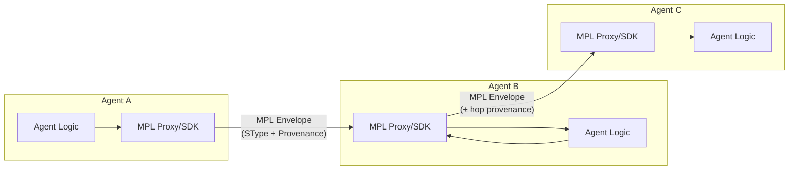
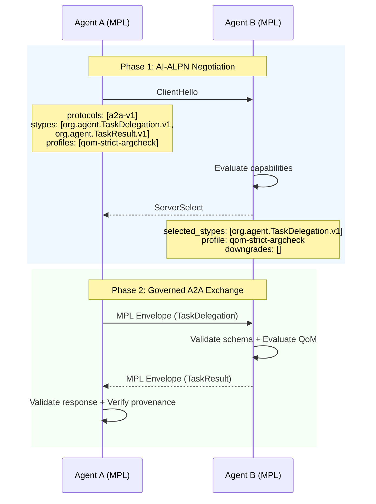
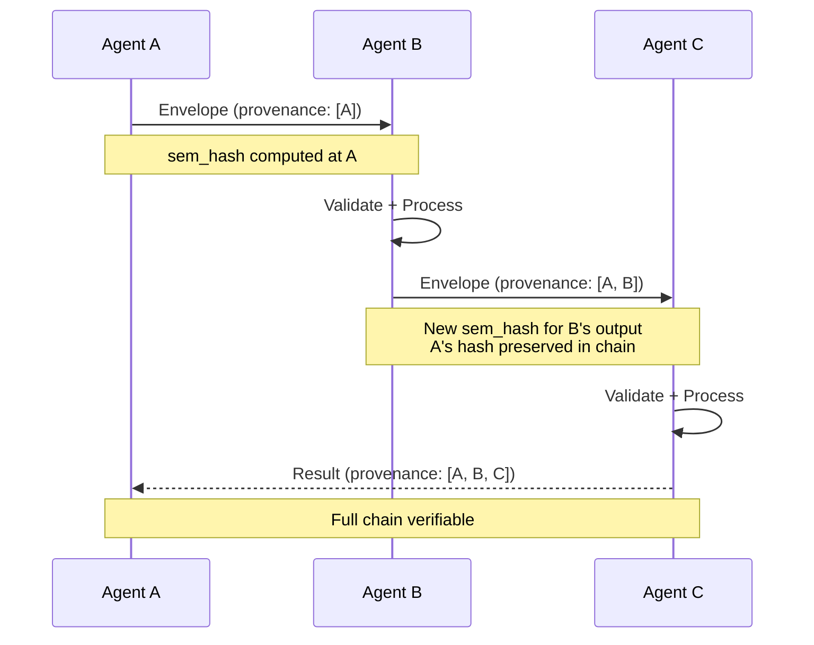
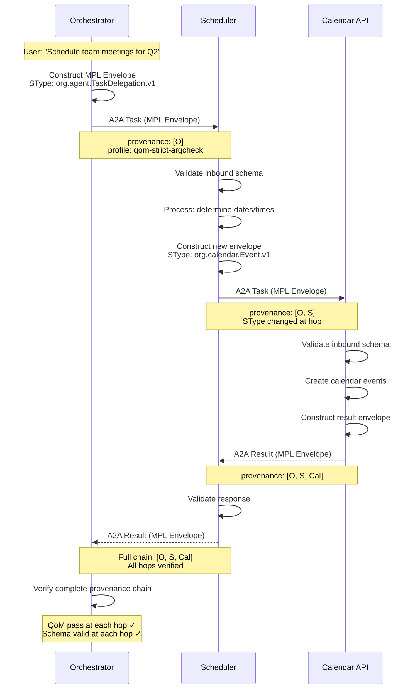

# MPL with A2A

MPL integrates with the Agent-to-Agent (A2A) protocol by wrapping A2A messages in semantic envelopes, enabling typed contracts, multi-hop provenance, and quality measurement across agent chains.

---

## Architecture

In A2A deployments, each participating agent runs MPL locally -- either as a sidecar proxy or via the SDK. Unlike MCP's client-server model, A2A is peer-to-peer, so MPL governance applies symmetrically at each hop:



!!! note "Symmetric Governance"
    Unlike MCP integration where the proxy sits in the middle, A2A integration applies MPL at **both** the sending and receiving side. Each agent validates outbound messages (correct SType, schema compliance) and inbound messages (schema validation, QoM evaluation).

---

## How It Works

### Message Wrapping

A2A `AgentMessage` payloads are wrapped in an MPL envelope that adds semantic governance metadata:

```json
{
  "mpl_envelope": {
    "id": "env-a7b3c9d1-4e5f-6789-abcd-ef0123456789",
    "stype": "org.agent.TaskDelegation.v1",
    "profile": "qom-strict-argcheck",
    "sem_hash": "blake3:f47ac10b58cc4372a5670e02b2c3d479...",
    "provenance": {
      "chain": [
        {
          "agent_id": "agent-a",
          "timestamp": "2025-01-15T10:00:00Z",
          "sem_hash": "blake3:f47ac10b..."
        }
      ]
    },
    "payload": {
      "task": "Schedule quarterly review meetings",
      "constraints": {
        "timeframe": "2025-Q2",
        "attendees": ["team-leads"],
        "duration_minutes": 60
      }
    }
  }
}
```

| Envelope Field | Purpose |
|---------------|---------|
| `id` | Unique envelope identifier for audit trail correlation |
| `stype` | The Semantic Type governing this message's schema |
| `profile` | QoM profile this interaction is measured against |
| `sem_hash` | BLAKE3 hash of the canonicalized payload |
| `provenance` | Chain of agents that have handled this message |
| `payload` | The actual A2A message content |

---

## AI-ALPN Handshake for A2A

Before A2A task exchange begins, agents negotiate capabilities using AI-ALPN. This happens during the initial connection setup:



!!! info "Handshake Caching"
    Once two agents have completed AI-ALPN negotiation, the agreed capabilities are cached for the session duration. Subsequent messages skip the handshake and use the established contract.

---

## Multi-Hop Provenance

As messages traverse agent chains, each hop appends its provenance entry. This creates an immutable audit trail of which agents handled the message and what transformations occurred:



### Provenance Chain Structure

```json
{
  "provenance": {
    "chain": [
      {
        "agent_id": "agent-a",
        "agent_name": "Orchestrator",
        "timestamp": "2025-01-15T10:00:00.000Z",
        "sem_hash": "blake3:f47ac10b58cc4372...",
        "stype_in": null,
        "stype_out": "org.agent.TaskDelegation.v1"
      },
      {
        "agent_id": "agent-b",
        "agent_name": "Scheduler",
        "timestamp": "2025-01-15T10:00:01.234Z",
        "sem_hash": "blake3:9a3b7c8d12ef5678...",
        "stype_in": "org.agent.TaskDelegation.v1",
        "stype_out": "org.calendar.Event.v1"
      },
      {
        "agent_id": "agent-c",
        "agent_name": "Calendar Service",
        "timestamp": "2025-01-15T10:00:02.567Z",
        "sem_hash": "blake3:2d4f6a8c0e1b3579...",
        "stype_in": "org.calendar.Event.v1",
        "stype_out": "org.agent.TaskResult.v1"
      }
    ]
  }
}
```

!!! warning "Provenance Integrity"
    Each `sem_hash` in the provenance chain is independently verifiable. If an intermediate agent tampers with the payload without updating the hash, downstream agents will detect the integrity violation during validation.

---

## Configuration

Configure A2A mode in your `mpl-config.yaml`:

```yaml
# mpl-config.yaml - A2A integration
listen: "0.0.0.0:9443"
mode: production
registry: "file://./registry"
profile: "qom-strict-argcheck"

# A2A-specific settings
a2a:
  enabled: true
  agent_id: "agent-scheduler-01"
  agent_name: "Scheduling Agent"

  # Advertise capabilities for agent discovery
  capabilities:
    stypes:
      - "org.agent.TaskDelegation.v1"
      - "org.agent.TaskResult.v1"
      - "org.calendar.Event.v1"
    profiles:
      - "qom-basic"
      - "qom-strict-argcheck"
    features:
      - "mpl.provenance-signing"
      - "mpl.multi-hop"

  # Provenance settings
  provenance:
    sign_hashes: true             # Sign sem_hash with agent key
    max_chain_depth: 10           # Reject chains deeper than this
    require_continuous: true      # No gaps allowed in chain

  # Peer trust
  trusted_peers:
    - agent_id: "agent-orchestrator"
      public_key: "./keys/orchestrator.pub"
    - agent_id: "agent-calendar"
      public_key: "./keys/calendar.pub"

# Metrics and dashboard
metrics:
  enabled: true
  listen: "0.0.0.0:9100"
dashboard:
  enabled: true
  listen: "0.0.0.0:9080"
```

---

## Agent Discovery

A2A agent cards advertise MPL capabilities so that peers can discover compatible agents before initiating communication:

### MPL-Enhanced Agent Card

```json
{
  "name": "Scheduling Agent",
  "description": "Handles calendar and scheduling tasks",
  "url": "https://scheduler.example.com",
  "version": "2.1.0",
  "capabilities": {
    "streaming": true,
    "pushNotifications": false
  },
  "mpl": {
    "supported": true,
    "version": "1.0",
    "stypes": [
      "org.agent.TaskDelegation.v1",
      "org.agent.TaskResult.v1",
      "org.calendar.Event.v1",
      "org.calendar.EventList.v1"
    ],
    "profiles": [
      "qom-basic",
      "qom-strict-argcheck"
    ],
    "features": [
      "mpl.provenance-signing",
      "mpl.multi-hop",
      "mpl.streaming"
    ],
    "registry_url": "https://registry.example.com/stypes"
  }
}
```

!!! tip "Discovery Flow"
    When an orchestrator agent queries available peers, it can filter by MPL capabilities. This ensures that only agents supporting the required STypes and QoM profiles are selected for task delegation.

---

## Example: Multi-Agent Task Delegation

A complete example showing an orchestrator delegating a task through a chain of specialized agents:



### SDK Code (Orchestrator)

```python
from mpl_sdk import Client, Mode, A2AConfig

async with Client(
    "http://scheduler-agent:9443",
    mode=Mode.PRODUCTION,
    a2a=A2AConfig(agent_id="orchestrator-01")
) as client:
    # Negotiate A2A capabilities
    session = await client.negotiate(
        stypes=["org.agent.TaskDelegation.v1", "org.agent.TaskResult.v1"],
        profile="qom-strict-argcheck"
    )

    # Delegate task with full provenance tracking
    result = await client.send(
        stype="org.agent.TaskDelegation.v1",
        payload={
            "task": "Schedule quarterly review meetings",
            "constraints": {
                "timeframe": "2025-Q2",
                "attendees": ["team-leads"],
                "duration_minutes": 60
            }
        }
    )

    # Verify provenance chain
    assert len(result.provenance.chain) >= 2
    assert result.qom_report.meets_profile
    print(f"Task completed via {len(result.provenance.chain)} agents")
```

---

## MCP vs A2A Integration

| Aspect | MCP Integration | A2A Integration |
|--------|----------------|-----------------|
| **Topology** | Client-server (proxy in the middle) | Peer-to-peer (MPL at each node) |
| **Proxy deployment** | Single proxy between client and server | One proxy/SDK per agent |
| **Handshake** | Client negotiates with proxy | Peer-to-peer negotiation |
| **Provenance** | Single hop (client to server) | Multi-hop chain across agents |
| **SType mapping** | Tool name to SType | Message type to SType |
| **Direction** | Request/response (synchronous) | Task delegation (async capable) |
| **Agent discovery** | Not applicable (fixed server) | Agent cards advertise MPL capabilities |
| **Typical latency** | 2-5ms per proxy hop | 2-5ms per agent hop |
| **Configuration** | `upstream` points to MCP server | `a2a.capabilities` declares STypes |
| **Best for** | Tool invocation governance | Multi-agent workflow governance |

---

## Limitations and Considerations

!!! warning "A2A-Specific Constraints"

    - **Chain depth**: Very deep agent chains (10+ hops) accumulate provenance overhead. Configure `max_chain_depth` to prevent runaway delegation.
    - **Clock skew**: Provenance timestamps require reasonable clock synchronization between agents. NTP is recommended.
    - **Key distribution**: Provenance signing requires pre-shared public keys or a PKI infrastructure for trusted peers.
    - **Async tasks**: Long-running A2A tasks maintain the MPL session for the task duration. Configure appropriate timeouts.

### Streaming in A2A

For streaming A2A responses, MPL validates and evaluates QoM on the **final assembled message**. Intermediate stream chunks are passed through with provisional provenance entries.

### Compatibility

| A2A Version | MPL Support | Notes |
|-------------|-------------|-------|
| A2A v1.0 | Full | Standard task/result exchange |
| A2A with streaming | Supported | Final-message validation |
| A2A push notifications | Partial | Notification-only validation |

---

## Next Steps

- **[MPL with MCP](mpl-with-mcp.md)** -- Compare with MCP integration
- **[Existing Infrastructure](existing-infrastructure.md)** -- Migrate incrementally
- **[Monitoring & Metrics](../operations/monitoring.md)** -- Monitor multi-agent chains
- **[Concepts: AI-ALPN Handshake](../../concepts/handshake.md)** -- Deep dive into negotiation
- **[Concepts: Architecture](../../concepts/architecture.md)** -- Protocol stack overview
