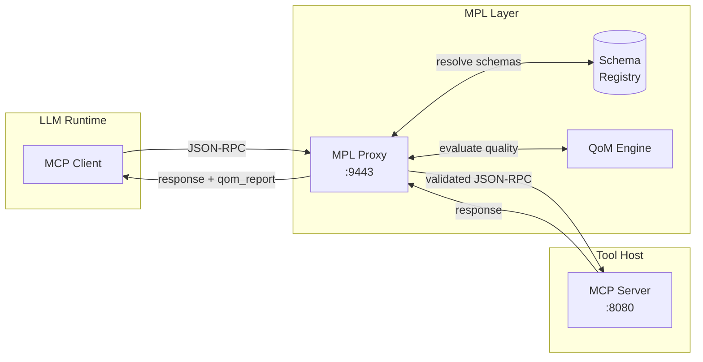
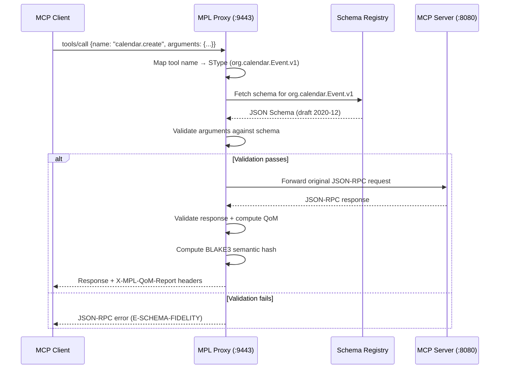

# MPL with MCP

MPL integrates with the Model Context Protocol (MCP) by sitting between the MCP client (LLM runtime) and the MCP server (tool host) as a transparent proxy. No changes are required to either the client or the server.

---

## Architecture

The MPL proxy intercepts JSON-RPC traffic between MCP endpoints, adding schema validation, QoM evaluation, and audit capabilities transparently:



!!! note "Zero-Code Deployment"
    The MPL proxy requires **no changes** to your MCP client or MCP server. Point your client at the proxy address (`:9443`) instead of the server directly, and point the proxy at the upstream MCP server. That is all.

---

## How It Works

The proxy intercepts standard MCP JSON-RPC messages and applies semantic governance at each stage:

1. **Intercept**: The proxy receives the JSON-RPC request from the MCP client
2. **Map SType**: The tool name is mapped to a registered SType (e.g., `calendar.create` to `org.calendar.Event.v1`)
3. **Validate**: The request payload is validated against the SType's JSON Schema
4. **Forward**: Valid requests are forwarded to the upstream MCP server
5. **Evaluate**: The response is evaluated for QoM metrics
6. **Augment**: The response is returned to the client with `qom_report` headers attached



---

## SType Mapping

MCP tool names must be mapped to MPL Semantic Types (STypes). There are three mechanisms for this mapping, in order of precedence:

### 1. Tool Descriptor Registry

Register explicit mappings in your `mpl-config.yaml`:

```yaml
# mpl-config.yaml
upstream: "http://mcp-server:8080"
listen: "0.0.0.0:9443"

stype_mappings:
  - tool: "calendar.create"
    stype: "org.calendar.Event.v1"
  - tool: "calendar.list"
    stype: "org.calendar.EventList.v1"
  - tool: "search.semantic"
    stype: "ai.search.SemanticQuery.v1"
  - tool: "finance.transfer"
    stype: "com.acme.finance.Transaction.v3"
```

### 2. X-MPL-SType Header

MCP clients that are MPL-aware can pass the SType explicitly in a request header:

```
X-MPL-SType: org.calendar.Event.v1
```

This takes precedence over registry mappings and is useful for dynamic tool invocations.

### 3. Auto-Detection (Learning Mode)

In learning mode, the proxy infers STypes from observed tool names and payload structures:

```bash
mpl proxy http://mcp-server:8080 --learn
```

After observing sufficient traffic, generate schemas:

```bash
mpl schemas generate
mpl schemas list
```

---

## Configuration

A complete `mpl-config.yaml` for MCP integration:

```yaml
# mpl-config.yaml - MCP integration
upstream: "http://mcp-server:8080"
listen: "0.0.0.0:9443"
mode: production                  # transparent | learning | production
registry: "file://./registry"
profile: "qom-strict-argcheck"

# MCP-specific settings
mcp:
  transport: http                 # http | websocket
  intercept_notifications: true   # Also validate MCP notifications
  pass_unknown_tools: true        # Forward tools without SType mappings

# SType mappings
stype_mappings:
  - tool: "calendar.create"
    stype: "org.calendar.Event.v1"
  - tool: "calendar.list"
    stype: "org.calendar.EventList.v1"

# QoM and metrics
metrics:
  enabled: true
  listen: "0.0.0.0:9100"
dashboard:
  enabled: true
  listen: "0.0.0.0:9080"
```

Start the proxy with this configuration:

```bash
mpl proxy --config mpl-config.yaml
```

Or use command-line flags for simple setups:

```bash
mpl proxy http://mcp-server:8080 --mode production --schemas ./schemas
```

---

## Schema Validation

Schema validation happens **in the proxy** before requests are forwarded to the MCP server. This means:

- Invalid payloads never reach the tool host
- Errors are caught early with clear semantic error codes
- The MCP server is protected from malformed inputs

### Validation Example

Given the SType `org.calendar.Event.v1` with this schema:

```json
{
  "$schema": "https://json-schema.org/draft/2020-12/schema",
  "$id": "https://mpl.dev/stypes/org/calendar/Event/v1/schema.json",
  "type": "object",
  "required": ["title", "start", "end"],
  "additionalProperties": false,
  "properties": {
    "title": { "type": "string", "minLength": 1 },
    "start": { "type": "string", "format": "date-time" },
    "end":   { "type": "string", "format": "date-time" }
  }
}
```

A valid MCP tool call:

```json
{
  "jsonrpc": "2.0",
  "method": "tools/call",
  "params": {
    "name": "calendar.create",
    "arguments": {
      "title": "Team Standup",
      "start": "2025-01-15T09:00:00Z",
      "end": "2025-01-15T09:30:00Z"
    }
  },
  "id": 1
}
```

An invalid call (missing `end`, extra `priority` field):

```json
{
  "jsonrpc": "2.0",
  "method": "tools/call",
  "params": {
    "name": "calendar.create",
    "arguments": {
      "title": "Meeting",
      "start": "2025-01-15T10:00:00Z",
      "priority": "high"
    }
  },
  "id": 2
}
```

The proxy returns an error without forwarding to the server:

```json
{
  "jsonrpc": "2.0",
  "error": {
    "code": -32602,
    "message": "MPL schema validation failed",
    "data": {
      "stype": "org.calendar.Event.v1",
      "errors": [
        {"path": "/", "message": "required property 'end' is missing"},
        {"path": "/priority", "message": "additional property 'priority' is not allowed"}
      ]
    }
  },
  "id": 2
}
```

---

## Response Augmentation

After the MCP server responds, the proxy augments the response with QoM metadata via headers:

| Header | Description | Example |
|--------|-------------|---------|
| `X-MPL-SType` | The resolved SType for this interaction | `org.calendar.Event.v1` |
| `X-MPL-Sem-Hash` | BLAKE3 hash of the canonicalized response | `blake3:a1b2c3d4...` |
| `X-MPL-QoM-Pass` | Whether the QoM profile was met | `true` |
| `X-MPL-QoM-Schema-Fidelity` | Schema conformance score (0.0-1.0) | `1.0` |
| `X-MPL-QoM-Instruction-Compliance` | How well instructions were followed (0.0-1.0) | `0.95` |
| `X-MPL-Profile` | The QoM profile evaluated against | `qom-strict-argcheck` |

!!! tip "SDK Integration"
    When using the MPL SDK, these headers are automatically parsed into a structured `QomReport` object. When using raw HTTP clients, parse the headers directly.

---

## Example: End-to-End MCP Tool Call

This example shows a complete MCP tool call flowing through the MPL proxy, with `calendar.create` mapped to `org.calendar.Event.v1`:

```bash
# 1. Start the MCP server (your existing tool host)
node mcp-server.js  # Listening on :8080

# 2. Start the MPL proxy
mpl proxy http://localhost:8080 \
  --mode production \
  --schemas ./schemas

# 3. Point your MCP client at the proxy
export MCP_SERVER_URL=http://localhost:9443

# 4. Make a tool call (from your LLM runtime)
curl -X POST http://localhost:9443 \
  -H "Content-Type: application/json" \
  -d '{
    "jsonrpc": "2.0",
    "method": "tools/call",
    "params": {
      "name": "calendar.create",
      "arguments": {
        "title": "Sprint Planning",
        "start": "2025-01-20T14:00:00Z",
        "end": "2025-01-20T15:00:00Z"
      }
    },
    "id": 1
  }'
```

Response (with QoM headers):

```
HTTP/1.1 200 OK
X-MPL-SType: org.calendar.Event.v1
X-MPL-Sem-Hash: blake3:9f86d081884c7d659a2feaa0c55ad015...
X-MPL-QoM-Pass: true
X-MPL-QoM-Schema-Fidelity: 1.0
X-MPL-Profile: qom-strict-argcheck

{
  "jsonrpc": "2.0",
  "result": {
    "content": [{"type": "text", "text": "Event created: Sprint Planning"}]
  },
  "id": 1
}
```

---

## Limitations and Considerations

!!! warning "Transport Considerations"

    | Transport | Support | Notes |
    |-----------|---------|-------|
    | **HTTP** | Full support | Standard JSON-RPC over HTTP; fully interceptable |
    | **WebSocket** | Supported | Proxy upgrades the connection; validates each frame |
    | **stdio** | Not supported | Use the SDK for stdio-based MCP servers (no network proxy possible) |
    | **SSE** | Partial | Server-Sent Events for notifications; request validation only |

### Streaming

For streaming MCP responses, the proxy validates the **final assembled response** rather than individual chunks. QoM is evaluated once the stream completes.

### Performance

The proxy adds minimal latency to MCP calls:

| Operation | Typical Latency |
|-----------|----------------|
| Schema lookup (cached) | < 0.1ms |
| JSON Schema validation | 0.5-2ms |
| QoM evaluation | 1-3ms |
| BLAKE3 hashing | < 0.1ms |
| **Total overhead** | **2-5ms** |

!!! tip "Schema Caching"
    Schemas are cached in memory after first resolution. The cache is invalidated when the registry is updated. For high-throughput deployments, ensure the registry is local (file-based) rather than remote.

### Unknown Tools

Tools without SType mappings are handled according to the `pass_unknown_tools` configuration:

- `true` (default): Forward without validation; log as `mpl_unknown_stype_total` metric
- `false`: Reject with an error indicating no SType mapping exists

---

## Next Steps

- **[MPL with A2A](mpl-with-a2a.md)** -- Integrate MPL with Agent-to-Agent protocol
- **[Existing Infrastructure](existing-infrastructure.md)** -- Migrate incrementally with zero code changes
- **[Monitoring & Metrics](../operations/monitoring.md)** -- Track proxy health and validation rates
- **[Concepts: STypes](../../concepts/stypes.md)** -- Deep dive into semantic type design
