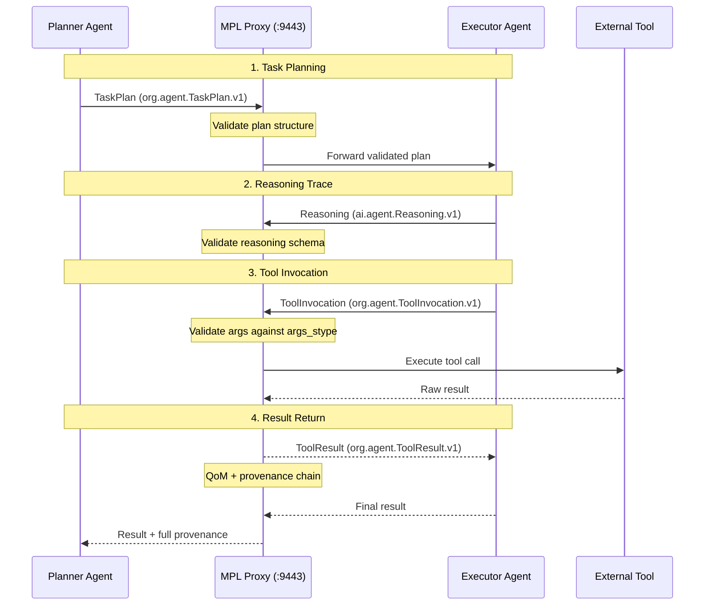
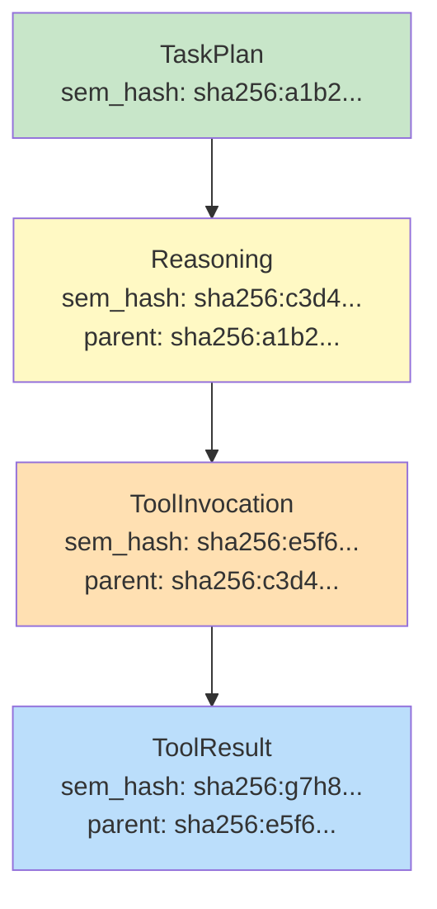

# Multi-Agent Workflow Tutorial

This tutorial demonstrates how MPL governs communication between multiple AI agents. You will build a planner-executor pattern where a planning agent decomposes tasks and an executor agent carries them out, with every message typed, validated, and tracked through the provenance chain.

---

## Goal

By the end of this tutorial, you will:

- Create typed task plans with `org.agent.TaskPlan.v1`
- Send typed tool invocations with `org.agent.ToolInvocation.v1`
- Return structured results with `org.agent.ToolResult.v1`
- Trace reasoning with `ai.agent.Reasoning.v1`
- Understand the full provenance chain across agent hops

---

## Prerequisites

| Requirement | Version | Check Command |
|-------------|---------|---------------|
| MPL CLI | >= 0.5.0 | `mpl --version` |
| MPL Proxy | Running on `:9443` | `curl http://localhost:9443/health` |
| Python SDK | >= 0.3.0 | `pip show mpl-sdk` |
| Registry | With `org.agent.*` and `ai.agent.*` STypes | `mpl schemas list --namespace org.agent` |

---

## Architecture



---

## The Agent STypes

### org.agent.TaskPlan.v1

Represents a decomposed task plan with ordered steps:

```json
{
  "$schema": "https://json-schema.org/draft/2020-12/schema",
  "$id": "https://mpl.dev/stypes/org/agent/TaskPlan/v1/schema.json",
  "title": "Agent Task Plan",
  "description": "A task decomposition with ordered steps for agent execution.",
  "type": "object",
  "required": ["planId", "goal", "steps"],
  "additionalProperties": false,
  "properties": {
    "planId": {
      "type": "string",
      "format": "uuid",
      "description": "Unique identifier for this plan"
    },
    "goal": {
      "type": "string",
      "minLength": 1,
      "description": "High-level goal this plan achieves"
    },
    "steps": {
      "type": "array",
      "minItems": 1,
      "items": {
        "type": "object",
        "required": ["stepId", "action", "tool"],
        "additionalProperties": false,
        "properties": {
          "stepId": { "type": "integer", "minimum": 1 },
          "action": { "type": "string", "description": "What this step does" },
          "tool": { "type": "string", "description": "Tool to invoke" },
          "dependsOn": {
            "type": "array",
            "items": { "type": "integer" },
            "description": "Step IDs this step depends on"
          },
          "args_stype": {
            "type": "string",
            "description": "SType for the tool arguments"
          }
        }
      }
    },
    "constraints": {
      "type": "object",
      "additionalProperties": false,
      "properties": {
        "maxRetries": { "type": "integer", "minimum": 0, "maximum": 10 },
        "timeoutSeconds": { "type": "integer", "minimum": 1 },
        "failureStrategy": {
          "type": "string",
          "enum": ["abort", "skip", "retry"]
        }
      }
    }
  }
}
```

### org.agent.ToolInvocation.v1

Represents a typed tool call with validated arguments:

```json
{
  "$schema": "https://json-schema.org/draft/2020-12/schema",
  "$id": "https://mpl.dev/stypes/org/agent/ToolInvocation/v1/schema.json",
  "title": "Agent Tool Invocation",
  "description": "A typed tool invocation with schema-validated arguments.",
  "type": "object",
  "required": ["invocationId", "planId", "stepId", "tool", "args"],
  "additionalProperties": false,
  "properties": {
    "invocationId": { "type": "string", "format": "uuid" },
    "planId": { "type": "string", "format": "uuid", "description": "Parent plan ID" },
    "stepId": { "type": "integer", "minimum": 1, "description": "Step in the plan" },
    "tool": { "type": "string", "description": "Tool name to invoke" },
    "args": { "type": "object", "description": "Tool arguments (validated against args_stype)" },
    "args_stype": {
      "type": "string",
      "description": "SType that the args object must conform to"
    }
  }
}
```

### org.agent.ToolResult.v1

Represents the structured result of a tool invocation:

```json
{
  "$schema": "https://json-schema.org/draft/2020-12/schema",
  "$id": "https://mpl.dev/stypes/org/agent/ToolResult/v1/schema.json",
  "title": "Agent Tool Result",
  "description": "Structured result from a tool invocation with status and provenance.",
  "type": "object",
  "required": ["invocationId", "status", "result"],
  "additionalProperties": false,
  "properties": {
    "invocationId": { "type": "string", "format": "uuid" },
    "status": { "type": "string", "enum": ["success", "error", "timeout"] },
    "result": { "type": "object", "description": "Tool output payload" },
    "error": {
      "type": "object",
      "properties": {
        "code": { "type": "string" },
        "message": { "type": "string" }
      }
    },
    "durationMs": { "type": "integer", "minimum": 0 }
  }
}
```

### ai.agent.Reasoning.v1

Captures an agent's reasoning trace:

```json
{
  "$schema": "https://json-schema.org/draft/2020-12/schema",
  "$id": "https://mpl.dev/stypes/ai/agent/Reasoning/v1/schema.json",
  "title": "Agent Reasoning Trace",
  "description": "Structured reasoning trace from an AI agent's decision process.",
  "type": "object",
  "required": ["reasoningId", "planId", "thought", "conclusion"],
  "additionalProperties": false,
  "properties": {
    "reasoningId": { "type": "string", "format": "uuid" },
    "planId": { "type": "string", "format": "uuid" },
    "thought": { "type": "string", "description": "The agent's reasoning process" },
    "conclusion": { "type": "string", "description": "The decision reached" },
    "confidence": { "type": "number", "minimum": 0.0, "maximum": 1.0 },
    "alternatives": {
      "type": "array",
      "items": {
        "type": "object",
        "properties": {
          "option": { "type": "string" },
          "reason_rejected": { "type": "string" }
        }
      }
    }
  }
}
```

---

## Step 1: Planner Creates a TaskPlan

The planner agent decomposes a goal into executable steps:

=== "Python"

    ```python
    from mpl_sdk import Client, Session
    import uuid

    client = Client("http://localhost:9443")
    plan_id = str(uuid.uuid4())

    # Planner creates a typed task plan
    plan_result = await client.call(
        "agent.plan",
        payload={
            "planId": plan_id,
            "goal": "Research competitor pricing and create a summary report",
            "steps": [
                {
                    "stepId": 1,
                    "action": "Search for competitor pricing data",
                    "tool": "web_search",
                    "args_stype": "eval.rag.RAGQuery.v1"
                },
                {
                    "stepId": 2,
                    "action": "Extract pricing information from results",
                    "tool": "data_extract",
                    "dependsOn": [1]
                },
                {
                    "stepId": 3,
                    "action": "Generate comparison report",
                    "tool": "report_generate",
                    "dependsOn": [1, 2],
                    "args_stype": "org.report.Summary.v1"
                }
            ],
            "constraints": {
                "maxRetries": 2,
                "timeoutSeconds": 120,
                "failureStrategy": "retry"
            }
        },
        headers={"X-MPL-SType": "org.agent.TaskPlan.v1"}
    )

    print(f"Plan validated: {plan_result.valid}")
    print(f"Sem hash: {plan_result.sem_hash}")
    ```

=== "TypeScript"

    ```typescript
    import { MplClient } from '@mpl/sdk';
    import { v4 as uuidv4 } from 'uuid';

    const client = new MplClient('http://localhost:9443');
    const planId = uuidv4();

    const planResult = await client.call('agent.plan', {
      payload: {
        planId,
        goal: 'Research competitor pricing and create a summary report',
        steps: [
          {
            stepId: 1,
            action: 'Search for competitor pricing data',
            tool: 'web_search',
            args_stype: 'eval.rag.RAGQuery.v1',
          },
          {
            stepId: 2,
            action: 'Extract pricing information from results',
            tool: 'data_extract',
            dependsOn: [1],
          },
          {
            stepId: 3,
            action: 'Generate comparison report',
            tool: 'report_generate',
            dependsOn: [1, 2],
            args_stype: 'org.report.Summary.v1',
          },
        ],
        constraints: {
          maxRetries: 2,
          timeoutSeconds: 120,
          failureStrategy: 'retry',
        },
      },
      headers: { 'X-MPL-SType': 'org.agent.TaskPlan.v1' },
    });

    console.log(`Plan validated: ${planResult.valid}`);
    console.log(`Sem hash: ${planResult.semHash}`);
    ```

=== "curl"

    ```bash
    curl -X POST http://localhost:9443/call \
      -H "Content-Type: application/json" \
      -H "X-MPL-SType: org.agent.TaskPlan.v1" \
      -d '{
        "method": "agent.plan",
        "payload": {
          "planId": "550e8400-e29b-41d4-a716-446655440010",
          "goal": "Research competitor pricing and create a summary report",
          "steps": [
            {"stepId": 1, "action": "Search for competitor pricing data", "tool": "web_search", "args_stype": "eval.rag.RAGQuery.v1"},
            {"stepId": 2, "action": "Extract pricing information", "tool": "data_extract", "dependsOn": [1]},
            {"stepId": 3, "action": "Generate comparison report", "tool": "report_generate", "dependsOn": [1, 2], "args_stype": "org.report.Summary.v1"}
          ],
          "constraints": {"maxRetries": 2, "timeoutSeconds": 120, "failureStrategy": "retry"}
        }
      }'
    ```

---

## Step 2: Executor Receives and Validates the Plan

The executor agent receives the plan, validates it, and records its reasoning:

=== "Python"

    ```python
    # Executor records its reasoning about the plan
    reasoning_result = await client.call(
        "agent.reason",
        payload={
            "reasoningId": str(uuid.uuid4()),
            "planId": plan_id,
            "thought": "The plan has 3 steps with clear dependencies. Step 1 (web_search) has no dependencies and can start immediately. Steps 2 and 3 depend on step 1. Step 3 also depends on step 2, creating a linear chain after step 1.",
            "conclusion": "Execute steps sequentially: 1 -> 2 -> 3. Use retry strategy on failure.",
            "confidence": 0.95,
            "alternatives": [
                {
                    "option": "Parallelize steps 2 and 3",
                    "reason_rejected": "Step 3 depends on step 2's output"
                }
            ]
        },
        headers={"X-MPL-SType": "ai.agent.Reasoning.v1"}
    )

    print(f"Reasoning validated: {reasoning_result.valid}")
    ```

=== "TypeScript"

    ```typescript
    const reasoningResult = await client.call('agent.reason', {
      payload: {
        reasoningId: uuidv4(),
        planId,
        thought: 'The plan has 3 steps with clear dependencies. Step 1 (web_search) has no dependencies and can start immediately. Steps 2 and 3 depend on step 1. Step 3 also depends on step 2, creating a linear chain.',
        conclusion: 'Execute steps sequentially: 1 -> 2 -> 3. Use retry strategy on failure.',
        confidence: 0.95,
        alternatives: [
          {
            option: 'Parallelize steps 2 and 3',
            reason_rejected: "Step 3 depends on step 2's output",
          },
        ],
      },
      headers: { 'X-MPL-SType': 'ai.agent.Reasoning.v1' },
    });

    console.log(`Reasoning validated: ${reasoningResult.valid}`);
    ```

!!! info "Why Type Reasoning Traces?"
    Typed reasoning traces enable auditing of agent decisions. You can query the provenance chain to understand *why* an agent took a particular action, not just *what* it did.

---

## Step 3: Executor Makes Typed Tool Invocations

The executor invokes tools with typed arguments. When `args_stype` is specified, the proxy validates the args against that SType as well:

=== "Python"

    ```python
    # Step 1: Web search with typed arguments
    invocation_id = str(uuid.uuid4())

    invocation_result = await client.call(
        "agent.invoke_tool",
        payload={
            "invocationId": invocation_id,
            "planId": plan_id,
            "stepId": 1,
            "tool": "web_search",
            "args": {
                "queryId": str(uuid.uuid4()),
                "query": "competitor SaaS pricing 2025",
                "context": {
                    "maxDocuments": 10,
                    "minRelevanceScore": 0.8,
                    "timeRange": {
                        "start": "2024-06-01T00:00:00Z",
                        "end": "2025-12-31T23:59:59Z"
                    }
                }
            },
            "args_stype": "eval.rag.RAGQuery.v1"
        },
        headers={"X-MPL-SType": "org.agent.ToolInvocation.v1"}
    )

    print(f"Invocation validated: {invocation_result.valid}")
    print(f"Args validated against: eval.rag.RAGQuery.v1")
    ```

=== "TypeScript"

    ```typescript
    const invocationId = uuidv4();

    const invocationResult = await client.call('agent.invoke_tool', {
      payload: {
        invocationId,
        planId,
        stepId: 1,
        tool: 'web_search',
        args: {
          queryId: uuidv4(),
          query: 'competitor SaaS pricing 2025',
          context: {
            maxDocuments: 10,
            minRelevanceScore: 0.8,
            timeRange: {
              start: '2024-06-01T00:00:00Z',
              end: '2025-12-31T23:59:59Z',
            },
          },
        },
        args_stype: 'eval.rag.RAGQuery.v1',
      },
      headers: { 'X-MPL-SType': 'org.agent.ToolInvocation.v1' },
    });

    console.log(`Invocation validated: ${invocationResult.valid}`);
    ```

!!! tip "Double Validation"
    When `args_stype` is present, the proxy performs **two** validations: first the outer `ToolInvocation` envelope, then the `args` object against the specified SType. Both must pass for the invocation to proceed.

---

## Step 4: Results Flow Back with QoM Reports

The tool result is returned as a typed `ToolResult` with full QoM reporting:

=== "Python"

    ```python
    # Receive and validate the tool result
    tool_result = await client.call(
        "agent.tool_result",
        payload={
            "invocationId": invocation_id,
            "status": "success",
            "result": {
                "queryId": invocation_result.data["queryId"],
                "answer": "Based on analysis, competitor pricing ranges from $29-$199/month for similar features.",
                "sources": [
                    {
                        "documentId": "pricing-page-001",
                        "chunk": "Acme Corp offers plans starting at $49/month...",
                        "relevanceScore": 0.92
                    },
                    {
                        "documentId": "pricing-page-002",
                        "chunk": "Beta Inc pricing: Starter $29/mo, Pro $99/mo, Enterprise $199/mo",
                        "relevanceScore": 0.89
                    }
                ],
                "metadata": {
                    "documentsRetrieved": 2,
                    "generationModel": "gpt-4",
                    "latencyMs": 850
                }
            },
            "durationMs": 1200
        },
        headers={"X-MPL-SType": "org.agent.ToolResult.v1"}
    )

    print(f"Result validated: {tool_result.valid}")
    print(f"QoM passed: {tool_result.qom_passed}")
    print(f"Provenance: {tool_result.provenance}")
    ```

=== "TypeScript"

    ```typescript
    const toolResult = await client.call('agent.tool_result', {
      payload: {
        invocationId,
        status: 'success',
        result: {
          queryId: invocationResult.data.queryId,
          answer: 'Based on analysis, competitor pricing ranges from $29-$199/month.',
          sources: [
            {
              documentId: 'pricing-page-001',
              chunk: 'Acme Corp offers plans starting at $49/month...',
              relevanceScore: 0.92,
            },
            {
              documentId: 'pricing-page-002',
              chunk: 'Beta Inc pricing: Starter $29/mo, Pro $99/mo, Enterprise $199/mo',
              relevanceScore: 0.89,
            },
          ],
          metadata: {
            documentsRetrieved: 2,
            generationModel: 'gpt-4',
            latencyMs: 850,
          },
        },
        durationMs: 1200,
      },
      headers: { 'X-MPL-SType': 'org.agent.ToolResult.v1' },
    });

    console.log(`Result validated: ${toolResult.valid}`);
    console.log(`QoM passed: ${toolResult.qomPassed}`);
    ```

---

## Step 5: Provenance Chain

The provenance chain tracks the full transformation history across all agent hops. Each message's `sem_hash` links to its predecessors, creating a tamper-evident audit trail:



### Querying the Provenance Chain

=== "Python"

    ```python
    from mpl_sdk import ProvenanceChain

    # Query the full provenance chain for a plan
    chain = await client.provenance(plan_id=plan_id)

    print(f"Chain length: {len(chain.entries)}")
    for entry in chain.entries:
        print(f"  [{entry.stype}] {entry.sem_hash[:16]}... "
              f"(parent: {entry.parent_hash[:16] if entry.parent_hash else 'root'}...)")
    ```

=== "curl"

    ```bash
    curl http://localhost:9443/provenance?planId=550e8400-e29b-41d4-a716-446655440010
    ```

### Provenance Response

```json
{
  "planId": "550e8400-e29b-41d4-a716-446655440010",
  "chain": [
    {
      "stype": "org.agent.TaskPlan.v1",
      "sem_hash": "sha256:a1b2c3d4...",
      "parent_hash": null,
      "timestamp": "2025-02-01T10:00:00.000Z",
      "qom_profile": "qom-strict-argcheck",
      "qom_passed": true
    },
    {
      "stype": "ai.agent.Reasoning.v1",
      "sem_hash": "sha256:c3d4e5f6...",
      "parent_hash": "sha256:a1b2c3d4...",
      "timestamp": "2025-02-01T10:00:00.150Z",
      "qom_profile": "qom-strict-argcheck",
      "qom_passed": true
    },
    {
      "stype": "org.agent.ToolInvocation.v1",
      "sem_hash": "sha256:e5f6g7h8...",
      "parent_hash": "sha256:c3d4e5f6...",
      "timestamp": "2025-02-01T10:00:00.300Z",
      "qom_profile": "qom-strict-argcheck",
      "qom_passed": true
    },
    {
      "stype": "org.agent.ToolResult.v1",
      "sem_hash": "sha256:g7h8i9j0...",
      "parent_hash": "sha256:e5f6g7h8...",
      "timestamp": "2025-02-01T10:00:01.500Z",
      "qom_profile": "qom-strict-argcheck",
      "qom_passed": true
    }
  ]
}
```

!!! info "Provenance for Compliance"
    The provenance chain provides a complete, cryptographically-linked audit trail. For regulated environments, this enables answering questions like "What information did the agent use to make this decision?" and "Were all governance policies satisfied at every step?"

---

## Using Sessions for Stateful Workflows

For multi-step workflows, use the SDK's `Session` object to maintain context and handle messages with typed callbacks:

=== "Python"

    ```python
    from mpl_sdk import Client, Session

    client = Client("http://localhost:9443")

    async with client.session() as session:
        # Register typed message handlers
        @session.on_message("org.agent.TaskPlan.v1")
        async def handle_plan(message):
            print(f"Received plan: {message.payload['goal']}")
            # Executor logic here
            return {"status": "accepted", "planId": message.payload["planId"]}

        @session.on_message("org.agent.ToolResult.v1")
        async def handle_result(message):
            print(f"Tool result: {message.payload['status']}")
            if message.payload["status"] == "error":
                # Handle retry logic
                return {"action": "retry", "stepId": message.payload["invocationId"]}
            return {"action": "continue"}

        @session.on_message("ai.agent.Reasoning.v1")
        async def handle_reasoning(message):
            print(f"Agent reasoning: {message.payload['conclusion']}")
            # Log for audit
            return {"acknowledged": True}

        # Start the session and process messages
        await session.run()
    ```

=== "TypeScript"

    ```typescript
    import { MplClient, Session } from '@mpl/sdk';

    const client = new MplClient('http://localhost:9443');

    const session = await client.createSession();

    session.onMessage('org.agent.TaskPlan.v1', async (message) => {
      console.log(`Received plan: ${message.payload.goal}`);
      return { status: 'accepted', planId: message.payload.planId };
    });

    session.onMessage('org.agent.ToolResult.v1', async (message) => {
      console.log(`Tool result: ${message.payload.status}`);
      if (message.payload.status === 'error') {
        return { action: 'retry', stepId: message.payload.invocationId };
      }
      return { action: 'continue' };
    });

    session.onMessage('ai.agent.Reasoning.v1', async (message) => {
      console.log(`Agent reasoning: ${message.payload.conclusion}`);
      return { acknowledged: true };
    });

    await session.run();
    ```

---

## Error Handling in Multi-Agent Workflows

When a step fails, the typed error response provides enough context for the orchestrator to decide on retry or abort:

```json
{
  "invocationId": "550e8400-e29b-41d4-a716-446655440020",
  "status": "error",
  "result": {},
  "error": {
    "code": "TOOL_TIMEOUT",
    "message": "web_search did not respond within 30 seconds"
  },
  "durationMs": 30000
}
```

The orchestrator can then apply the plan's `failureStrategy`:

=== "Python"

    ```python
    async def execute_step(session, plan, step):
        """Execute a plan step with retry logic."""
        retries = plan["constraints"]["maxRetries"]
        strategy = plan["constraints"]["failureStrategy"]

        for attempt in range(retries + 1):
            result = await session.call(
                "agent.invoke_tool",
                payload={
                    "invocationId": str(uuid.uuid4()),
                    "planId": plan["planId"],
                    "stepId": step["stepId"],
                    "tool": step["tool"],
                    "args": build_args(step),
                    "args_stype": step.get("args_stype")
                },
                headers={"X-MPL-SType": "org.agent.ToolInvocation.v1"}
            )

            if result.data["status"] == "success":
                return result.data

            if strategy == "abort":
                raise StepFailedError(step["stepId"], result.data["error"])
            elif strategy == "skip":
                return None
            # strategy == "retry": continue loop

        raise MaxRetriesExceeded(step["stepId"], retries)
    ```

---

## What You Learned

In this tutorial, you:

1. **Created typed task plans** with step dependencies and constraints
2. **Recorded reasoning traces** for auditability
3. **Invoked tools with typed arguments** using double validation (envelope + args)
4. **Received structured results** with QoM reports
5. **Traced provenance** across the full agent communication chain
6. **Used Sessions** for stateful, event-driven agent workflows

---

## Next Steps

- **[Creating a Custom SType](custom-stype.md)** -- Design your own semantic type for agent communication
- **[Calendar Workflow](calendar-workflow.md)** -- Start with a simpler single-agent example
- **[RAG with QoM](rag-workflow.md)** -- Deep dive into groundedness for RAG pipelines
- **[QoM Concepts](../../concepts/qom.md)** -- Understand all six quality metrics
- **[Architecture](../../concepts/architecture.md)** -- See how the protocol stack handles multi-agent scenarios
