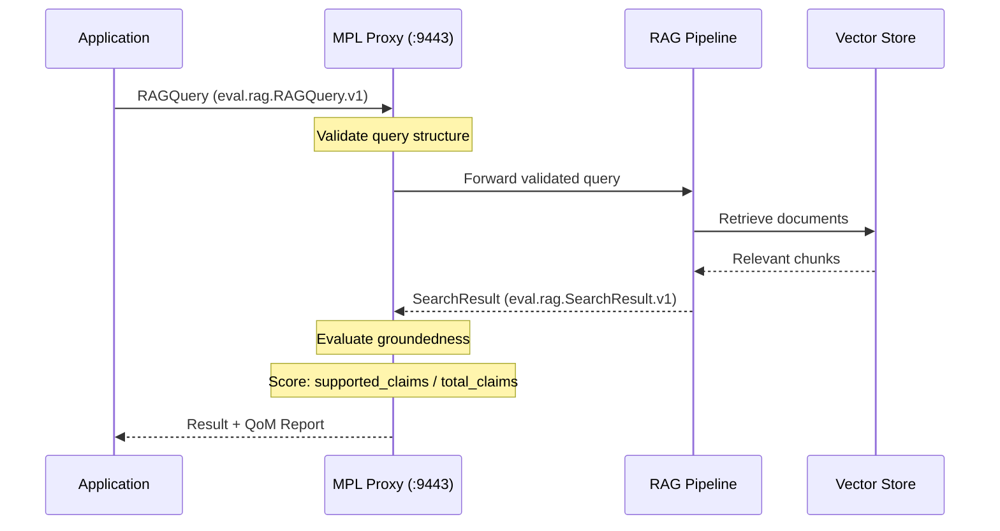
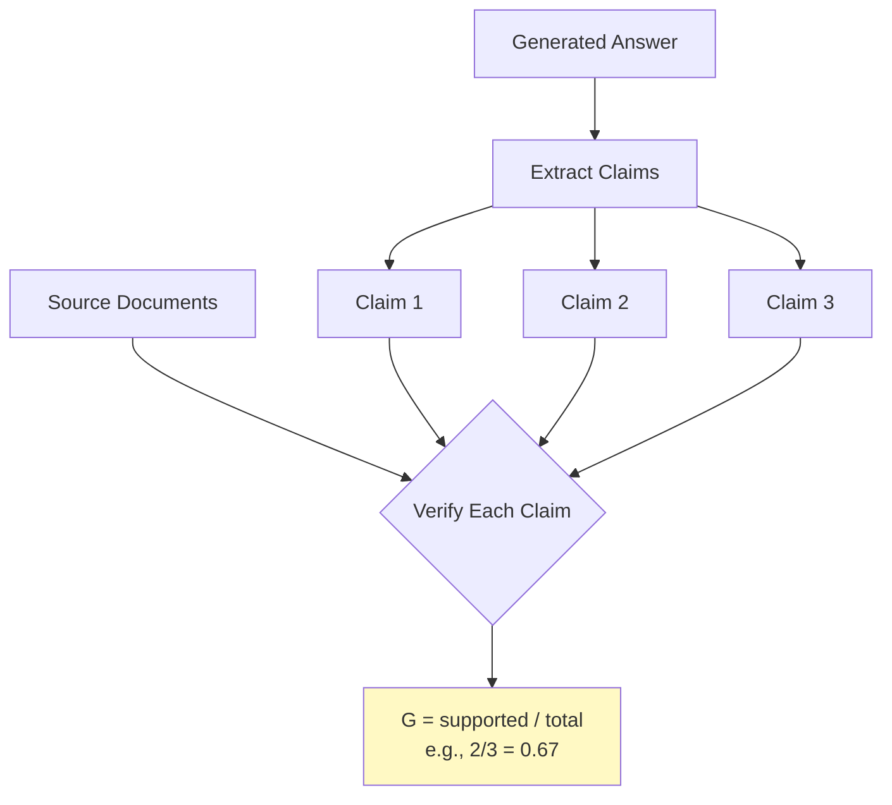

# RAG with QoM Tutorial

This tutorial demonstrates how MPL validates Retrieval-Augmented Generation (RAG) pipelines. You will learn to structure RAG queries as typed contracts, evaluate groundedness of search results, and handle QoM breaches when answers lack sufficient source support.

---

## Goal

By the end of this tutorial, you will:

- Send a typed RAG query through the MPL proxy
- Validate query structure with `eval.rag.RAGQuery.v1`
- Understand groundedness scoring for RAG results
- Handle `E-QOM-BREACH` when groundedness thresholds are not met
- Compare behavior across QoM profiles

---

## Prerequisites

| Requirement | Version | Check Command |
|-------------|---------|---------------|
| MPL CLI | >= 0.5.0 | `mpl --version` |
| MPL Proxy | Running on `:9443` | `curl http://localhost:9443/health` |
| Python SDK | >= 0.3.0 | `pip show mpl-sdk` |
| Registry | With `eval.rag.*` STypes registered | `mpl schemas list --namespace eval` |

---

## Architecture



---

## The RAG STypes

### eval.rag.RAGQuery.v1

The query SType defines the structure of a RAG request:

```json
{
  "$schema": "https://json-schema.org/draft/2020-12/schema",
  "$id": "https://mpl.dev/stypes/eval/rag/RAGQuery/v1/schema.json",
  "title": "RAG Query",
  "description": "A structured query for retrieval-augmented generation with context parameters.",
  "type": "object",
  "required": ["queryId", "query", "context"],
  "additionalProperties": false,
  "properties": {
    "queryId": {
      "type": "string",
      "format": "uuid",
      "description": "Unique identifier for this query"
    },
    "query": {
      "type": "string",
      "minLength": 1,
      "maxLength": 2000,
      "description": "The natural language query"
    },
    "context": {
      "type": "object",
      "required": ["maxDocuments"],
      "additionalProperties": false,
      "properties": {
        "maxDocuments": {
          "type": "integer",
          "minimum": 1,
          "maximum": 50,
          "description": "Maximum number of documents to retrieve"
        },
        "minRelevanceScore": {
          "type": "number",
          "minimum": 0.0,
          "maximum": 1.0,
          "description": "Minimum relevance score threshold for retrieved documents"
        },
        "timeRange": {
          "type": "object",
          "additionalProperties": false,
          "properties": {
            "start": {
              "type": "string",
              "format": "date-time",
              "description": "Start of time range filter"
            },
            "end": {
              "type": "string",
              "format": "date-time",
              "description": "End of time range filter"
            }
          }
        }
      },
      "description": "Retrieval context configuration"
    }
  }
}
```

### eval.rag.SearchResult.v1

The result SType structures the RAG pipeline response:

```json
{
  "$schema": "https://json-schema.org/draft/2020-12/schema",
  "$id": "https://mpl.dev/stypes/eval/rag/SearchResult/v1/schema.json",
  "title": "RAG Search Result",
  "description": "A structured response from a RAG pipeline with source citations.",
  "type": "object",
  "required": ["queryId", "answer", "sources", "metadata"],
  "additionalProperties": false,
  "properties": {
    "queryId": {
      "type": "string",
      "format": "uuid",
      "description": "Matches the query's queryId"
    },
    "answer": {
      "type": "string",
      "description": "The generated answer text"
    },
    "sources": {
      "type": "array",
      "items": {
        "type": "object",
        "required": ["documentId", "chunk", "relevanceScore"],
        "additionalProperties": false,
        "properties": {
          "documentId": { "type": "string" },
          "chunk": { "type": "string" },
          "relevanceScore": { "type": "number", "minimum": 0.0, "maximum": 1.0 }
        }
      },
      "description": "Source documents used to generate the answer"
    },
    "metadata": {
      "type": "object",
      "required": ["documentsRetrieved", "generationModel"],
      "additionalProperties": false,
      "properties": {
        "documentsRetrieved": { "type": "integer" },
        "generationModel": { "type": "string" },
        "latencyMs": { "type": "integer" }
      }
    }
  }
}
```

---

## Step 1: Send a RAG Query

Send a validated RAG query through the proxy:

=== "Python"

    ```python
    from mpl_sdk import Client
    import uuid

    client = Client("http://localhost:9443")

    query_id = str(uuid.uuid4())

    result = await client.call(
        "rag.query",
        payload={
            "queryId": query_id,
            "query": "What are the key benefits of semantic governance for AI agents?",
            "context": {
                "maxDocuments": 5,
                "minRelevanceScore": 0.75,
                "timeRange": {
                    "start": "2024-01-01T00:00:00Z",
                    "end": "2025-12-31T23:59:59Z"
                }
            }
        },
        headers={"X-MPL-SType": "eval.rag.RAGQuery.v1"}
    )

    print(f"Valid: {result.valid}")
    print(f"QoM passed: {result.qom_passed}")
    ```

=== "TypeScript"

    ```typescript
    import { MplClient } from '@mpl/sdk';
    import { v4 as uuidv4 } from 'uuid';

    const client = new MplClient('http://localhost:9443');
    const queryId = uuidv4();

    const result = await client.call('rag.query', {
      payload: {
        queryId,
        query: 'What are the key benefits of semantic governance for AI agents?',
        context: {
          maxDocuments: 5,
          minRelevanceScore: 0.75,
          timeRange: {
            start: '2024-01-01T00:00:00Z',
            end: '2025-12-31T23:59:59Z',
          },
        },
      },
      headers: { 'X-MPL-SType': 'eval.rag.RAGQuery.v1' },
    });

    console.log(`Valid: ${result.valid}`);
    console.log(`QoM passed: ${result.qomPassed}`);
    ```

=== "curl"

    ```bash
    curl -X POST http://localhost:9443/call \
      -H "Content-Type: application/json" \
      -H "X-MPL-SType: eval.rag.RAGQuery.v1" \
      -d '{
        "method": "rag.query",
        "payload": {
          "queryId": "550e8400-e29b-41d4-a716-446655440000",
          "query": "What are the key benefits of semantic governance for AI agents?",
          "context": {
            "maxDocuments": 5,
            "minRelevanceScore": 0.75,
            "timeRange": {
              "start": "2024-01-01T00:00:00Z",
              "end": "2025-12-31T23:59:59Z"
            }
          }
        }
      }'
    ```

---

## Step 2: Validate Query Structure

The proxy validates the query against the `eval.rag.RAGQuery.v1` schema before forwarding. Here is an example of an invalid query:

=== "Python"

    ```python
    # Invalid: maxDocuments exceeds the maximum of 50
    try:
        result = await client.call(
            "rag.query",
            payload={
                "queryId": str(uuid.uuid4()),
                "query": "What are the benefits?",
                "context": {
                    "maxDocuments": 100  # Maximum is 50!
                }
            },
            headers={"X-MPL-SType": "eval.rag.RAGQuery.v1"}
        )
    except client.ValidationError as e:
        print(f"Error: {e.code}")  # E-SCHEMA-FIDELITY
        print(f"Details: {e.details}")
        # "100 is greater than the maximum of 50"
    ```

=== "curl"

    ```bash
    curl -X POST http://localhost:9443/call \
      -H "Content-Type: application/json" \
      -H "X-MPL-SType: eval.rag.RAGQuery.v1" \
      -d '{
        "method": "rag.query",
        "payload": {
          "queryId": "550e8400-e29b-41d4-a716-446655440001",
          "query": "What are the benefits?",
          "context": {
            "maxDocuments": 100
          }
        }
      }'
    ```

Error response:

```json
{
  "success": false,
  "error": {
    "code": "E-SCHEMA-FIDELITY",
    "message": "Payload does not conform to eval.rag.RAGQuery.v1",
    "validation_errors": [
      {
        "path": "/context/maxDocuments",
        "message": "100 is greater than the maximum of 50",
        "keyword": "maximum"
      }
    ]
  }
}
```

---

## Step 3: Understand Groundedness Evaluation

When the RAG pipeline returns a response, MPL evaluates the **groundedness** of the answer. Groundedness measures whether claims in the generated answer are supported by the cited sources.



### Successful Response with Groundedness

A well-grounded response scores high:

```json
{
  "success": true,
  "data": {
    "queryId": "550e8400-e29b-41d4-a716-446655440000",
    "answer": "Semantic governance provides three key benefits for AI agents: (1) type-safe communication through STypes, (2) measurable quality via QoM metrics, and (3) audit trails for compliance.",
    "sources": [
      {
        "documentId": "doc-001",
        "chunk": "STypes provide type-safe communication contracts between AI agents, ensuring payload structure is validated before processing.",
        "relevanceScore": 0.92
      },
      {
        "documentId": "doc-002",
        "chunk": "Quality of Meaning metrics quantify semantic quality across six dimensions, giving operators measurable confidence in AI outputs.",
        "relevanceScore": 0.88
      },
      {
        "documentId": "doc-003",
        "chunk": "MPL's audit trail captures semantic hashes and provenance chains, enabling full compliance visibility.",
        "relevanceScore": 0.85
      }
    ],
    "metadata": {
      "documentsRetrieved": 3,
      "generationModel": "gpt-4",
      "latencyMs": 1240
    }
  },
  "mpl": {
    "stype": "eval.rag.SearchResult.v1",
    "sem_hash": "sha256:a3f2e1c...",
    "qom_report": {
      "profile": "qom-strict-argcheck",
      "meets_profile": true,
      "metrics": {
        "schema_fidelity": {
          "score": 1.0,
          "details": { "validation_errors": [] }
        },
        "instruction_compliance": {
          "score": 1.0,
          "details": { "assertions_total": 2, "assertions_passed": 2 }
        },
        "groundedness": {
          "score": 1.0,
          "details": {
            "claims_total": 3,
            "claims_supported": 3,
            "claims": [
              { "claim": "type-safe communication through STypes", "supported": true, "source": "doc-001" },
              { "claim": "measurable quality via QoM metrics", "supported": true, "source": "doc-002" },
              { "claim": "audit trails for compliance", "supported": true, "source": "doc-003" }
            ]
          }
        }
      },
      "evaluation_duration_ms": 85
    }
  }
}
```

---

## Step 4: Handle Groundedness Breach

When the generated answer contains claims not supported by the retrieved sources, the groundedness score drops. If it falls below the profile threshold, an `E-QOM-BREACH` is raised.

=== "Python"

    ```python
    from mpl_sdk import Client, QomProfile

    client = Client(
        "http://localhost:9443",
        qom_profile=QomProfile.STRICT_ARGCHECK  # Requires groundedness >= 0.9
    )

    # Simulate a poorly-grounded response from the RAG pipeline
    # The answer makes claims not in the source documents
    try:
        result = await client.call(
            "rag.query",
            payload={
                "queryId": str(uuid.uuid4()),
                "query": "What is the market share of semantic governance tools?",
                "context": {
                    "maxDocuments": 5,
                    "minRelevanceScore": 0.7
                }
            },
            headers={"X-MPL-SType": "eval.rag.RAGQuery.v1"}
        )
    except client.QomBreachError as e:
        print(f"Error: {e.code}")            # E-QOM-BREACH
        print(f"Profile: {e.profile}")       # qom-strict-argcheck
        print(f"Metric: {e.metric}")         # groundedness
        print(f"Required: {e.required}")     # 0.9
        print(f"Actual: {e.actual}")         # 0.33
        print(f"Retry allowed: {e.retry_allowed}")  # True
    ```

=== "TypeScript"

    ```typescript
    import { MplClient, QomProfile, QomBreachError } from '@mpl/sdk';

    const client = new MplClient('http://localhost:9443', {
      qomProfile: QomProfile.StrictArgcheck,
    });

    try {
      const result = await client.call('rag.query', {
        payload: {
          queryId: uuidv4(),
          query: 'What is the market share of semantic governance tools?',
          context: {
            maxDocuments: 5,
            minRelevanceScore: 0.7,
          },
        },
        headers: { 'X-MPL-SType': 'eval.rag.RAGQuery.v1' },
      });
    } catch (error) {
      if (error instanceof QomBreachError) {
        console.log(`Error: ${error.code}`);          // E-QOM-BREACH
        console.log(`Profile: ${error.profile}`);     // qom-strict-argcheck
        console.log(`Metric: ${error.metric}`);       // groundedness
        console.log(`Required: ${error.required}`);   // 0.9
        console.log(`Actual: ${error.actual}`);       // 0.33
      }
    }
    ```

### Breach Response

```json
{
  "success": false,
  "error": {
    "code": "E-QOM-BREACH",
    "message": "Response does not meet qom-strict-argcheck profile",
    "profile": "qom-strict-argcheck",
    "violations": [
      {
        "metric": "groundedness",
        "required": 0.9,
        "actual": 0.33,
        "gap": 0.57
      }
    ],
    "retry_allowed": true,
    "retry_budget": 2,
    "details": {
      "claims_total": 3,
      "claims_supported": 1,
      "unsupported_claims": [
        "Semantic governance tools hold 45% market share",
        "The market is expected to grow 200% by 2026"
      ]
    }
  }
}
```

!!! danger "Hallucination Detection"
    The groundedness metric is MPL's primary defense against AI hallucinations in RAG pipelines. When the answer makes claims not present in the retrieved sources, groundedness drops and the proxy can block the response before it reaches the end user.

---

## Step 5: Compare QoM Profiles

Different profiles set different groundedness thresholds. Let us compare the behavior:

### Profile Comparison

| Profile | Groundedness Required | Behavior |
|---------|----------------------|----------|
| `qom-basic` | Not evaluated (1.0 by default) | Only schema is checked |
| `qom-strict-argcheck` | >= 0.9 | Answer must be well-grounded |
| `qom-comprehensive` | >= 0.95 | Near-perfect source support required |

### Using qom-basic (No Groundedness Check)

=== "Python"

    ```python
    client_basic = Client(
        "http://localhost:9443",
        qom_profile=QomProfile.BASIC
    )

    # Same query passes with qom-basic (groundedness not evaluated)
    result = await client_basic.call(
        "rag.query",
        payload={
            "queryId": str(uuid.uuid4()),
            "query": "What is the market share of semantic governance tools?",
            "context": { "maxDocuments": 5, "minRelevanceScore": 0.7 }
        },
        headers={"X-MPL-SType": "eval.rag.RAGQuery.v1"}
    )

    print(f"Valid: {result.valid}")       # True (schema passes)
    print(f"QoM passed: {result.qom_passed}")  # True (groundedness not required)
    ```

=== "curl"

    ```bash
    curl -X POST http://localhost:9443/call \
      -H "Content-Type: application/json" \
      -H "X-MPL-SType: eval.rag.RAGQuery.v1" \
      -H "X-MPL-QoM-Profile: qom-basic" \
      -d '{
        "method": "rag.query",
        "payload": {
          "queryId": "550e8400-e29b-41d4-a716-446655440002",
          "query": "What is the market share of semantic governance tools?",
          "context": { "maxDocuments": 5, "minRelevanceScore": 0.7 }
        }
      }'
    ```

### Using qom-strict (Strict Groundedness)

=== "Python"

    ```python
    client_strict = Client(
        "http://localhost:9443",
        qom_profile=QomProfile.STRICT_ARGCHECK
    )

    # Same query may fail with qom-strict if groundedness < 0.9
    try:
        result = await client_strict.call(
            "rag.query",
            payload={
                "queryId": str(uuid.uuid4()),
                "query": "What is the market share of semantic governance tools?",
                "context": { "maxDocuments": 5, "minRelevanceScore": 0.7 }
            },
            headers={"X-MPL-SType": "eval.rag.RAGQuery.v1"}
        )
        print(f"Groundedness: {result.qom_report.metrics.groundedness.score}")
    except client_strict.QomBreachError as e:
        print(f"Blocked! Groundedness {e.actual} < {e.required}")
    ```

=== "curl"

    ```bash
    curl -X POST http://localhost:9443/call \
      -H "Content-Type: application/json" \
      -H "X-MPL-SType: eval.rag.RAGQuery.v1" \
      -H "X-MPL-QoM-Profile: qom-strict-argcheck" \
      -d '{
        "method": "rag.query",
        "payload": {
          "queryId": "550e8400-e29b-41d4-a716-446655440003",
          "query": "What is the market share of semantic governance tools?",
          "context": { "maxDocuments": 5, "minRelevanceScore": 0.7 }
        }
      }'
    ```

!!! tip "Choosing the Right Profile for RAG"
    - **Development**: Use `qom-basic` to iterate quickly without groundedness checks
    - **Staging**: Use `qom-strict-argcheck` to catch hallucination patterns before production
    - **Production**: Use `qom-strict-argcheck` or `qom-comprehensive` depending on risk tolerance
    - **Healthcare/Legal**: Use `qom-comprehensive` with groundedness >= 0.95

---

## Improving Groundedness

When your RAG pipeline produces low groundedness scores, consider these strategies:

| Strategy | Description | Impact |
|----------|-------------|--------|
| Increase `maxDocuments` | Retrieve more context for the generator | More evidence available |
| Raise `minRelevanceScore` | Only use highly relevant chunks | Higher quality evidence |
| Narrow `timeRange` | Focus on recent, authoritative sources | Reduces stale citations |
| Improve chunking | Better document splitting strategy | More precise chunks |
| Add citations | Instruct the model to cite sources inline | Easier verification |

---

## What You Learned

In this tutorial, you:

1. **Structured RAG queries** using the `eval.rag.RAGQuery.v1` SType with context parameters
2. **Validated query structure** and saw how schema violations are caught
3. **Understood groundedness** as the ratio of supported claims to total claims
4. **Handled QoM breaches** when groundedness thresholds are not met
5. **Compared profiles** and saw how different thresholds affect behavior

---

## Next Steps

- **[Multi-Agent Workflow](multi-agent.md)** -- Typed communication between agents
- **[Creating a Custom SType](custom-stype.md)** -- Build your own semantic type
- **[QoM Concepts](../../concepts/qom.md)** -- Deep dive into all six quality metrics
- **[Calendar Workflow](calendar-workflow.md)** -- Start with the basics if you skipped it
