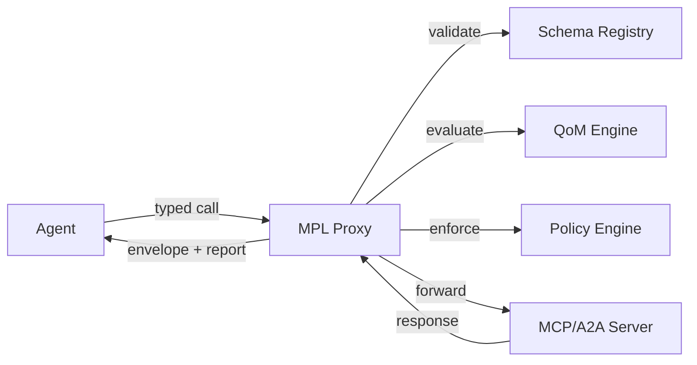

# Meaning Protocol Layer

**Semantic governance for AI agents in regulated environments.**

MPL is a lightweight protocol overlay that brings typed contracts, quality SLOs, and audit trails to AI agent communications—without replacing MCP or A2A.

---

<div class="grid cards" markdown>

-   :material-shield-check:{ .lg .middle } **Typed Contracts**

    ---

    Semantic Types (STypes) provide versioned, schema-backed contracts for every message between AI agents.

    [:octicons-arrow-right-24: Learn about STypes](concepts/stypes.md)

-   :material-chart-bar:{ .lg .middle } **Quality SLOs**

    ---

    Quality of Meaning (QoM) metrics measure and enforce semantic quality with configurable profiles.

    [:octicons-arrow-right-24: Explore QoM](concepts/qom.md)

-   :material-fingerprint:{ .lg .middle } **Audit Trails**

    ---

    BLAKE3 semantic hashing and provenance metadata provide tamper-evident audit trails for every interaction.

    [:octicons-arrow-right-24: See Audit Trails](security/audit-trails.md)

-   :material-puzzle:{ .lg .middle } **Zero-Code Integration**

    ---

    Deploy as a sidecar proxy alongside existing MCP/A2A infrastructure. No code changes required.

    [:octicons-arrow-right-24: Integration Modes](concepts/integration-modes.md)

</div>

---

## Start Here

Choose your path based on your role:

| Role | Start Here | You'll Learn |
|------|-----------|--------------|
| **Executive / CTO** | [Why MPL](overview/why-mpl.md) | How MPL unblocks AI deployment in regulated environments |
| **CISO / Compliance** | [Security Overview](security/index.md) | Compliance mapping, threat model, audit capabilities |
| **Architect** | [Architecture](concepts/architecture.md) | Protocol design, integration patterns, QoM system |
| **Engineer** | [Quick Start](getting-started/quick-start.md) | Install, configure, and validate in 5 minutes |

---

## Quick Start

```bash
# Install the CLI
cargo install mpl-cli

# Start proxy pointing to your MCP server
mpl proxy http://your-mcp-server:8080

# Dashboard: http://localhost:9080
# Metrics:   http://localhost:9100/metrics
```

What you get immediately:

- Traffic visibility for all MCP/A2A requests
- Real-time metrics and dashboard
- Schema learning from observed traffic

[:octicons-arrow-right-24: Full Quick Start Guide](getting-started/quick-start.md)

---

## Core Concepts at a Glance



| Concept | Description |
|---------|-------------|
| **STypes** | Versioned semantic type identifiers (e.g., `org.calendar.Event.v1`) backed by JSON Schema |
| **QoM** | Six quality metrics: Schema Fidelity, Instruction Compliance, Groundedness, Determinism, Ontology Adherence, Tool Outcome Correctness |
| **Envelope** | Message wrapper carrying payload, SType, semantic hash, provenance, and QoM report |
| **AI-ALPN** | Capability negotiation handshake before work begins |
| **Policy Engine** | Rule-based enforcement of organizational policies |
| **Registry** | Versioned store of SType schemas, profiles, and assertions |

---

## SDKs

=== "Python"

    ```bash
    pip install mpl-sdk
    ```

    ```python
    from mpl_sdk import Client, Mode

    async with Client("http://localhost:9443", mode=Mode.PRODUCTION) as client:
        result = await client.call("calendar.create", {"title": "Meeting"})
        assert result.valid
        assert result.qom_passed
    ```

=== "TypeScript"

    ```bash
    npm install @mpl/sdk
    ```

    ```typescript
    import { MplClient, QomProfile } from '@mpl/sdk';

    const client = new MplClient('http://localhost:9443');
    await client.negotiate({
      stypes: ['org.calendar.Event.v1'],
      profile: QomProfile.Strict
    });

    const result = await client.validate({
      stype: 'org.calendar.Event.v1',
      payload: { title: 'Meeting', start: '2025-01-15T10:00:00Z' }
    });
    ```

[:octicons-arrow-right-24: Python SDK Reference](reference/python/index.md) | [:octicons-arrow-right-24: TypeScript SDK Reference](reference/typescript/index.md)

---

## Compliance at a Glance

| Regulation | MPL Control |
|------------|-------------|
| **SOX** | Semantic hashes + provenance for tamper-evident audit trails |
| **GDPR** | Consent references in envelopes; policy engine for data handling |
| **HIPAA** | SType patterns restrict PHI access; QoM thresholds enforce accuracy |
| **EU AI Act** | QoM metrics for transparency; provenance for explainability |

[:octicons-arrow-right-24: Full Compliance Mapping](security/compliance.md)
