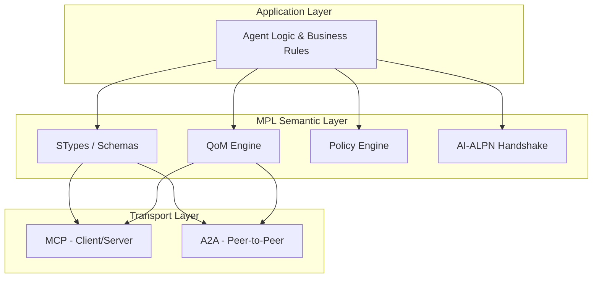
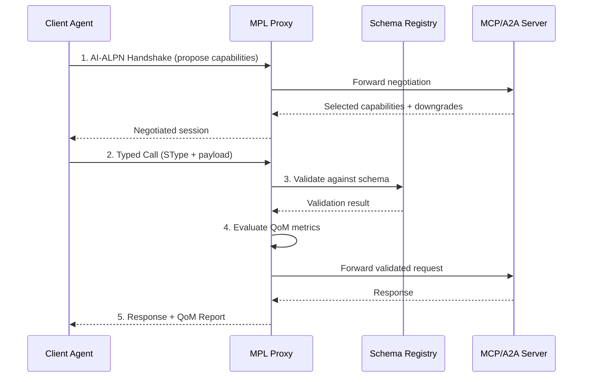

# How It Works

MPL operates as a semantic layer between your agents and their MCP/A2A servers. This page explains the core mechanics.

---

## Protocol Stack



MPL sits between the application layer and transport layer, adding semantic contracts without modifying either.

---

## Message Flow

A typical MPL-enhanced interaction follows five steps:



### Step 1: Handshake

Before exchanging work, peers negotiate capabilities using AI-ALPN:

- **Client proposes:** Protocols, STypes, tools, QoM profiles, policies
- **Server selects:** Compatible subset with downgrade reasons
- **Result:** Both sides agree on the semantic contract

### Step 2: Typed Call

Every message carries an MPL envelope declaring its semantic type:

```json
{
  "id": "msg-001",
  "stype": "org.calendar.Event.v1",
  "payload": {
    "title": "Team Standup",
    "start": "2025-01-15T09:00:00Z",
    "end": "2025-01-15T09:30:00Z"
  },
  "profile": "qom-strict-argcheck",
  "provenance": {
    "agent_id": "scheduler-agent",
    "intent": "create-event"
  }
}
```

### Step 3: Schema Validation

The proxy validates the payload against its registered JSON Schema. If validation fails, a typed error (`E-SCHEMA-FIDELITY`) is returned immediately—before the request reaches the server.

### Step 4: QoM Evaluation

Quality metrics are computed based on the negotiated profile:

| Metric | What It Measures |
|--------|-----------------|
| Schema Fidelity | Payload conforms to declared schema |
| Instruction Compliance | Assertions and constraints are met |
| Groundedness | Claims are supported by sources |
| Determinism | Output is stable under perturbation |
| Ontology Adherence | Domain rules are followed |
| Tool Outcome Correctness | Side effects match expectations |

### Step 5: Response with Report

The response includes a QoM report:

```json
{
  "payload": { "eventId": "evt-123", "status": "created" },
  "qom_report": {
    "meets_profile": true,
    "metrics": {
      "schema_fidelity": 1.0,
      "instruction_compliance": 0.98
    }
  },
  "sem_hash": "blake3:a1b2c3..."
}
```

---

## The Envelope

Every MPL message is wrapped in an **MplEnvelope** containing:

| Field | Purpose |
|-------|---------|
| `id` | Unique message identifier |
| `stype` | Semantic type (e.g., `org.calendar.Event.v1`) |
| `payload` | The actual message content |
| `args_stype` | SType for tool input arguments |
| `profile` | QoM profile to evaluate against |
| `sem_hash` | BLAKE3 hash for tamper detection |
| `provenance` | Origin, intent, and transformation chain |
| `qom_report` | Quality metrics and pass/fail status |
| `features` | Negotiated feature flags |
| `timestamp` | ISO 8601 creation time |

---

## Deployment Model

The recommended deployment uses a **sidecar proxy**:

```
┌─────────────────────────────────┐
│         Your Application        │
│  ┌────────┐     ┌────────────┐  │
│  │ Agent  │────▶│ MPL Proxy  │──────▶ MCP/A2A Server
│  └────────┘     └────────────┘  │
│                   │    │        │
│                   ▼    ▼        │
│              Registry  Metrics  │
└─────────────────────────────────┘
```

The proxy:

- Intercepts traffic transparently
- Adds handshake negotiation
- Validates schemas and evaluates QoM
- Enriches responses with provenance and reports
- Exposes Prometheus metrics on port 9100
- Serves a dashboard on port 9080

No code changes are required in your agents or servers.

---

## Progressive Adoption

MPL supports a gradual path from observation to enforcement:

| Mode | Behavior | Use Case |
|------|----------|----------|
| **Transparent** | Observe and log; never reject | Learning phase, initial deployment |
| **Learning** | Record schemas from live traffic | Automated schema discovery |
| **Strict** | Validate and reject on failure | Production enforcement |

Start in transparent mode, generate schemas from observed traffic, then switch to strict when ready.
