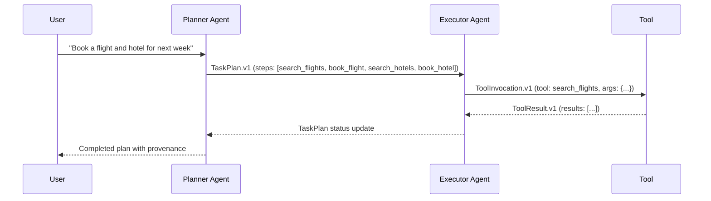

# Use Cases

MPL addresses semantic governance challenges across regulated industries. Here are concrete scenarios where typed contracts, quality metrics, and audit trails provide value.

---

## Financial Advisory

**Scenario:** An AI agent provides investment recommendations that must comply with fiduciary duty regulations.

**Without MPL:** The agent produces JSON responses with no enforceable schema. Compliance cannot verify that required disclaimers, risk ratings, and suitability assessments are present. Audit requires manual log review.

**With MPL:**

- **SType:** `org.finance.InvestmentRecommendation.v1` enforces required fields (risk_rating, suitability_score, disclaimers)
- **QoM Profile:** `qom-strict-argcheck` with IC >= 0.97 ensures assertion compliance
- **Assertions:** "risk_rating must be present", "disclaimer text must reference regulatory body"
- **Audit:** Semantic hash + provenance provide tamper-evident trail for FCA/PRA compliance

```python
result = await client.send(
    stype="org.finance.InvestmentRecommendation.v1",
    payload={
        "ticker": "AAPL",
        "action": "buy",
        "risk_rating": "moderate",
        "suitability_score": 0.85,
        "disclaimers": ["Past performance..."]
    }
)
assert result.qom_passed  # IC threshold met
```

---

## Healthcare Patient Summaries

**Scenario:** An AI agent generates patient summaries from clinical notes. Outputs must comply with HIPAA and maintain clinical accuracy.

**Without MPL:** No enforcement that PHI is handled correctly. No measurement of whether clinical claims are grounded in source notes. No audit trail for data access patterns.

**With MPL:**

- **SType:** `org.health.PatientSummary.v1` with strict schema for clinical fields
- **QoM Metrics:** Groundedness (G >= 0.95) ensures claims cite source notes
- **Policy Engine:** Enforces PHI access rules and consent requirements
- **Provenance:** Tracks which clinical notes were used as inputs

---

## Enterprise Calendar Scheduling

**Scenario:** An AI scheduling agent creates and modifies calendar events across an organization.

**Without MPL:** Calendar payloads vary across integrations. An agent might create events with missing required fields (timezone, end time) that pass the API but produce incorrect behavior.

**With MPL:**

- **SType:** `org.calendar.Event.v1` enforces ISO 8601 timestamps, required fields, valid timezones
- **Schema Fidelity:** Catches missing or malformed fields before the API call
- **Provenance:** Tracks which user request led to each calendar modification

```json
{
  "stype": "org.calendar.Event.v1",
  "payload": {
    "title": "Quarterly Review",
    "start": "2025-03-15T14:00:00Z",
    "end": "2025-03-15T15:00:00Z",
    "timezone": "America/New_York",
    "attendees": ["alice@corp.com", "bob@corp.com"]
  }
}
```

---

## RAG Pipelines

**Scenario:** A Retrieval-Augmented Generation pipeline answers questions using a document corpus. Answers must cite sources and maintain factual accuracy.

**Without MPL:** No structured way to verify that retrieved documents are relevant or that generated answers are grounded in the retrieved content. Quality degrades silently.

**With MPL:**

- **SType:** `eval.rag.RAGQuery.v1` for queries, `eval.rag.SearchResult.v1` for results
- **QoM Profile:** Groundedness metric ensures answers cite sources
- **Determinism:** DJ metric verifies answer stability under temperature variation
- **Assertions:** Minimum relevance score thresholds for retrieved documents

---

## Multi-Agent Task Planning

**Scenario:** A planner agent decomposes complex tasks and delegates subtasks to executor agents. Each step must be typed and tracked.

**Without MPL:** Task plans are ad-hoc JSON. Executor agents may receive malformed subtask specifications. No visibility into which steps succeeded or failed semantically.

**With MPL:**

- **STypes:** `org.agent.TaskPlan.v1`, `org.agent.ToolInvocation.v1`, `org.agent.ToolResult.v1`
- **Handshake:** Planner and executor negotiate compatible STypes and QoM levels
- **Provenance:** Full transformation chain from original request to final result
- **QoM:** Schema Fidelity ensures each subtask specification is well-formed



---

## Supply Chain Document Processing

**Scenario:** AI agents process invoices, purchase orders, and shipping manifests across multiple vendors with different formats.

**With MPL:**

- **STypes:** Standardized document types across vendors (`org.supply.Invoice.v1`, `org.supply.PurchaseOrder.v1`)
- **Schema Fidelity:** Ensures all vendor documents conform to agreed schemas
- **Ontology Adherence:** Validates business rules (quantities match, dates are sequential)
- **Audit Trails:** Every document transformation is hash-chained for SOX compliance

---

## Common Patterns

Across these use cases, MPL provides consistent value through:

| Pattern | Benefit |
|---------|---------|
| Schema enforcement at the protocol layer | Catch errors before they reach downstream systems |
| Quality SLOs per interaction | Measurable, enforceable quality guarantees |
| Typed error responses | Faster debugging with semantic context |
| Provenance chains | End-to-end auditability across agent hops |
| Policy enforcement | Organizational rules enforced at runtime |
| Progressive adoption | Start observing, then enforce when ready |
