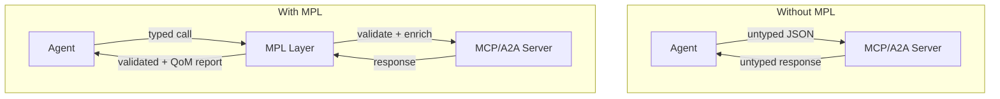

# Why MPL

## The Problem

Regulated enterprises are blocking AI agent deployments because they cannot answer a fundamental question: **"Can we prove the agent did what we said?"**

Current agent protocols—MCP (Model Context Protocol) and A2A (Agent-to-Agent)—provide transport and tool invocation but leave critical gaps:

| Gap | Impact |
|-----|--------|
| No schema enforcement | Messages lack contracts for what they mean |
| No quality guarantees | No SLOs for agent behavior or output correctness |
| No audit trails | No provenance or tamper detection for compliance |
| No policy controls | No enforcement of organizational rules at the protocol level |

These gaps force AI agent pilots into 12-18 week compliance approval cycles, effectively blocking production deployment.

---

## What MPL Adds

MPL is a **semantic overlay**—not a replacement. It augments MCP and A2A with typed semantics while keeping your existing agent infrastructure intact.

MPL introduces five capabilities:

1. **Semantic Types (STypes)** — Versioned, schema-backed contracts for every message
2. **Quality of Meaning (QoM)** — Measurable quality metrics with enforceable thresholds
3. **AI-ALPN Handshake** — Capability negotiation before work begins
4. **Semantic Integrity** — BLAKE3 hashing for tamper detection across hops
5. **Policy Engine** — Rule-based enforcement of organizational constraints

---

## Value by Stakeholder

### For CTOs

MPL unblocks AI agent deployment by providing compliance teams the semantic guarantees they need. Your existing investments in MCP/A2A infrastructure remain intact—MPL overlays, not replaces.

### For CISOs

Every MPL message carries a semantic hash, provenance metadata, and a QoM report. These map directly to SOX, GDPR, HIPAA, and EU AI Act requirements. See the [Compliance Mapping](../security/compliance.md) for details.

### For Architects

MPL deploys as a sidecar proxy requiring zero code changes. It works with existing MCP and A2A infrastructure, adding semantic contracts at the protocol level. See [Integration Modes](../concepts/integration-modes.md).

### For Engineers

Install the CLI, point the proxy at your MCP server, and get immediate traffic visibility. Schema learning starts automatically. See the [Quick Start](../getting-started/quick-start.md).

---

## Why an Overlay Wins

Teams adopt MPL faster than a greenfield protocol because it:

- **Works with existing transports** — Reuses MCP WebSocket/HTTP sessions and A2A channels
- **Adds minimal friction** — One handshake and a compact envelope
- **Provides immediate value** — Typed payloads, QoM scores, and provenance without rewriting orchestrators
- **Supports incremental adoption** — Start in transparent mode, graduate to enforcement

---

## Challenges MPL Addresses

### 1. Meaning Is Implicit and Brittle

Payloads rarely ship with canonical schemas. Tooling depends on human convention instead of enforceable contracts. Silent breaking changes are discovered in production after multi-step workflows have mutated state.

**MPL response:** Versioned Semantic Types with registry-backed schemas and provenance hashes.

### 2. Capability Negotiation Is Ad Hoc

MCP clients learn about tool availability only after first failure. There's no telemetry for capability downgrades and no way to negotiate quality expectations.

**MPL response:** AI-ALPN negotiation that explicitly selects protocol version, STypes, tools, QoM profiles, and policies up front.

### 3. Quality Is Unmeasured

Teams rely on manual QA. There's no shared vocabulary for quality—schema fidelity, groundedness, and deterministic behavior are invisible to the protocol.

**MPL response:** Quality of Meaning profiles with measurable metrics and clear breach semantics.

### 4. Governance and Ecosystem Friction

Without shared registries, each integration reinvents schema definitions. Audit requirements remain unmet because there's no machine-verifiable quality evidence.

**MPL response:** A curated registry with namespace governance, semantic checksums, and auditable policy profiles.

### 5. Operational Complexity

Support teams face long MTTR because semantic mismatches masquerade as transport failures. Observability tools measure latency and uptime, not semantic correctness.

**MPL response:** Typed envelopes with structured telemetry, error taxonomies, and semantic signatures that route incidents to root cause.
