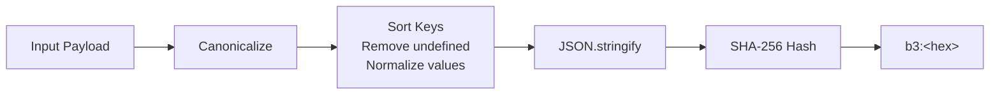

# Hashing

The hashing module provides deterministic semantic hashing for MPL payloads. It uses canonicalization to ensure that semantically equivalent payloads produce identical hashes, regardless of property ordering or formatting.

---

## Import

```typescript
import { canonicalize, semanticHash, verifyHash } from '@mpl/sdk';
```

---

## Functions

### canonicalize()

Convert a value to its canonical JSON representation for deterministic hashing.

```typescript
function canonicalize(value: unknown): string
```

| Parameter | Type | Description |
|-----------|------|-------------|
| `value` | `unknown` | Any JSON-serializable value (object, array, string, number, etc.) |

**Returns:** A deterministic JSON string with sorted keys and normalized values.

#### Canonicalization Rules

1. **Object keys are sorted alphabetically** at all nesting levels
2. **Arrays preserve order** (elements are not sorted)
3. **`undefined` values are removed** from objects
4. **`null` values are preserved** as `null`
5. **Numbers are normalized** to their JSON representation
6. **Strings are preserved** as-is
7. **Nested objects** are recursively canonicalized

#### Examples

**Key ordering is normalized:**

```typescript
// These produce the same canonical form
const a = canonicalize({ zebra: 1, alpha: 2 });
const b = canonicalize({ alpha: 2, zebra: 1 });

console.log(a === b); // true
console.log(a);       // '{"alpha":2,"zebra":1}'
```

**Nested objects are recursively sorted:**

```typescript
const result = canonicalize({
  event: {
    title: 'Meeting',
    attendees: ['bob', 'alice'],  // Array order preserved
    metadata: {
      zone: 'US',
      category: 'work',          // Keys sorted
    },
  },
  id: '123',
});

console.log(result);
// '{"event":{"attendees":["bob","alice"],"metadata":{"category":"work","zone":"US"},"title":"Meeting"},"id":"123"}'
```

**Undefined values are stripped:**

```typescript
const result = canonicalize({
  title: 'Meeting',
  description: undefined,  // Removed
  start: '2024-01-15',
});

console.log(result);
// '{"start":"2024-01-15","title":"Meeting"}'
```

**Null values are preserved:**

```typescript
const result = canonicalize({
  title: 'Meeting',
  description: null,  // Kept as null
});

console.log(result);
// '{"description":null,"title":"Meeting"}'
```

**Arrays maintain element order:**

```typescript
const result = canonicalize({
  items: [3, 1, 2],
  tags: ['beta', 'alpha'],
});

console.log(result);
// '{"items":[3,1,2],"tags":["beta","alpha"]}'
```

---

### semanticHash()

Compute a semantic hash of a payload. The hash is computed over the canonicalized form, ensuring that semantically equivalent payloads produce the same hash.

```typescript
function semanticHash(payload: unknown): string
```

| Parameter | Type | Description |
|-----------|------|-------------|
| `payload` | `unknown` | Any JSON-serializable value |

**Returns:** Hash string in `"b3:<hex>"` format.

!!! info "Hash Algorithm"
    The current implementation uses SHA-256 with a `b3:` prefix for forward compatibility with BLAKE3. The `b3:` prefix indicates the hash format and allows future migration to native BLAKE3 without changing the API contract.

#### Examples

**Hashing an object:**

```typescript
const hash = semanticHash({
  title: 'Team Standup',
  start: '2024-01-15T10:00:00Z',
  attendees: ['alice@example.com', 'bob@example.com'],
});

console.log(hash);
// "b3:7a8b9c0d1e2f3a4b5c6d7e8f9a0b1c2d3e4f5a6b7c8d9e0f1a2b3c4d5e6f7a8b"
```

**Equivalent payloads produce the same hash:**

```typescript
const hash1 = semanticHash({ b: 2, a: 1 });
const hash2 = semanticHash({ a: 1, b: 2 });

console.log(hash1 === hash2); // true - key order doesn't matter
```

**Different values produce different hashes:**

```typescript
const hash1 = semanticHash({ amount: 100 });
const hash2 = semanticHash({ amount: 101 });

console.log(hash1 === hash2); // false
```

**Hashing primitives:**

```typescript
const strHash = semanticHash("hello world");
const numHash = semanticHash(42);
const arrHash = semanticHash([1, 2, 3]);

console.log(strHash); // "b3:..."
console.log(numHash); // "b3:..."
console.log(arrHash); // "b3:..."
```

---

### verifyHash()

Verify that a payload matches an expected semantic hash.

```typescript
function verifyHash(payload: unknown, expectedHash: string): boolean
```

| Parameter | Type | Description |
|-----------|------|-------------|
| `payload` | `unknown` | The payload to verify |
| `expectedHash` | `string` | The expected hash string (e.g., `"b3:abc123..."`) |

**Returns:** `true` if the computed hash matches the expected hash, `false` otherwise.

#### Examples

**Successful verification:**

```typescript
const payload = { title: 'Meeting', start: '2024-01-15T10:00:00Z' };
const hash = semanticHash(payload);

console.log(verifyHash(payload, hash)); // true
```

**Failed verification (modified payload):**

```typescript
const original = { title: 'Meeting', start: '2024-01-15T10:00:00Z' };
const hash = semanticHash(original);

const modified = { title: 'Meeting', start: '2024-01-16T10:00:00Z' }; // Changed date
console.log(verifyHash(modified, hash)); // false
```

**Verification with envelope:**

```typescript
import { MplEnvelope, verifyHash } from '@mpl/sdk';

function verifyEnvelopeIntegrity(envelope: MplEnvelope): boolean {
  if (!envelope.semHash) {
    return true; // No hash to verify
  }
  return verifyHash(envelope.payload, envelope.semHash);
}

// Usage
session.onMessage('org.calendar.Event.v1', (envelope) => {
  if (!verifyEnvelopeIntegrity(envelope)) {
    console.error('Envelope integrity check failed!');
    console.error('Payload may have been modified in transit.');
    return;
  }
  // Safe to process
  processEvent(envelope.payload);
});
```

---

## Hash Format

The hash string follows this format:

```
b3:<64-character-hex-string>
```

| Part | Description |
|------|-------------|
| `b3:` | Algorithm prefix (BLAKE3 compatibility) |
| `<hex>` | 64-character lowercase hexadecimal SHA-256 digest |

Example: `b3:7a8b9c0d1e2f3a4b5c6d7e8f9a0b1c2d3e4f5a6b7c8d9e0f1a2b3c4d5e6f7a8b`

---

## How It Works

The semantic hashing process follows these steps:



1. The payload is passed through `canonicalize()` to produce a deterministic JSON string
2. The canonical string is hashed using SHA-256
3. The result is prefixed with `b3:` to indicate the format

---

## Use Cases

### Data Integrity Verification

Ensure payloads are not modified in transit between agents:

```typescript
// Sender
const payload = { diagnosis: 'Hypertension', confidence: 0.95 };
const envelope = new MplEnvelope({
  stype: 'org.medical.Diagnosis.v1',
  payload,
  semHash: semanticHash(payload),
});
session.ws?.send(envelope.toJSON());

// Receiver
session.onMessage('org.medical.Diagnosis.v1', (envelope) => {
  if (!verifyHash(envelope.payload, envelope.semHash!)) {
    throw new HashMismatchError(envelope.semHash!, semanticHash(envelope.payload));
  }
});
```

### Deduplication

Identify duplicate payloads without deep comparison:

```typescript
const processedHashes = new Set<string>();

function processIfNew(payload: Record<string, unknown>): boolean {
  const hash = semanticHash(payload);
  if (processedHashes.has(hash)) {
    return false; // Already processed
  }
  processedHashes.add(hash);
  return true;
}
```

### Audit Trail

Create an immutable record of what was processed:

```typescript
interface AuditEntry {
  timestamp: string;
  stype: string;
  payloadHash: string;
  responseHash: string;
}

async function auditedSend(
  session: Session,
  stype: string,
  payload: Record<string, unknown>,
): Promise<MplEnvelope> {
  const response = await session.send(stype, payload);

  const entry: AuditEntry = {
    timestamp: new Date().toISOString(),
    stype,
    payloadHash: semanticHash(payload),
    responseHash: semanticHash(response.payload),
  };

  await appendToAuditLog(entry);
  return response;
}
```

### Cache Keys

Use hashes as cache keys for deterministic operations:

```typescript
const cache = new Map<string, unknown>();

async function cachedCall(
  client: Client,
  tool: string,
  args: Record<string, unknown>,
): Promise<unknown> {
  const key = semanticHash({ tool, args });

  if (cache.has(key)) {
    return cache.get(key);
  }

  const result = await client.call(tool, args);
  cache.set(key, result.data);
  return result.data;
}
```

---

## Integration with Session

When `autoHash` is enabled (default), the `Session` automatically computes and attaches semantic hashes to outgoing envelopes:

```typescript
const session = new Session({
  endpoint: 'ws://localhost:9443/ws',
  stypes: ['org.calendar.Event.v1'],
  autoHash: true,  // Default: true
});

await session.connect();

// Hash is automatically computed and attached
const response = await session.send('org.calendar.Event.v1', {
  title: 'Meeting',
  start: '2024-01-15T10:00:00Z',
});

// The sent envelope includes semHash automatically
```

To disable automatic hashing for a specific message:

```typescript
const response = await session.send(
  'org.calendar.Event.v1',
  { title: 'Draft' },
  { computeHash: false },  // Skip hashing for this message
);
```

---

## Determinism Guarantees

The hashing system guarantees the following:

| Property | Guarantee |
|----------|-----------|
| **Deterministic** | Same payload always produces the same hash |
| **Key-order independent** | `{a:1, b:2}` and `{b:2, a:1}` hash identically |
| **Undefined-insensitive** | `{a:1, b:undefined}` and `{a:1}` hash identically |
| **Null-sensitive** | `{a:null}` and `{}` produce different hashes |
| **Type-sensitive** | `{a:"1"}` and `{a:1}` produce different hashes |
| **Array-order sensitive** | `[1,2]` and `[2,1]` produce different hashes |
| **Collision-resistant** | SHA-256 provides 256-bit collision resistance |

---

## See Also

- [Session](session.md) - Automatic hashing with `autoHash`
- [Types](types.md) - `semHash` field on MplEnvelope
- [Errors](errors.md) - HashMismatchError for verification failures
