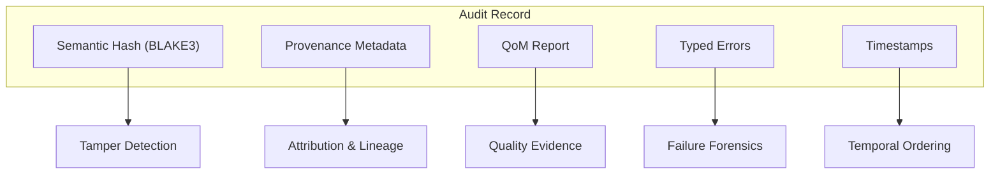
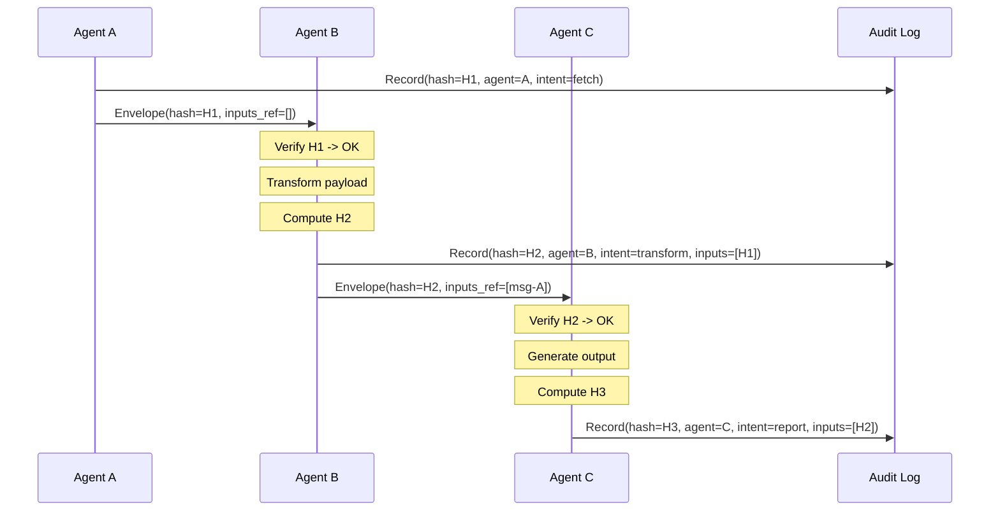
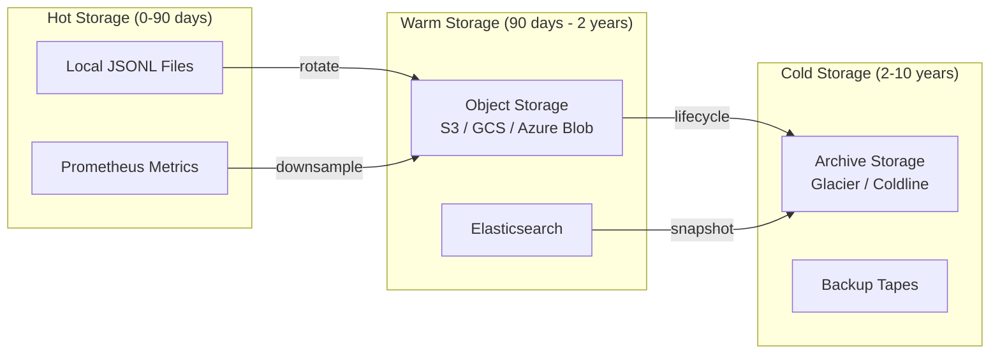
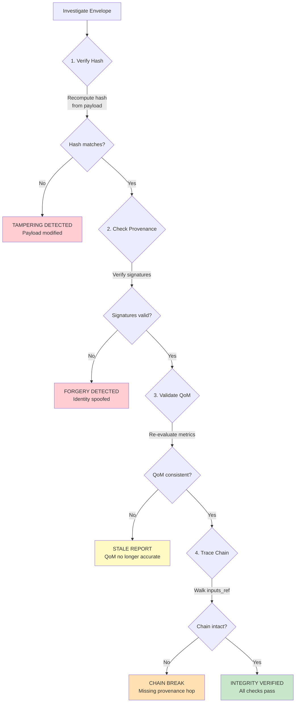

# Audit Trails

MPL produces comprehensive, tamper-evident audit trails for every agent interaction. Each message generates structured evidence -- semantic hashes, provenance metadata, QoM reports, and policy decisions -- that can be queried, exported, and integrated with enterprise security and compliance systems.

---

## Components of an Audit Trail

Every MPL audit record consists of five interconnected components:



### 1. Semantic Hash (BLAKE3)

The semantic hash provides a tamper-evident content fingerprint for each envelope's payload.

| Property | Detail |
|----------|--------|
| **Algorithm** | BLAKE3 (256-bit output) |
| **Input** | Canonicalized payload (sorted keys, NFC-normalized, minified) |
| **Format** | `blake3:<64-hex-characters>` |
| **Purpose** | Detect any modification to payload content |
| **Verification** | Re-canonicalize and hash; compare against stored value |

```json
{
  "sem_hash": "blake3:7f2a1c4e8b9d3f6a0e5c2b8d4f1a7e3c9b5d2f8a4e6c0b3d7f9a1e5c8b2d4f6"
}
```

---

### 2. Provenance Metadata

Provenance records the identity, intent, and lineage of every envelope.

| Field | Type | Purpose |
|-------|------|---------|
| `agent_id` | string | Unique identifier of the originating/transforming agent |
| `intent` | string | Declared purpose of the action |
| `inputs_ref` | string[] | Envelope IDs that contributed to this message |
| `consent_ref` | string | Reference to the consent grant authorizing this action |
| `signatures` | object[] | Cryptographic signatures for non-repudiation |

```json
{
  "provenance": {
    "agent_id": "analysis-agent-v1",
    "intent": "summarize-financial-report",
    "inputs_ref": ["msg-001", "msg-002"],
    "consent_ref": "consent-finance-readonly-2025",
    "signatures": [
      {
        "agent_id": "analysis-agent-v1",
        "algorithm": "ed25519",
        "value": "base64:pR7sT2uV..."
      }
    ]
  }
}
```

---

### 3. QoM Report

The quality report captures the measurable quality of each agent output, including per-metric scores and pass/fail status.

| Field | Type | Purpose |
|-------|------|---------|
| `profile` | string | QoM profile evaluated against |
| `meets_profile` | boolean | Whether all thresholds were satisfied |
| `metrics` | object | Individual metric scores (0.0 to 1.0) |
| `evaluated_at` | string | ISO 8601 timestamp of evaluation |
| `evaluation_duration_ms` | number | Time spent on QoM evaluation |
| `skipped_metrics` | string[] | Metrics not required by the profile |

---

### 4. Typed Errors

When validation, policy, or QoM evaluation fails, structured error records provide forensic detail.

| Error Code | Trigger | Audit Fields |
|-----------|---------|--------------|
| `E-SCHEMA-FIDELITY` | Payload fails schema validation | Schema, validation errors, failing fields |
| `E-QOM-BREACH` | QoM metrics below profile threshold | Profile, violations, gaps |
| `E-POLICY-DENIED` | Policy rule rejects the envelope | Policy name, rule, remediation |
| `E-HANDSHAKE-FAIL` | AI-ALPN negotiation failure | Requested vs. available capabilities |
| `E-HASH-MISMATCH` | Semantic hash verification fails | Expected hash, computed hash |

---

### 5. Timestamps

All audit events use ISO 8601 format with timezone information for unambiguous temporal ordering.

| Timestamp | Purpose |
|-----------|---------|
| `envelope.timestamp` | When the envelope was created |
| `qom_report.evaluated_at` | When QoM evaluation completed |
| `policy_decision.timestamp` | When the policy engine decided |
| `audit_record.logged_at` | When the audit system recorded the event |

!!! info "Clock Synchronization"
    For accurate temporal ordering across distributed agents, use NTP-synchronized clocks. MPL records all timestamps in UTC to avoid timezone ambiguity.

---

## Event Logging Format

MPL writes audit events to `qom_events.jsonl` -- a newline-delimited JSON format optimized for append-only logging and streaming ingestion.

### File Format

```
# qom_events.jsonl - one JSON object per line
{"event_type":"envelope_validated","timestamp":"2025-01-15T10:00:01Z",...}
{"event_type":"qom_evaluated","timestamp":"2025-01-15T10:00:02Z",...}
{"event_type":"policy_decided","timestamp":"2025-01-15T10:00:03Z",...}
```

### Event Types

| Event Type | Trigger | Key Fields |
|-----------|---------|------------|
| `envelope_validated` | Schema validation completed | `stype`, `result`, `errors` |
| `qom_evaluated` | QoM assessment completed | `profile`, `meets_profile`, `metrics` |
| `policy_decided` | Policy engine rendered decision | `policy`, `decision`, `rule` |
| `hash_verified` | Semantic hash verification | `expected`, `computed`, `match` |
| `handshake_completed` | AI-ALPN negotiation finished | `capabilities`, `profile`, `features` |
| `consent_checked` | Consent reference validated | `consent_ref`, `valid`, `scope` |

### Example Event Record

```json
{
  "event_type": "qom_evaluated",
  "timestamp": "2025-01-15T10:00:05.123Z",
  "envelope_id": "msg-01JQ7K3M5N8P2R4S6T8V0W",
  "stype": "org.finance.Transaction.v1",
  "agent_id": "payment-processor-v2",
  "session_id": "sess-abc123",
  "profile": "qom-comprehensive",
  "meets_profile": true,
  "metrics": {
    "schema_fidelity": 1.0,
    "instruction_compliance": 0.99,
    "groundedness": 1.0,
    "determinism": 0.95,
    "ontology_adherence": 1.0,
    "tool_outcome_correctness": 0.98
  },
  "evaluation_duration_ms": 45,
  "provenance": {
    "agent_id": "payment-processor-v2",
    "intent": "process-payment",
    "inputs_ref": ["msg-01JQ7K2A3B4C5D6E7F8G9H"],
    "consent_ref": "consent-payment-auth-2025"
  },
  "sem_hash": "blake3:7f2a1c4e8b9d3f6a0e5c2b8d4f1a7e3c9b5d2f8a4e6c0b3d7f9a1e5c8b2d4f6"
}
```

---

## Hash Chains Across Multi-Agent Workflows

In multi-agent workflows, hash chains provide end-to-end integrity verification. Each agent verifies the incoming hash, transforms the payload, recomputes the hash, and records the lineage through provenance references.



### Verifying a Hash Chain

To verify the integrity of a multi-agent workflow, walk the provenance chain backwards:

```python
from mpl_sdk import AuditClient

audit = AuditClient("http://localhost:9080")

# Start from the final output
final_envelope = audit.get_envelope("msg-03")

# Walk the chain
chain = audit.trace_provenance(final_envelope.id)
for step in chain:
    assert step.verify_hash(), f"Integrity failure at {step.id}"
    print(f"  {step.provenance.agent_id}: {step.provenance.intent}")
    print(f"  Hash: {step.sem_hash} -> VERIFIED")
```

**Output:**
```
  data-fetcher-v1: fetch-records
  Hash: blake3:a1b2c3... -> VERIFIED
  analysis-agent-v2: transform-data
  Hash: blake3:d4e5f6... -> VERIFIED
  report-agent-v1: generate-report
  Hash: blake3:g7h8i9... -> VERIFIED
Chain integrity: VALID (3 hops, 3 verified)
```

---

## Querying Audit History

The audit system supports structured queries for compliance review, incident investigation, and operational monitoring.

### Query by Agent

```bash
# All events from a specific agent
mpl audit query --agent "payment-processor-v2" --limit 100

# Events from agent pattern
mpl audit query --agent "external-*" --start "2025-01-01" --end "2025-01-31"
```

### Query by SType

```bash
# All financial transaction events
mpl audit query --stype "org.finance.Transaction.v1"

# All health-related events (wildcard)
mpl audit query --stype "org.health.*" --format json
```

### Query by Time Range

```bash
# Events in a specific window
mpl audit query \
  --start "2025-01-15T09:00:00Z" \
  --end "2025-01-15T17:00:00Z" \
  --format table
```

### Query by QoM Status

```bash
# All QoM breaches
mpl audit query --qom-status "breach" --limit 50

# Events below threshold
mpl audit query \
  --metric "instruction_compliance" \
  --below 0.95 \
  --start "2025-01-01"
```

### Combined Queries

```bash
# PHI access by external agents in Q1
mpl audit query \
  --agent "external-*" \
  --stype "org.health.*" \
  --start "2025-01-01" \
  --end "2025-03-31" \
  --format compliance-report
```

### Programmatic Query API

```python
from mpl_sdk import AuditClient, AuditQuery

audit = AuditClient("http://localhost:9080")

# Build a query
query = AuditQuery(
    agent_pattern="payment-*",
    stype_pattern="org.finance.*",
    start="2025-01-01T00:00:00Z",
    end="2025-03-31T23:59:59Z",
    qom_status="breach",
    limit=1000
)

results = audit.search(query)
for record in results:
    print(f"{record.timestamp} | {record.agent_id} | {record.stype} | {record.qom_status}")
```

---

## Retention and Storage Recommendations

### Retention Periods by Regulation

| Regulation | Minimum Retention | Recommended Retention | Data Types |
|-----------|-------------------|----------------------|------------|
| SOX | 7 years | 7 years | Financial transactions, audit trails |
| GDPR | Duration of processing + 3 years | 5 years | Personal data processing records |
| HIPAA | 6 years | 7 years | PHI access logs, integrity records |
| EU AI Act | 10 years | 10 years | AI decision records, quality metrics |
| UK FCA/PRA | 7 years | 7 years | Financial advice, instruction records |

### Storage Architecture



### Configuration

```yaml
audit:
  storage:
    hot:
      path: "./logs/audit"
      format: "jsonl"
      rotation:
        max_size_mb: 100
        max_age_days: 90
        compress: true

    warm:
      backend: "s3"
      bucket: "mpl-audit-warm"
      prefix: "audit/"
      retention_days: 730  # 2 years

    cold:
      backend: "s3-glacier"
      bucket: "mpl-audit-archive"
      prefix: "archive/"
      retention_days: 3650  # 10 years

  integrity:
    hash_algorithm: "blake3"
    sign_logs: true
    verify_on_read: true
```

!!! warning "Immutability"
    Audit logs must be append-only and tamper-evident. Configure your storage backend with write-once-read-many (WORM) policies where available (e.g., S3 Object Lock, Azure Immutable Blob Storage).

---

## Integration with Enterprise SIEM/Log Systems

MPL audit events can be streamed to enterprise security information and event management (SIEM) systems for centralized monitoring and correlation.

### Splunk Integration

```yaml
audit:
  outputs:
    - type: "splunk-hec"
      endpoint: "https://splunk.example.com:8088"
      token: "${SPLUNK_HEC_TOKEN}"
      index: "mpl_audit"
      sourcetype: "mpl:audit:event"
      fields:
        environment: "production"
        service: "mpl-proxy"
```

**Splunk search examples:**

```spl
# Find all QoM breaches in the last 24 hours
index=mpl_audit event_type="qom_evaluated" meets_profile=false
| stats count by agent_id, stype, profile

# Track hash verification failures
index=mpl_audit event_type="hash_verified" match=false
| timechart count by agent_id

# Policy denial investigation
index=mpl_audit event_type="policy_decided" decision="deny"
| table timestamp, agent_id, stype, policy, rule, remediation
```

### Elastic (ELK) Stack Integration

```yaml
audit:
  outputs:
    - type: "elasticsearch"
      hosts: ["https://elasticsearch.example.com:9200"]
      index_pattern: "mpl-audit-{yyyy.MM.dd}"
      username: "${ES_USERNAME}"
      password: "${ES_PASSWORD}"
      pipeline: "mpl-audit-enrichment"
```

**Kibana query examples:**

```json
// Find anomalous QoM scores
{
  "query": {
    "bool": {
      "must": [
        {"term": {"event_type": "qom_evaluated"}},
        {"range": {"metrics.instruction_compliance": {"lt": 0.9}}}
      ],
      "filter": [
        {"range": {"timestamp": {"gte": "now-24h"}}}
      ]
    }
  }
}
```

### Datadog Integration

```yaml
audit:
  outputs:
    - type: "datadog"
      api_key: "${DD_API_KEY}"
      site: "datadoghq.com"
      service: "mpl-proxy"
      tags:
        - "env:production"
        - "team:security"
```

### Generic Webhook / Syslog

```yaml
audit:
  outputs:
    - type: "syslog"
      protocol: "tcp+tls"
      host: "syslog.example.com"
      port: 6514
      format: "rfc5424"
      facility: "auth"

    - type: "webhook"
      url: "https://security.example.com/api/events"
      method: "POST"
      headers:
        Authorization: "Bearer ${WEBHOOK_TOKEN}"
      batch_size: 100
      flush_interval_ms: 5000
```

---

## Example: Complete Audit Record

The following shows a complete audit record for a financial transaction processed through a multi-agent workflow:

```json
{
  "audit_version": "1.0",
  "logged_at": "2025-01-15T10:00:05.456Z",
  "envelope_id": "msg-01JQ7K3M5N8P2R4S6T8V0W",
  "session_id": "sess-finance-abc123",
  "stype": "org.finance.Transaction.v1",
  "payload_size_bytes": 2048,
  "sem_hash": "blake3:7f2a1c4e8b9d3f6a0e5c2b8d4f1a7e3c9b5d2f8a4e6c0b3d7f9a1e5c8b2d4f6",
  "provenance": {
    "agent_id": "payment-processor-v2",
    "intent": "process-payment",
    "inputs_ref": [
      "msg-01JQ7K2A3B4C5D6E7F8G9H",
      "msg-01JQ7K2B4C5D6E7F8G9HJK"
    ],
    "consent_ref": "consent-payment-auth-2025-user-789",
    "signatures": [
      {
        "agent_id": "payment-processor-v2",
        "algorithm": "ed25519",
        "value": "base64:xK9mN2pQrS4tU6vW8xY0zA..."
      }
    ]
  },
  "qom_report": {
    "profile": "qom-comprehensive",
    "meets_profile": true,
    "evaluated_at": "2025-01-15T10:00:05.123Z",
    "evaluation_duration_ms": 45,
    "metrics": {
      "schema_fidelity": {"score": 1.0, "details": {"validation_errors": []}},
      "instruction_compliance": {"score": 0.99, "details": {"assertions_passed": 49, "assertions_total": 50}},
      "groundedness": {"score": 1.0, "details": {"claims_supported": 12, "claims_total": 12}},
      "determinism": {"score": 0.95, "details": {"reruns": 3, "avg_similarity": 0.95}},
      "ontology_adherence": {"score": 1.0, "details": {"rules_passed": 8, "rules_total": 8}},
      "tool_outcome_correctness": {"score": 0.98, "details": {"checks_passed": 5, "checks_total": 5}}
    },
    "skipped_metrics": []
  },
  "policy_decisions": [
    {
      "policy": "sox-compliance",
      "decision": "allow",
      "rules_evaluated": 3,
      "rules_passed": 3,
      "timestamp": "2025-01-15T10:00:04.890Z"
    },
    {
      "policy": "fiduciary-duty",
      "decision": "allow",
      "rules_evaluated": 4,
      "rules_passed": 4,
      "timestamp": "2025-01-15T10:00:04.892Z"
    }
  ],
  "schema_validation": {
    "result": "pass",
    "schema": "org.finance.Transaction.v1",
    "registry_version": "2025.01.10",
    "validation_errors": []
  },
  "handshake": {
    "session_established": "2025-01-15T09:55:00Z",
    "negotiated_profile": "qom-comprehensive",
    "negotiated_stypes": ["org.finance.Transaction.v1", "org.finance.Receipt.v1"],
    "features": {"mpl.provenance-signing": true, "mpl.streaming": false}
  },
  "transport": {
    "tls_version": "1.3",
    "cipher_suite": "TLS_AES_256_GCM_SHA384",
    "client_cert_cn": "payment-processor-v2.agents.example.com"
  }
}
```

---

## Tamper Detection Workflow

When investigating potential tampering, follow this verification workflow:



### Verification Steps

**Step 1: Verify Hash**
```python
from mpl_sdk import canonicalize, semantic_hash

record = audit.get_envelope(envelope_id)
canonical = canonicalize(record.payload)
computed_hash = semantic_hash(canonical)
assert computed_hash == record.sem_hash, "TAMPER: Hash mismatch"
```

**Step 2: Check Provenance**
```python
for sig in record.provenance.signatures:
    public_key = key_store.get(sig.agent_id)
    assert verify_signature(
        public_key, sig.value, record.sem_hash
    ), f"FORGERY: Invalid signature from {sig.agent_id}"
```

**Step 3: Validate QoM**
```python
# Re-evaluate QoM to check for stale reports
current_qom = qom_evaluator.evaluate(record.payload, record.profile)
for metric, score in current_qom.metrics.items():
    original = record.qom_report.metrics[metric]
    assert abs(score - original) < 0.05, f"STALE: {metric} drifted"
```

**Step 4: Trace Chain**
```python
chain = audit.trace_provenance(envelope_id)
for i, step in enumerate(chain):
    assert step.verify_hash(), f"CHAIN BREAK at hop {i}: {step.id}"
    if step.provenance.inputs_ref:
        for ref in step.provenance.inputs_ref:
            assert audit.get_envelope(ref) is not None, f"MISSING: {ref}"
```

---

## Audit Configuration

### Proxy Configuration

```yaml
proxy:
  audit:
    enabled: true
    output_path: "./logs/qom_events.jsonl"
    log_level: "info"  # debug, info, warn, error
    include:
      - envelope_validated
      - qom_evaluated
      - policy_decided
      - hash_verified
      - handshake_completed
      - consent_checked
    exclude: []

    # Performance tuning
    buffer_size: 1000
    flush_interval_ms: 1000
    async_writes: true

    # Integrity protection
    sign_entries: true
    signing_key: "${AUDIT_SIGNING_KEY}"
    hash_chain: true  # Each entry includes hash of previous entry
```

### Log Rotation

```yaml
audit:
  rotation:
    max_size_mb: 100
    max_age_days: 90
    max_backups: 365
    compress: true
    compress_format: "zstd"
```

!!! tip "Hash Chain Integrity"
    When `hash_chain: true` is enabled, each audit entry includes the hash of the previous entry, creating an append-only chain. Any deletion or modification of intermediate entries is detectable by re-walking the chain.

---

## Next Steps

- [Compliance Mapping](compliance.md) -- How audit trails satisfy specific regulatory requirements
- [Threat Model](threat-model.md) -- Threats that audit trails help detect and investigate
- [Adversarial Robustness](adversarial-robustness.md) -- Hardening audit systems against attack
- [Envelope & Provenance](../concepts/envelope.md) -- Deep dive into provenance metadata
- [QoM](../concepts/qom.md) -- Understanding quality metrics in audit reports
