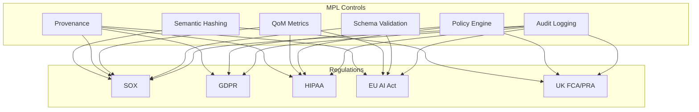
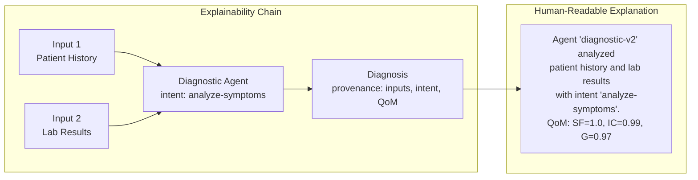

# Compliance Mapping

This document provides detailed mappings between regulatory requirements and MPL's security controls. For each regulation, it identifies the specific requirements, the MPL controls that satisfy them, and the evidence artifacts produced for audit purposes.

---

## Overview

MPL's governance primitives were designed with regulatory compliance in mind. The protocol produces structured evidence -- hash chains, QoM reports, provenance logs, and policy decisions -- that directly satisfy audit requirements across multiple frameworks.



---

## SOX (Sarbanes-Oxley Act)

SOX requires publicly traded companies to maintain internal controls over financial reporting, with complete audit trails and data integrity assurance.

### Requirements and Controls

| SOX Requirement | Section | MPL Control | Implementation |
|----------------|---------|-------------|----------------|
| Internal controls over financial reporting | 302/404 | Semantic hashes provide tamper-evident audit trails | Every financial envelope includes BLAKE3 hash |
| Management assessment of controls | 404 | QoM metrics demonstrate control effectiveness | QoM reports show continuous compliance rates |
| Audit trail completeness | 802 | Provenance tracks agent identity and intent | Full transformation chain for every data point |
| Data integrity | 302 | Hash chains detect unauthorized modifications | Multi-hop hash verification across workflows |
| Segregation of duties | 404 | Policy engine restricts agent capabilities | Role-based SType access patterns |

### MPL Controls for SOX

#### Tamper-Evident Audit Trails

```json
{
  "sem_hash": "blake3:7f2a1c4e8b9d3f6a0e5c2b8d4f1a7e3c9b5d2f8a4e6c0b3d7f9a1e5c8b2d4f6",
  "provenance": {
    "agent_id": "finance-reconciliation-v2",
    "intent": "generate-quarterly-report",
    "inputs_ref": ["msg-001", "msg-002", "msg-003"],
    "signatures": [
      {
        "agent_id": "finance-reconciliation-v2",
        "algorithm": "ed25519",
        "value": "base64:aB3cD4eF..."
      }
    ]
  }
}
```

#### Control Effectiveness Evidence

```json
{
  "qom_report": {
    "profile": "qom-comprehensive",
    "meets_profile": true,
    "metrics": {
      "schema_fidelity": 1.0,
      "instruction_compliance": 0.99,
      "groundedness": 1.0,
      "determinism": 0.97,
      "ontology_adherence": 1.0,
      "tool_outcome_correctness": 0.98
    }
  }
}
```

### Evidence Artifacts for SOX Auditors

| Evidence Type | Format | Retention | Location |
|--------------|--------|-----------|----------|
| Hash chains | JSON (envelope records) | 7 years | Audit log store |
| QoM reports | JSON (per-message) | 7 years | `qom_events.jsonl` |
| Provenance logs | JSON (transformation chains) | 7 years | Audit log store |
| Policy decisions | JSON (allow/deny records) | 7 years | Policy event log |
| Schema versions | JSON Schema files | Indefinite | Registry (versioned) |

!!! tip "SOX Audit Preparation"
    Export compliance evidence using the audit query API:
    ```bash
    mpl audit export \
      --stype "org.finance.*" \
      --start "2025-01-01" \
      --end "2025-03-31" \
      --format sox-report
    ```

---

## GDPR (General Data Protection Regulation)

GDPR requires lawful processing of personal data, with consent management, data minimization, and the right to explanation for automated decisions.

### Requirements and Controls

| GDPR Requirement | Article | MPL Control | Implementation |
|-----------------|---------|-------------|----------------|
| Lawful basis for processing | Art. 6 | Consent references in envelopes (`consent_ref`) | Every data access requires valid consent token |
| Data minimization | Art. 5(1)(c) | Schema validation restricts payload to declared fields | STypes enforce minimal data structures |
| Right to explanation | Art. 22 | Provenance supports right to explanation | Full decision chain traceable through `inputs_ref` |
| Data processing records | Art. 30 | Policy engine logs all processing activities | Structured processing records with timestamps |
| Consent withdrawal | Art. 7(3) | Consent store supports revocation; policy engine rejects revoked consent | Real-time consent status checks |
| Data subject access | Art. 15 | Audit trail queryable by subject identifier | Query by agent ID, SType, or data subject |
| Purpose limitation | Art. 5(1)(b) | Policy engine enforces intent matching | Provenance `intent` verified against consent scope |

### MPL Controls for GDPR

#### Consent References

```json
{
  "provenance": {
    "agent_id": "crm-agent-v1",
    "intent": "update-contact-preferences",
    "consent_ref": "gdpr-consent-user-12345-marketing"
  }
}
```

#### Policy Engine for Data Handling

```yaml
policies:
  - name: "gdpr-data-processing"
    description: "Enforce GDPR consent and minimization"
    match:
      stypes: ["data.personal.*"]
    rules:
      - require_consent: "gdpr-data-processing"
      - deny_if_missing:
          - "provenance.consent_ref"
          - "provenance.intent"
      - require_profile: "qom-strict-argcheck"

  - name: "gdpr-right-to-erasure"
    description: "Support data deletion requests"
    match:
      stypes: ["data.personal.*"]
      operations: ["delete"]
    rules:
      - require_consent: "gdpr-erasure-request"
```

#### Redaction Plans for Minimization

MPL supports redaction plans that strip unnecessary fields before forwarding:

```yaml
redaction:
  - match:
      stypes: ["data.personal.UserProfile.v1"]
      agents: ["analytics-*"]
    redact_fields:
      - "email"
      - "phone"
      - "address"
    retain_fields:
      - "age_bracket"
      - "region"
      - "preferences"
```

### Evidence Artifacts for GDPR

| Evidence Type | Format | Retention | Location |
|--------------|--------|-----------|----------|
| Consent receipts | JSON (consent grants/revocations) | Duration of processing + 3 years | Consent store |
| Processing records | JSON (policy decisions) | 3 years after last processing | Policy event log |
| Data subject requests | JSON (access/erasure records) | 3 years | Request log |
| Policy violation logs | JSON (denied requests) | 3 years | `policy_events.jsonl` |
| Provenance chains | JSON (decision explanations) | Duration of processing | Audit log store |

!!! info "Right to Explanation"
    When a data subject requests an explanation of an automated decision, the provenance chain provides a complete record:

    1. Which agents were involved (`agent_id`)
    2. What each agent intended (`intent`)
    3. Which inputs contributed (`inputs_ref`)
    4. What consent authorized it (`consent_ref`)
    5. What quality standards were met (`qom_report`)

---

## HIPAA (Health Insurance Portability and Accountability Act)

HIPAA requires safeguards for Protected Health Information (PHI), with access controls, audit trails, and data integrity measures.

### Requirements and Controls

| HIPAA Requirement | Rule | MPL Control | Implementation |
|------------------|------|-------------|----------------|
| Access controls | Security Rule 164.312(a) | SType patterns restrict PHI access | Policy engine gates `org.health.*` STypes |
| Audit controls | Security Rule 164.312(b) | Complete access logs with agent identity | Provenance records every PHI access |
| Integrity controls | Security Rule 164.312(c) | BLAKE3 hashing verifies data integrity | Tamper-evident hash chains |
| Transmission security | Security Rule 164.312(e) | TLS 1.3 encryption for all traffic | Transport-layer encryption mandatory |
| Minimum necessary | Privacy Rule 164.502(b) | Schema validation restricts to declared fields | STypes enforce minimal PHI exposure |
| Consent requirements | Privacy Rule 164.508 | Policy engine requires patient consent | `require_consent` rules for health STypes |
| Quality assurance | Security Rule 164.306(a) | QoM thresholds enforce accuracy | Comprehensive profiles for health data |

### MPL Controls for HIPAA

#### PHI Access Restriction

```yaml
policies:
  - name: "hipaa-phi-access"
    description: "Restrict PHI to authorized agents with consent"
    match:
      stypes: ["org.health.*"]
    rules:
      - require_consent: "hipaa-patient-consent"
      - require_profile: "qom-strict-argcheck"
      - deny_if_missing:
          - "provenance.agent_id"
          - "provenance.intent"
          - "provenance.consent_ref"

  - name: "hipaa-minimum-necessary"
    description: "Enforce minimum necessary standard"
    match:
      stypes: ["org.health.PatientRecord.v1"]
      agents: ["billing-*"]
    rules:
      - qom_override:
          schema_fidelity: 1.0
          instruction_compliance: 0.99
```

#### QoM Accuracy Enforcement

```json
{
  "qom_report": {
    "profile": "qom-strict-argcheck",
    "meets_profile": true,
    "metrics": {
      "schema_fidelity": 1.0,
      "instruction_compliance": 0.99,
      "groundedness": 1.0
    },
    "evaluated_at": "2025-01-15T10:00:05Z"
  }
}
```

### Evidence Artifacts for HIPAA

| Evidence Type | Format | Retention | Location |
|--------------|--------|-----------|----------|
| Access patterns | JSON (who accessed what PHI) | 6 years | Audit log store |
| Validation records | JSON (schema + QoM results) | 6 years | `qom_events.jsonl` |
| Consent verifications | JSON (consent checks) | 6 years | Policy event log |
| Integrity verifications | JSON (hash checks) | 6 years | Audit log store |
| Transmission logs | JSON (TLS handshake records) | 6 years | Transport log |

!!! warning "HIPAA Breach Notification"
    If a hash verification failure indicates potential PHI tampering, organizations must evaluate whether the incident triggers HIPAA breach notification requirements (45 CFR 164.404). MPL's audit trail provides the forensic evidence needed for this assessment.

---

## EU AI Act

The EU AI Act requires transparency, explainability, human oversight, and risk management for AI systems operating in the European Union.

### Requirements and Controls

| EU AI Act Requirement | Article | MPL Control | Implementation |
|----------------------|---------|-------------|----------------|
| Transparency | Art. 13 | QoM metrics provide operational transparency | Per-message quality scores visible to operators |
| Explainability | Art. 14 | Provenance enables decision explanation | Full input/output chain with intent declarations |
| Human oversight | Art. 14 | Policy controls enable intervention points | `deny` rules create human-in-the-loop gates |
| Risk management | Art. 9 | Risk categorization through QoM profiles | Progressive profiles match risk levels |
| Technical documentation | Art. 11 | Schema registry documents AI capabilities | Versioned STypes describe all agent behaviors |
| Record-keeping | Art. 12 | Comprehensive audit logging | All events logged with ISO 8601 timestamps |
| Accuracy | Art. 15 | QoM groundedness and instruction compliance | Measurable accuracy thresholds per deployment |
| Robustness | Art. 15 | Determinism under Jitter metric | Consistency verification under perturbation |

### MPL Controls for EU AI Act

#### Transparency via QoM Reporting

Every AI agent interaction produces a transparent quality report:

```json
{
  "qom_report": {
    "profile": "qom-comprehensive",
    "meets_profile": true,
    "metrics": {
      "schema_fidelity": {"score": 1.0, "details": {}},
      "instruction_compliance": {"score": 0.98, "details": {"assertions_passed": 49, "assertions_total": 50}},
      "groundedness": {"score": 0.95, "details": {"claims_supported": 19, "claims_total": 20}},
      "determinism": {"score": 0.92, "details": {"reruns": 3, "similarity": "cosine"}},
      "ontology_adherence": {"score": 1.0, "details": {"rules_passed": 15, "rules_total": 15}},
      "tool_outcome_correctness": {"score": 0.97, "details": {"checks_passed": 29, "checks_total": 30}}
    }
  }
}
```

#### Human Oversight Controls

```yaml
policies:
  - name: "high-risk-human-oversight"
    description: "Require human approval for high-risk AI decisions"
    match:
      stypes: ["org.decision.HighRisk.*"]
    rules:
      - require_consent: "human-oversight-approval"
      - require_profile: "qom-comprehensive"
      - deny_if_missing:
          - "provenance.consent_ref"
          - "provenance.signatures"

  - name: "risk-categorization"
    description: "Enforce appropriate profiles by risk level"
    match:
      stypes: ["org.decision.*"]
    rules:
      - require_profile: "qom-strict-argcheck"
```

#### Explainability via Provenance



### Evidence Artifacts for EU AI Act

| Evidence Type | Format | Retention | Location |
|--------------|--------|-----------|----------|
| QoM reports | JSON (per-message quality) | 10 years | `qom_events.jsonl` |
| Provenance chains | JSON (decision explanations) | 10 years | Audit log store |
| Policy logs | JSON (oversight decisions) | 10 years | Policy event log |
| Risk categorizations | YAML (profile assignments) | Indefinite | Proxy configuration |
| Technical documentation | JSON Schema (SType definitions) | Indefinite | Registry |
| Robustness evidence | JSON (DJ metric results) | 10 years | `qom_events.jsonl` |

!!! info "High-Risk AI Systems"
    Under the EU AI Act, high-risk AI systems face the strictest requirements. Map high-risk use cases to `qom-comprehensive` profiles and implement human oversight policies to satisfy Articles 13-15.

---

## UK FCA/PRA

The UK Financial Conduct Authority (FCA) and Prudential Regulation Authority (PRA) require financial firms to demonstrate fiduciary duty, instruction compliance, and supervisory readiness.

### Requirements and Controls

| FCA/PRA Requirement | Reference | MPL Control | Implementation |
|--------------------|-----------|-------------|----------------|
| Fiduciary duty | FCA PRIN 2.1 | Policy engine enforces client-interest rules | Custom policies for financial agents |
| Instruction compliance | FCA COBS 11.2 | QoM instruction compliance metric | Assertion-based instruction verification |
| Audit trails | PRA SS2/21 | Comprehensive event logging | Structured audit records with timestamps |
| Supervisory access | FCA SUP 2 | Queryable audit history | API access to compliance evidence |
| Outsourcing oversight | PRA SS2/21 | Provenance tracks external agent usage | Agent ID identifies third-party services |
| Operational resilience | PRA PS6/21 | QoM monitoring and alerting | Continuous quality monitoring with breach alerts |

### MPL Controls for UK FCA/PRA

#### Fiduciary Duty Enforcement

```yaml
policies:
  - name: "fiduciary-duty"
    description: "Ensure AI agents act in client interest"
    match:
      stypes: ["org.finance.ClientAdvice.*"]
    rules:
      - require_profile: "qom-comprehensive"
      - deny_if_missing:
          - "provenance.agent_id"
          - "provenance.intent"
          - "provenance.consent_ref"
      - qom_override:
          groundedness: 0.99
          instruction_compliance: 0.99
```

#### Instruction Compliance Verification

```cel
// Assertions for financial instruction compliance
// Trade must be within authorized limits
payload.trade_value <= client.authorized_limit

// Instrument must be in approved list
payload.instrument in client.approved_instruments

// Execution venue must be regulated
payload.venue in ["LSE", "CBOE", "EUREX", "CME"]
```

### Evidence Artifacts for UK FCA/PRA

| Evidence Type | Format | Retention | Location |
|--------------|--------|-----------|----------|
| Instruction compliance | JSON (assertion results) | 7 years | `qom_events.jsonl` |
| Fiduciary evidence | JSON (policy decisions) | 7 years | Policy event log |
| Supervisory reports | JSON/CSV (exportable) | 7 years | Audit log store |
| Agent provenance | JSON (third-party tracking) | 7 years | Audit log store |
| Operational metrics | Prometheus (time-series) | 2 years | Metrics store |

---

## Master Compliance Mapping Table

The following table provides a consolidated view of regulations, requirements, MPL controls, and evidence types:

| Regulation | Requirement | MPL Control | Evidence |
|-----------|-------------|-------------|----------|
| SOX 302 | Internal controls | Semantic hashing, policy engine | Hash chains, policy logs |
| SOX 404 | Management assessment | QoM metrics | QoM reports, compliance dashboards |
| SOX 802 | Audit trail completeness | Provenance tracking | Provenance chains |
| GDPR Art. 5 | Data minimization | Schema validation, redaction plans | Schema definitions, redaction logs |
| GDPR Art. 6 | Lawful basis | Consent references | Consent receipts |
| GDPR Art. 7 | Consent withdrawal | Consent store revocation | Revocation records |
| GDPR Art. 22 | Right to explanation | Provenance chains | Decision explanation exports |
| GDPR Art. 30 | Processing records | Policy engine logging | Processing activity logs |
| HIPAA 164.312(a) | Access controls | SType restrictions, policy engine | Access logs |
| HIPAA 164.312(b) | Audit controls | Provenance, audit logging | Audit trail records |
| HIPAA 164.312(c) | Integrity controls | BLAKE3 hashing | Hash verification records |
| HIPAA 164.312(e) | Transmission security | TLS 1.3 | Transport logs |
| HIPAA 164.502(b) | Minimum necessary | Schema validation | Schema definitions |
| HIPAA 164.508 | Consent | Policy engine consent rules | Consent verification logs |
| EU AI Act Art. 9 | Risk management | QoM profiles (risk-based) | Profile assignments |
| EU AI Act Art. 11 | Technical documentation | Schema registry | SType definitions |
| EU AI Act Art. 12 | Record-keeping | Audit logging | Event logs |
| EU AI Act Art. 13 | Transparency | QoM metrics | QoM reports |
| EU AI Act Art. 14 | Explainability/Oversight | Provenance, policy controls | Provenance chains, policy logs |
| EU AI Act Art. 15 | Accuracy/Robustness | QoM (G, DJ metrics) | Metric reports |
| UK FCA PRIN 2.1 | Fiduciary duty | Policy engine | Policy decision logs |
| UK FCA COBS 11.2 | Instruction compliance | QoM IC metric | Assertion results |
| UK PRA SS2/21 | Audit trails | Comprehensive logging | Audit records |
| UK PRA PS6/21 | Operational resilience | QoM monitoring | Prometheus metrics |

---

## Implementing Compliance

### Step 1: Identify Applicable Regulations

Determine which regulations apply to your deployment based on industry, geography, and data types:

```yaml
# compliance-config.yaml
regulations:
  - sox:
      applicable: true
      stypes: ["org.finance.*"]
  - gdpr:
      applicable: true
      stypes: ["data.personal.*"]
      regions: ["EU", "EEA", "UK"]
  - hipaa:
      applicable: true
      stypes: ["org.health.*"]
  - eu_ai_act:
      applicable: true
      risk_level: "high"
      stypes: ["org.decision.*"]
```

### Step 2: Configure Appropriate Controls

Map regulations to proxy configuration:

```yaml
proxy:
  middleware:
    - schema_validation:
        registry: "./registry"
        strict: true
    - policy_engine:
        policies: "./policies/compliance.yaml"
        mode: "enforce"
    - qom_evaluation:
        default_profile: "qom-strict-argcheck"
    - audit_logger:
        output: "./logs/audit"
        format: "jsonl"
        retention_days: 2555  # 7 years
```

### Step 3: Validate Evidence Generation

Verify that all required evidence artifacts are being produced:

```bash
# Verify audit trail completeness
mpl audit verify \
  --regulation sox \
  --period "2025-Q1" \
  --check completeness

# Export compliance report
mpl audit export \
  --regulation gdpr \
  --format compliance-report \
  --output ./reports/gdpr-q1-2025.json
```

!!! warning "Evidence Retention"
    Different regulations require different retention periods. Configure your log storage to retain evidence for the longest applicable period (typically 7-10 years for financial regulations).

---

## Next Steps

- [Audit Trails](audit-trails.md) -- Detailed audit trail implementation and querying
- [Threat Model](threat-model.md) -- Security threats that compliance controls address
- [Policy Engine](../concepts/policy-engine.md) -- Configuring compliance enforcement rules
- [QoM](../concepts/qom.md) -- Understanding quality metrics used for compliance evidence
