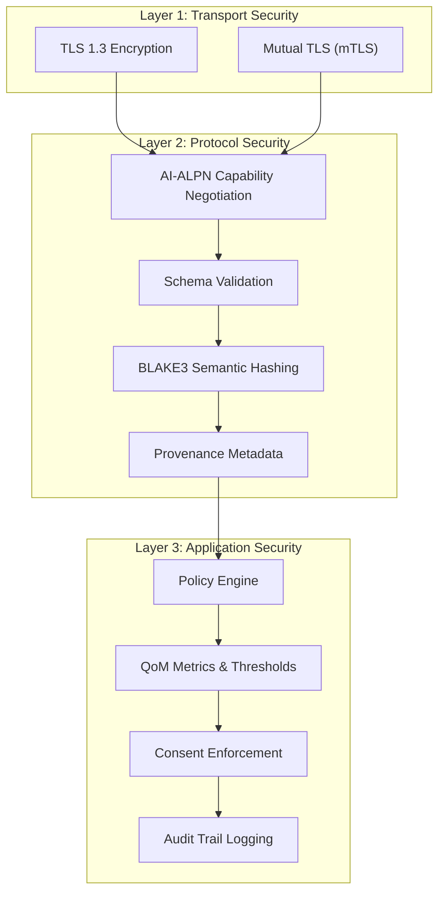
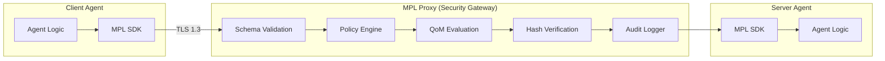

# Security & Compliance

MPL provides a **defense-in-depth** security architecture purpose-built for AI agent deployments. Rather than bolting security onto existing protocols, MPL embeds governance primitives -- schema enforcement, semantic hashing, provenance tracking, policy evaluation, and quality metrics -- directly into the protocol layer.

---

## Executive Summary

For CISOs and security architects evaluating MPL for enterprise AI deployments:

!!! abstract "MPL Security Posture"
    MPL treats every agent-to-agent message as an untrusted input. The protocol enforces validation, integrity, provenance, and policy compliance **at the proxy layer**, independent of application code. This means security guarantees hold regardless of the agent framework, LLM provider, or programming language in use.

### Key Security Capabilities

| Capability | Mechanism | Purpose |
|-----------|-----------|---------|
| **Schema Enforcement** | JSON Schema validation against registered STypes | Prevents malformed or unexpected payloads from reaching agents |
| **Semantic Hashing** | BLAKE3 over canonicalized payloads | Tamper detection across multi-hop agent workflows |
| **Provenance Tracking** | Agent ID, intent, inputs, consent references | Complete audit trail for every data transformation |
| **Policy Engine** | Declarative YAML rules with matchers | Organizational constraint enforcement at protocol level |
| **QoM Metrics** | Six-dimension quality measurement | Continuous quality assurance with configurable thresholds |
| **AI-ALPN Handshake** | Capability negotiation before work begins | Prevents capability escalation and downgrade attacks |

---

## Defense-in-Depth Layers

MPL implements security at three distinct layers, each reinforcing the others:

---

## Threat-to-Control Mapping

The following table maps common AI-specific threats to MPL's security controls and the compliance frameworks they satisfy:

| Threat | MPL Control | Detection | Compliance |
|--------|------------|-----------|------------|
| Prompt Injection | Schema validation rejects unexpected fields | `E-SCHEMA-FIDELITY` error | SOX, EU AI Act |
| Data Exfiltration | Policy engine enforces data handling rules | `E-POLICY-DENIED` with remediation | GDPR, HIPAA |
| Output Manipulation | BLAKE3 semantic hashes detect payload tampering | Hash mismatch on verification | SOX, UK FCA |
| Jailbreaking | QoM thresholds flag anomalous quality drops | `E-QOM-BREACH` with violation details | EU AI Act |
| Man-in-the-Middle | Semantic signatures in provenance verify identity | Signature verification failure | HIPAA, SOX |
| Replay Attacks | Unique envelope IDs and ISO 8601 timestamps | Duplicate ID detection | SOX, UK FCA |
| Schema Poisoning | Registry governance with CODEOWNERS approval | Pull request review workflow | EU AI Act |
| Capability Escalation | AI-ALPN limits negotiated capabilities per session | Handshake rejection | GDPR, HIPAA |

---

## Compliance Coverage

MPL's security controls map to requirements across major regulatory frameworks:

| Regulation | Key Requirements | MPL Controls |
|-----------|-----------------|--------------|
| **SOX** | Internal controls, audit trails, data integrity | Semantic hashing, provenance, QoM reports |
| **GDPR** | Data minimization, consent, right to explanation | Consent references, policy engine, provenance |
| **HIPAA** | PHI access controls, audit logs, data integrity | SType restrictions, QoM thresholds, policy engine |
| **EU AI Act** | Transparency, explainability, risk management | QoM metrics, provenance chains, risk profiles |
| **UK FCA/PRA** | Fiduciary duty, audit trails, instruction compliance | Policy engine, audit trails, compliance checks |

!!! tip "Compliance Documentation"
    See the [Compliance Mapping](compliance.md) page for detailed requirement-to-control mappings with specific evidence types for each regulation.

---

## Security Architecture

The MPL proxy acts as a security gateway, validating all traffic between agents:

!!! warning "Zero Trust Principle"
    The MPL proxy validates **every** envelope regardless of source. Even internal agents communicating within the same cluster are subject to schema validation, policy evaluation, and QoM assessment. There is no implicit trust boundary.

---

## Quick Links

-   :material-shield-alert:{ .lg .middle } **Threat Model**

    ---

    AI-specific threat categories and MPL's layered defenses

    [:octicons-arrow-right-24: Threat Model](threat-model.md)

-   :material-sword-cross:{ .lg .middle } **Adversarial Robustness**

    ---

    Attack scenarios, countermeasures, and hardening recommendations

    [:octicons-arrow-right-24: Adversarial Robustness](adversarial-robustness.md)

-   :material-certificate:{ .lg .middle } **Compliance Mapping**

    ---

    Regulation-to-control mapping for SOX, GDPR, HIPAA, EU AI Act

    [:octicons-arrow-right-24: Compliance Mapping](compliance.md)

-   :material-file-document-check:{ .lg .middle } **Audit Trails**

    ---

    Comprehensive auditing with hash chains, provenance, and QoM reports

    [:octicons-arrow-right-24: Audit Trails](audit-trails.md)

---

## Security Principles

MPL's security design is guided by these principles:

1. **Protocol-level enforcement** -- Security guarantees are embedded in the protocol, not delegated to application code
2. **Semantic awareness** -- Controls understand the meaning of data, not just its structure
3. **Continuous verification** -- Every message is validated, not just the first one in a session
4. **Auditable by default** -- All decisions produce structured evidence for compliance review
5. **Defense in depth** -- Multiple independent layers prevent single-point failures
6. **Least privilege** -- AI-ALPN ensures agents can only access negotiated capabilities
7. **Fail closed** -- Schema, policy, or QoM failures result in rejection, never silent pass-through

---

## Next Steps

- [Threat Model](threat-model.md) -- Understand the threats MPL defends against
- [Adversarial Robustness](adversarial-robustness.md) -- How MPL resists sophisticated attacks
- [Compliance Mapping](compliance.md) -- Map MPL controls to your regulatory requirements
- [Audit Trails](audit-trails.md) -- Implement comprehensive audit logging
